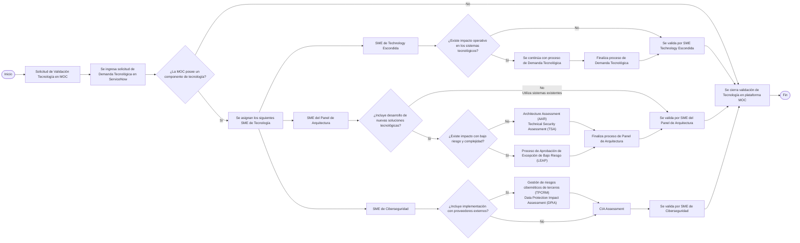

# Proceso de Gestión de Demanda MoC

Flujograma Gestión Demanda MoC - Tecnología Escondida

Flujograma de Solicitud de Demanda - MOC

![[CleanShot 2026-08-03 at 10.37.12.png]]
## Listado de Documentos

El pre-requisito es saber la aplicabilidad de los siguientes documentos de tecnología:

**Cybersecurity**
- TSA - Technical Security Assessment
- TPCRM - Third Party Cyber Risk Management
- CIA - Confidentiality, Integrity and Availability Assessment
- DPIA - Data Privacy Impact Assessment

**Architecture**
- AISA - Architecture Impact Self Assessment
- ==HLD - High Level Design==
- LLD - Low Level Design
