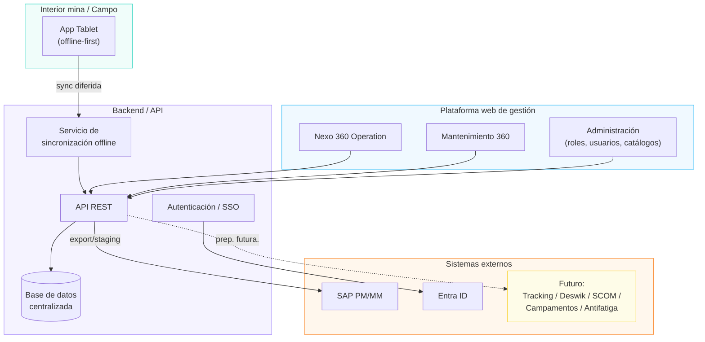
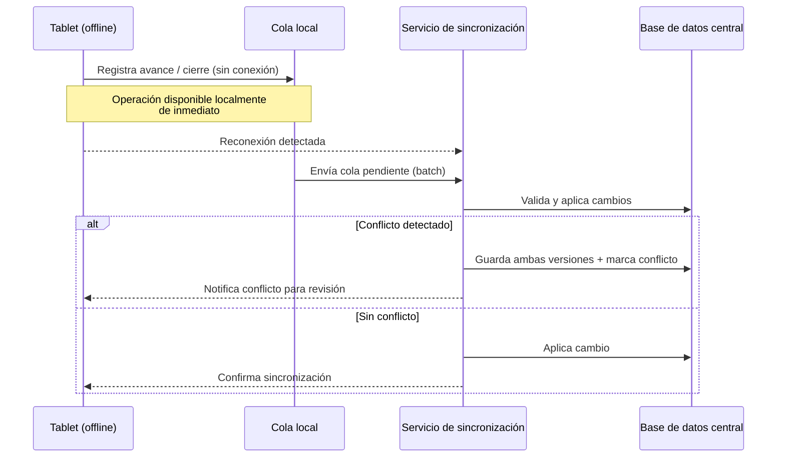

# Arquitectura Técnica de Referencia
### Nexo 360 Operation + Mantenimiento 360 — Consorcio Minero Horizonte (CMH), Unidad Parcoy

**Preparado por:** ASTAY Systems
**Fecha:** 25 de julio de 2026
**Para:** Equipo de Tecnología y Transformación Digital de CMH (uso interno ASTAY para propuesta técnica)

**Fuentes:** `Documentacion/Referencias/TDR_Nexo_360_Operation_Mantenimiento_360_CM_Parcoy_VF.md`, `Documentacion/Entregables/2026-07-26-alcance-requisitos-tecnicos-v1.md`, `Documentacion/Reuniones/2026-07-22-analisis-reunion-licitacion.md`

---

## Objetivo de este documento

Definir la arquitectura de referencia para la propuesta técnica, cubriendo los tres componentes de la solución y los ejes no funcionales críticos (usuarios, segregación de accesos, escalabilidad). Todo lo que dependa de una confirmación pendiente de CMH está marcado explícitamente como **supuesto a validar** — no se asume nada de lo señalado como "pendiente de confirmar por escrito" en el análisis de la reunión del 22-jul.

---

## 1. Componentes de la solución

| Componente | Descripción | Usuarios principales |
|---|---|---|
| **Plataforma web de gestión** | Cubre los dos productos funcionales — Nexo 360 Operation (planificación, asignación, OT, cierre, SIC) y Mantenimiento 360 (equipos, disponibilidad, preventivos/correctivos, backlog) — como módulos de una misma plataforma, con pantallas de sala COM y sala de guardia. | COM, Jefes de Sección/Guardia, Planeamiento, Programadores, Mantenimiento, SSOMA, Administradores |
| **Aplicación tablet (campo)** | App para jefes de sección/guardia y personal de mantenimiento en interior mina, con capacidad offline (Store & Forward) para zonas sin conectividad. | Jefes de guardia, supervisores de mantenimiento en campo |
| **Capa de integración** | SAP (PM/MM), Microsoft Entra ID (SSO), y puntos de preparación para integraciones futuras (tracking, Deswik, "SCOM", control de campamentos, sistema antifatiga). | Sistemas, no usuarios directos |

---

## 2. Arquitectura lógica y de despliegue

**Monolito modular, no microservicios.** Se recomienda un backend monolítico modular (módulos internos separados por dominio: Planificación, Frentes, Asignación, OT, Mantenimiento, Administración) en lugar de microservicios independientes.

- **Trade-off:** microservicios ofrecerían escalado independiente por módulo, pero para ~100 usuarios concurrentes (TDR §7) el costo operativo de orquestación, observabilidad y despliegue distribuido no se justifica. Un monolito modular con límites de dominio claros permite migrar a microservicios más adelante si CMH replica la solución a las 4 unidades adicionales y el volumen lo exige.
- **Frontend/backend separados:** frontend web responsive (SPA) consumiendo el mismo API REST que la app tablet — un solo contrato de API para ambos clientes, evita duplicar lógica de negocio.

**Ambientes:** Dev, QA/UAT, Producción, con control de versiones y despliegue documentado (TDR §7, "Ambientes").

**Infraestructura de despliegue — supuesto a validar:** en la reunión del 22-jul, Luis Chang (CMH) indicó verbalmente que *CMH proveería los ambientes de infraestructura*, en tensión con el TDR (Anexo B, ítem G) que pide cotizar infraestructura "si aplica". Este documento asume que ASTAY debe **proponer los requisitos de infraestructura (prerequisitos técnicos)**, y que CMH aprovisiona el hosting — pero la propuesta económica debe incluir una partida de respaldo por si esto no se confirma por escrito antes de la propuesta económica.

**Ubicación del despliegue:** el TDR (§7) deja abierto nube privada, nube pública autorizada u on-premise — decisión de CMH. La arquitectura debe ser agnóstica de proveedor cloud (containerizada) para no bloquear esa decisión.

---

## 3. Modelo de usuarios, roles y segregación de accesos

### 3.1 Matriz de roles × permisos × módulo

| Rol | Nexo 360 Operation | Mantenimiento 360 | Administración | Alcance de datos |
|---|---|---|---|---|
| Gerencia de Operaciones | Lectura / aprobación de hitos | Lectura | — | Todas las zonas |
| COM / Supervisor SIC | Lectura + edición de tableros, alertas, seguimiento intraturno | Lectura de disponibilidad | — | Todas las zonas |
| Jefe de Sección | Edición: prioridades, validación de programación, resolución de desvíos | Lectura | — | Su(s) zona(s) asignada(s) |
| Programador (producción/desarrollo) | Edición: plan de turno, 12/24/48h | Lectura de disponibilidad | — | Zonas asignadas |
| Programador de mantenimiento | Lectura (disponibilidad requerida) | Edición: planes preventivos, disponibilidad | — | Flota asignada |
| Jefe de Guardia / Residente | Edición: OT, cierre de guardia (vía tablet en campo) | Solicitud de correctivos | — | Su labor/frente asignado |
| SSOMA | Edición: mensajes preventivos, restricciones de seguridad | — | — | Todas las zonas (solo su dominio funcional) |
| Mantenimiento (equipo) | — | Edición completa: OT, backlog, historial, indicadores | — | Flota propia/asignada |
| Contratistas | Edición limitada: disponibilidad de su personal/equipos, cierre de sus labores | Edición limitada: disponibilidad/estado de su flota | — | Solo su empresa |
| TI / Administrador técnico | — | — | Completo | Todas |
| Administrador funcional | Configuración de catálogos, plantillas, turnos | Configuración de catálogos | Completo (sin acceso a infraestructura) | Todas |
| Soporte proveedor (ASTAY) | Solo con aprobación formal, sin cuentas genéricas | Solo con aprobación formal | Limitado, auditado | Según incidente |

Esta matriz es un punto de partida para validar en el levantamiento funcional — el TDR (N360-20) exige parametrización de roles, usuarios, permisos, catálogos, turnos y empresas contratistas, por lo que debe quedar completamente configurable, no hardcodeada.

### 3.2 Segregación CMH vs. contratistas

- **Mínimo privilegio por defecto:** todo usuario contratista ve y edita únicamente los datos de su propia empresa (personal, equipos, cuadrillas, cierres). Se implementa como filtro obligatorio a nivel de API por `empresa_id`, no solo en la UI.
- **Sin cuentas genéricas:** cada usuario (CMH o contratista) tiene cuenta nominal, según exige el estándar TTD-ES-001 (TDR §14.1).
- **Autenticación diferenciada — supuesto a validar:** el TDR no aclara si el SSO de Entra ID debe federar también a los contratistas (pregunta abierta en el documento de alcance, sección "Seguridad y estándar TTD-ES-001"). Se propone:
  - Usuarios CMH → SSO vía Entra ID (SAML 2.0 / OIDC), sin credenciales locales.
  - Usuarios contratistas → cuentas gestionadas localmente por la plataforma (con políticas de contraseña y MFA equivalentes), salvo que CMH confirme que también los federa vía Entra ID.

### 3.3 Diseño multi-unidad (replicabilidad)

El cliente indicó que la solución debe ser replicable a las otras 4 unidades de CMH (Trujillo, Puno, Cerro de Pasco, Colombia). Se recomienda:

- Modelo de datos con `unidad_minera_id` como partición lógica desde el diseño inicial (no agregarlo después), aunque el MVP solo active Parcoy.
- Catálogos (roles, plantillas de OT, tipos de estado de frente, etc.) parametrizables por unidad, con posibilidad de heredar una configuración base y sobrescribir por unidad.
- Esto evita rediseño de esquema si CMH decide activar una segunda unidad tras el piloto.

---

## 4. Dimensionamiento y escalabilidad

Requisito base (TDR §7): **500 usuarios registrados, 100 usuarios concurrentes**, impresión masiva por guardia, consultas de tableros sin degradación significativa.

| Aspecto | Estrategia |
|---|---|
| Escalado de aplicación | Horizontal (múltiples instancias del backend detrás de balanceador), stateless — la sesión no vive en memoria del proceso. |
| Picos de cambio de guardia (6am/6pm) | Los ~100 concurrentes no se distribuyen parejo en el día: se concentran en ventanas de cambio de guardia. Diseñar con capacidad de auto-scaling (o sobre-aprovisionamiento manual) alrededor de esas dos ventanas horarias, en vez de dimensionar para carga constante. |
| Impresión masiva de OT | Generación de PDF como proceso asíncrono (cola de trabajos), no síncrono en el request — evita bloquear la API durante impresión de ~360 personas/guardia. |
| Sincronización masiva de tablets | Cuando se recupera conectividad tras un corte, múltiples tablets pueden sincronizar simultáneamente — requiere cola de sincronización con procesamiento por lotes y backoff, no writes directos concurrentes a la misma fila. |
| Tableros/dashboards | Cache de lectura (ej. vistas materializadas o cache in-memory) para los tableros COM de 12/24/48h, refrescados por evento o intervalo corto, no calculados on-demand por cada usuario. |
| Crecimiento a otras unidades | El particionamiento lógico por `unidad_minera_id` (sección 3.3) permite escalar usuarios sin rediseño; si el volumen total crece significativamente, evaluar separar Mantenimiento 360 como servicio independiente (ya modularizado desde el monolito). |

---

## 5. Estrategia offline-first para la app tablet

Requisito TDR §7: modo **"Store & Forward"** — almacenamiento local y sincronización automática diferida.

- **Qué debe funcionar 100% offline:** registro de avance de labor/OT, checklist de estado de equipo, cierre de labor/turno, mensajes SSOMA de la guardia en curso. Estas operaciones deben quedar en cola local (ej. base de datos embebida en el dispositivo) y sincronizarse al recuperar señal.
- **Qué requiere conectividad:** consulta de datos maestros actualizados (personal/equipos disponibles a nivel global), tableros COM en tiempo real, emisión inicial de OT desde planificación.
- **Resolución de conflictos — pregunta abierta con el cliente** (ver documento de alcance, sección "Capacidad offline"): se propone como default **"último cambio gana" con registro de auditoría del conflicto** (se guarda la versión descartada, no se pierde), salvo que CMH prefiera resolución manual para ciertos campos críticos (ej. cierre de guardia). Debe confirmarse antes de fijar el diseño.
- **Duración de desconexión a soportar:** no definida por el cliente (pregunta abierta) — se recomienda diseñar la cola local sin límite de tiempo fijo (persistente hasta sincronizar), pero validar con CMH el peor caso real de desconexión en campo para dimensionar almacenamiento local.

---

## 6. Seguridad y cumplimiento

Mapeo contra el estándar TTD-ES-001 citado en el TDR (§14.1) y contra los criterios de evaluación de arquitectura/ciberseguridad (TDR §16, 20% del puntaje):

| Requisito TTD-ES-001 (TDR) | Enfoque propuesto |
|---|---|
| SSO corporativo (Entra ID, SAML 2.0 / OIDC) | Autenticación federada para usuarios CMH; ver sección 3.2 para contratistas (pendiente de confirmar) |
| Sin cuentas genéricas | Cuentas nominales para todos los roles, incluida administración y soporte |
| Roles y permisos por mínimo privilegio | Matriz de la sección 3.1, aplicada a nivel de API, no solo UI |
| Auditoría de eventos funcionales y técnicos | Log inmutable de: accesos, cambios de permisos, reprogramaciones, cierres de guardia, cambios de disponibilidad, modificación de maestros, cargas masivas, exportaciones SAP, acciones administrativas |
| Integración con SIEM/SOC de CMH | Exportación de logs en formato estándar (ej. Syslog/JSON) hacia la plataforma de monitoreo que defina CMH — mecanismo concreto pendiente de que TI de CMH indique su plataforma |
| Controles para cargas masivas (Excel/CSV, adjuntos) | Validación de tipo de archivo, tamaño, contenido y escaneo antimalware antes de procesar cualquier carga masiva o adjunto |
| Protección de APIs/exportaciones | Autenticación + autorización + trazabilidad en cada endpoint, incluidas las exportaciones/staging hacia SAP |
| Cifrado en tránsito y en reposo | TLS en todas las comunicaciones; cifrado de base de datos según motor elegido |
| Declaración de dependencias de terceros | Inventario de librerías/frameworks/servicios cloud a entregar como parte de la propuesta técnica y mantenerlo actualizado durante el proyecto |

**Nota:** el documento completo del estándar TTD-ES-001 aún no ha sido compartido por CMH (pregunta abierta en el documento de alcance) — esta sección se basa únicamente en lo que el TDR resume del estándar; debe revisarse en detalle apenas se reciba.

---

## 7. Matriz de decisiones y supuestos

| Decisión | Alternativa descartada | Trade-off | ¿Depende de confirmación de CMH? |
|---|---|---|---|
| Backend monolito modular | Microservicios desde el inicio | Menor complejidad operativa ahora vs. menor flexibilidad de escalado independiente a futuro | No |
| Un solo API REST para web y tablet | APIs separadas por cliente | Evita duplicar lógica de negocio; requiere diseño de contrato cuidadoso para offline | No |
| Partición lógica por `unidad_minera_id` desde el diseño inicial | Agregarla después si se replica a otras unidades | Algo de sobre-ingeniería ahora vs. evitar migración costosa después | No (decisión interna de ASTAY) |
| CMH provee infraestructura de hosting | ASTAY cotiza y gestiona infraestructura | Reduce costo/alcance de ASTAY si se confirma; riesgo de subestimar propuesta si no se confirma | **Sí — pendiente de confirmar por escrito** |
| SSO Entra ID solo para usuarios CMH; contratistas con cuenta local gestionada por la plataforma | Federar también a contratistas vía Entra ID | Menor dependencia de que CMH habilite cuentas de contratistas en su directorio corporativo | **Sí — pendiente de confirmar** |
| Mecanismo de integración SAP: exportación por archivos/staging (como primer alcance) | Integración vía API en tiempo real desde el día uno | Menor complejidad y riesgo inicial; requiere evolutivo posterior si CMH pide tiempo real | **Sí — el cliente mismo indica que no está definido** |
| Resolución de conflictos offline: "último cambio gana" + registro de auditoría | Resolución manual obligatoria para todo conflicto | Menor fricción operativa vs. posible pérdida de intención del usuario en campo | **Sí — pendiente de confirmar con CMH** |
| Preparación arquitectónica para tracking/antifatiga/campamentos sin implementarlos en el MVP | Incluir su desarrollo en el alcance actual | Evita comprometer alcance/costo por sistemas de terceros aún sin definir | **Sí — naturaleza y madurez de estos sistemas no está clara** |

---

## Próximos pasos

1. Incluir en el pliego de consultas (vence 2026-07-27) las confirmaciones marcadas como pendientes en la sección 7, en particular infraestructura, SSO de contratistas y mecanismo SAP — son las que más impactan el dimensionamiento de la propuesta económica.
2. Validar con CMH la matriz de roles y permisos (sección 3.1) durante el levantamiento funcional, antes de fijarla en el diseño TO-BE.
3. Solicitar el documento completo del estándar TTD-ES-001 para revisar el detalle de la sección 6 contra el estándar real, no solo contra el resumen del TDR.

---

*Documento preparado por ASTAY Systems para uso interno — insumo de la propuesta técnica a CMH.*
