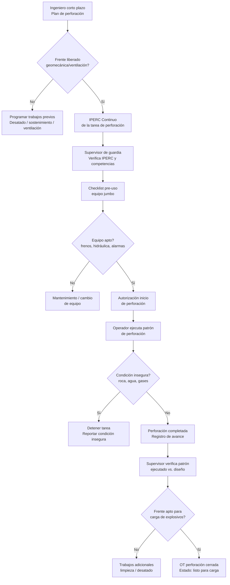
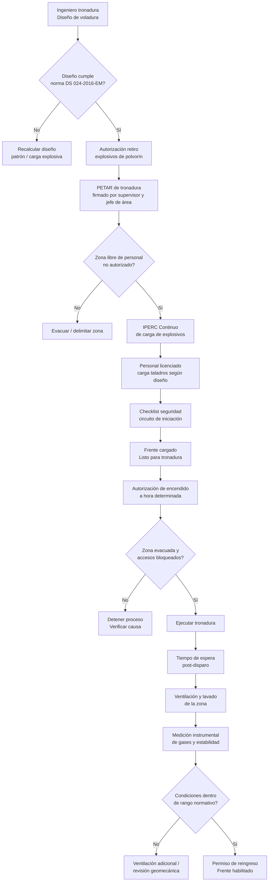
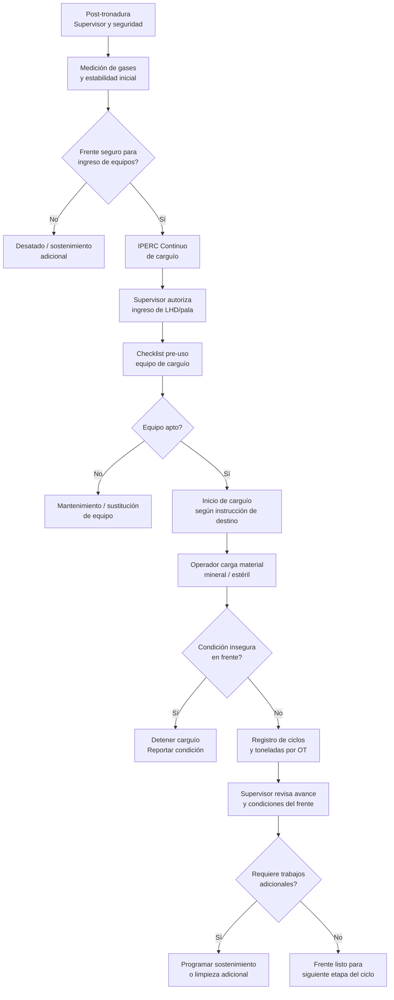
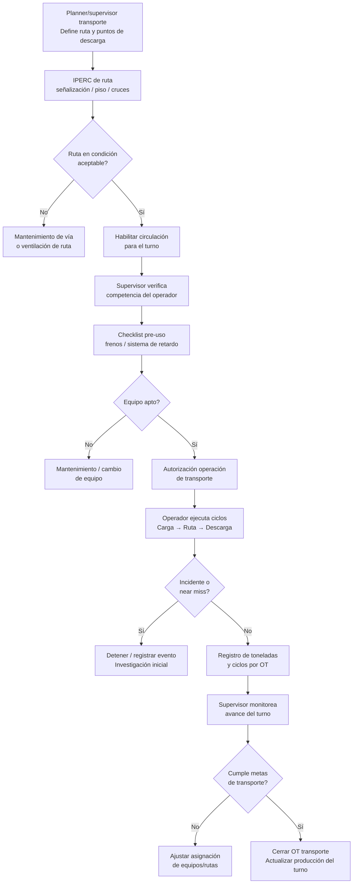
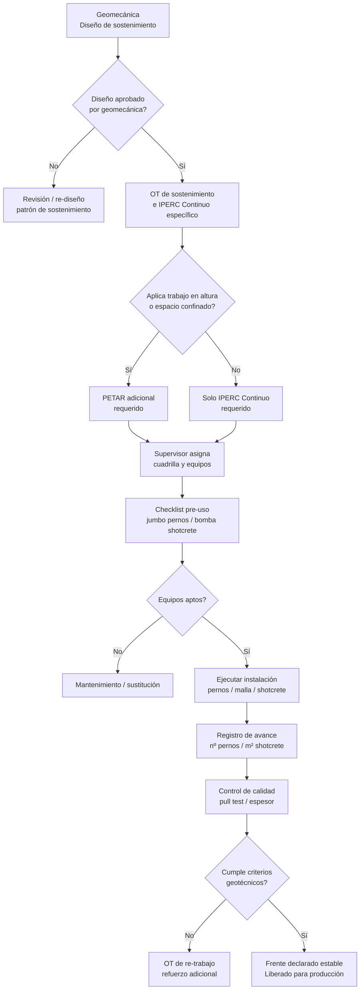
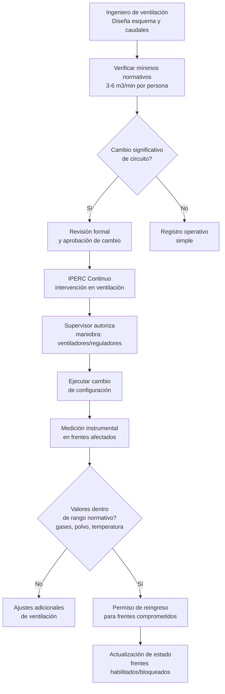
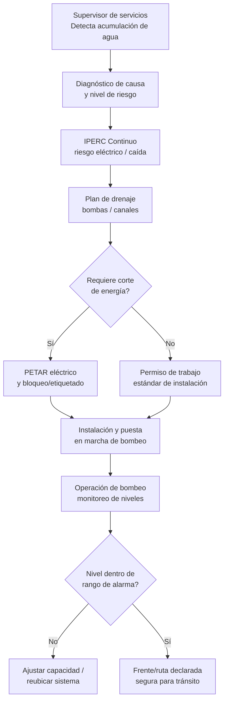
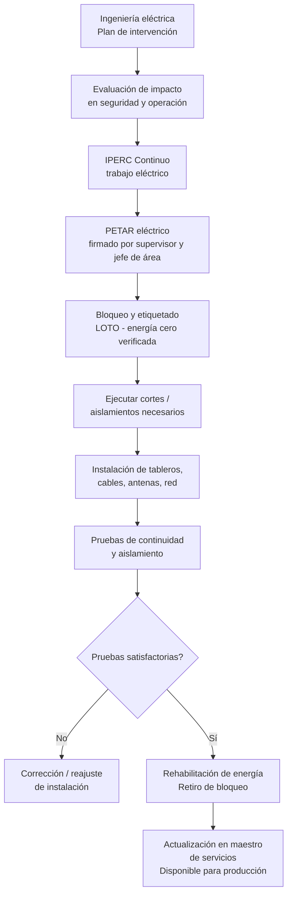
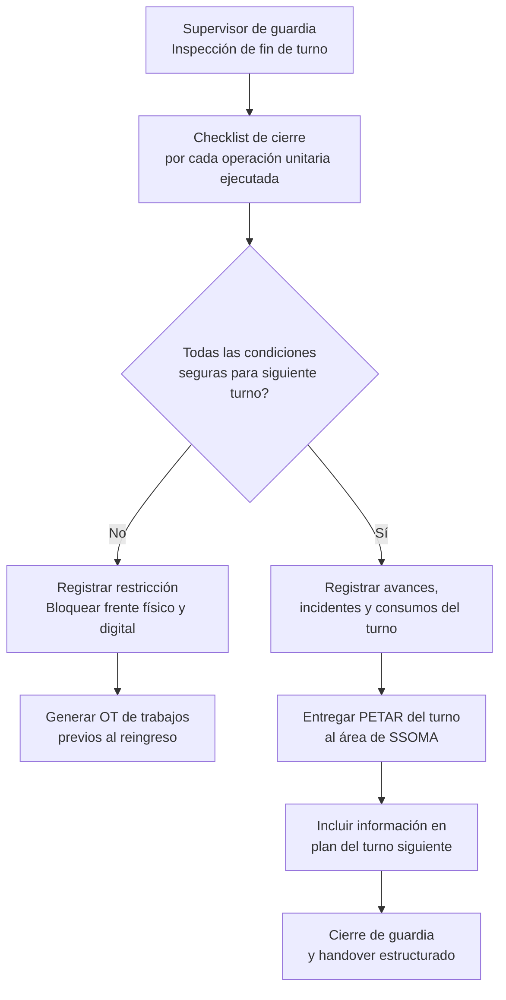

# En mermaid todos los flujos

Aquí tienes los 9 diagramas actualizados en Mermaid, con la nomenclatura regulatoria peruana (PETAR, IPERC Continuo, checklist pre-uso, permiso de reingreso) integrada en cada nodo.

### 1. Perforación

### 2. Voladura (tronadura)

### 3. Carguío

### 4. Acarreo / Transporte

### 5. Sostenimiento / Fortificación

### 6. Ventilación

### 7. Drenaje

### 8. Energía y comunicaciones

### 9. Cierre de frente / fin de turno

Cada flujo refleja los puntos de control normativos (PETAR e IPERC Continuo) discutidos en el detalle previo, listos para que tu equipo de producto los use como base de las reglas de negocio del motor de OT/SSOMA.[^1][^2][^3][^4][^5][^6]

⁂

[^1]: https://consitecperu.com/vocabulario-sst/petar-permiso-escrito-para-trabajos-de-alto-riesgo

[^2]: https://www.osinergmin.gob.pe/seccion/centro_documental/PlantillaMarcoLegalBusqueda/DS-024-2016-EM.pdf

[^3]: https://egcperu.com/seguridad-calidad-medio-ambiente/sector-minero-cuando-aplica-iperc-de-linea-base-iperc-continuo-y-ats/

[^4]: https://www.studocu.com/pe/document/servicio-nacional-de-adiestramiento-en-trabajo-industrial/seguridad-y-prevencion-de-riesgos/seguridad-en-la-ventilacion-de-minas/124487974

[^5]: https://resourcegovernance.org/sites/default/files/Reglamento de Seguridad Minera.pdf

[^6]: https://revistaseguridadminera.com/operaciones-mineras/ventilacion-minera-adecuada-segun-el-reglamento/

