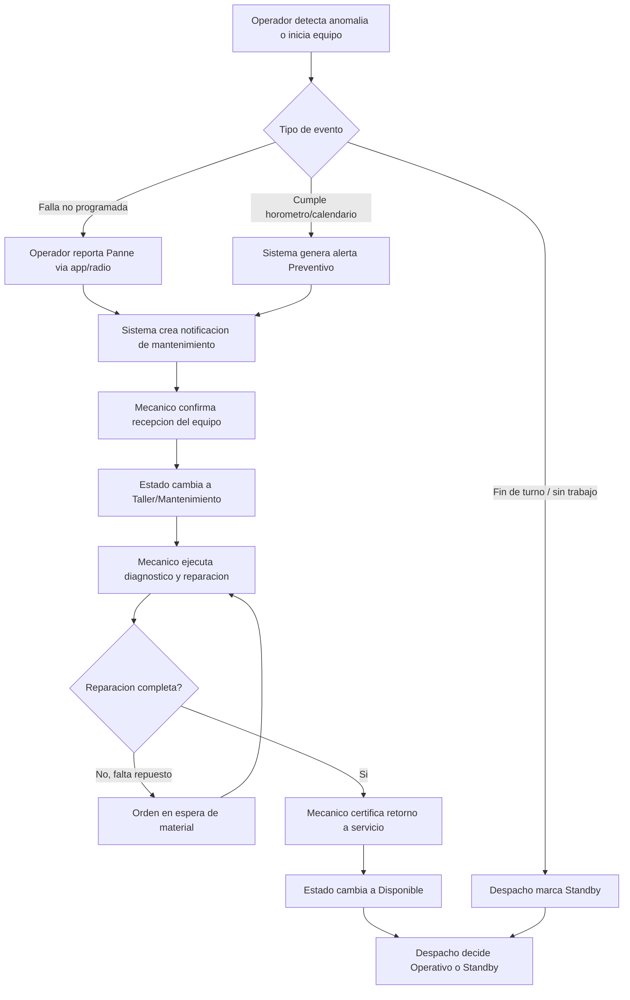
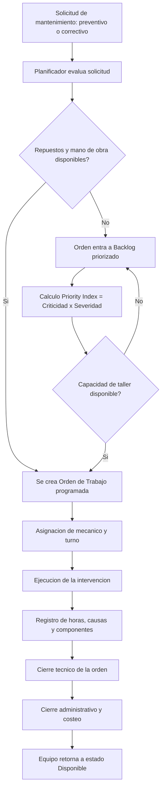
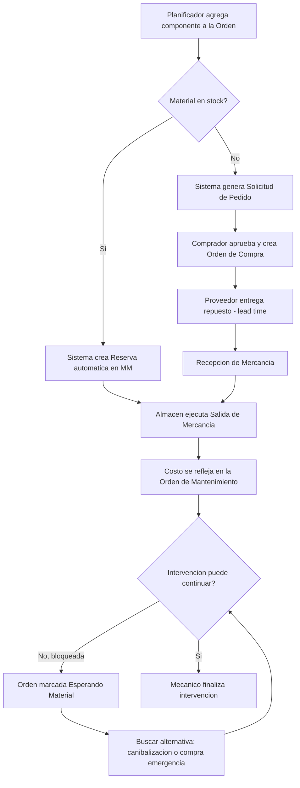
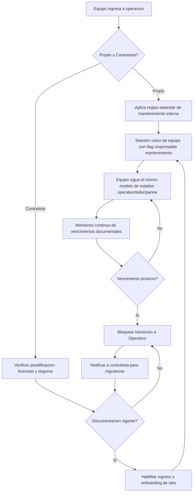
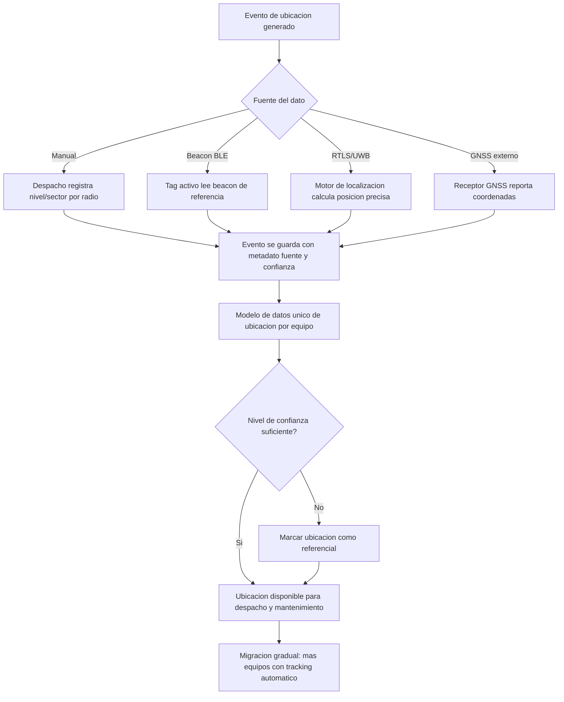
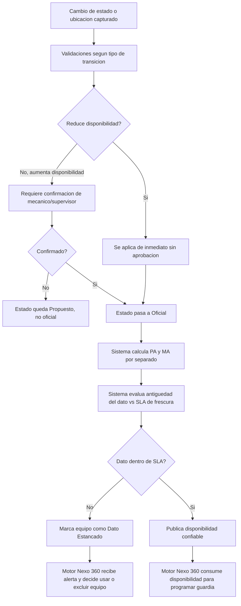

# Flujos Mermaid detallados de los procesos de disponibilidad y mantenimiento de flota minera
Estos diagramas descomponen paso a paso los procesos identificados en la investigación previa, con actores, decisiones y puntos de control explícitos. Cada flujo incluye el diagrama renderizado y el código Mermaid correspondiente para copiar y pegar directamente en cualquier editor compatible (Mermaid Live Editor, GitHub, Notion, Obsidian, etc.).
## Transición de estado de un equipo en tiempo real

Este flujo cubre el ciclo completo: reporte de evento por operador/despacho, apertura de notificación de mantenimiento, confirmación de recepción por el mecánico, ejecución, y retorno certificado a disponibilidad, incluyendo el bloqueo por falta de repuesto.

## Ciclo de vida de la orden de mantenimiento y priorización de backlog

Cubre desde la solicitud (preventiva o correctiva) hasta el cierre administrativo, incluyendo el cálculo del índice de prioridad (criticidad × severidad) cuando la demanda excede la capacidad de taller.

## Integración de repuestos con MM (reserva, compra, bloqueo)

Detalla la creación automática de reserva cuando hay stock, la generación de solicitud de pedido cuando no lo hay, el ciclo de compra/recepción, y el manejo de la intervención bloqueada por falta de material con sus alternativas.

## Gestión diferenciada de equipos propios vs. contratistas

Muestra cómo un mismo modelo de estados operacionales aplica a ambos tipos de equipo, diferenciado por las validaciones de vigencia documental que bloquean la transición a "Operativo" en el caso de contratistas.

## Evolución de ubicación: de registro manual a tracking automatizado

Modela el evento de ubicación con metadato de fuente (manual, BLE, RTLS, GNSS) y nivel de confianza, permitiendo que coexistan múltiples fuentes en el mismo modelo de datos durante la migración gradual.

## Interfaz de disponibilidad consumida por el motor de asignación de Nexo 360

Detalla las validaciones antes de que un cambio de estado se considere "oficial", el cálculo separado de PA/MA, la evaluación de frescura del dato contra el SLA definido, y cómo el motor de asignación recibe o excluye equipos con dato estancado.

## Consideraciones para dimensionamiento técnico
Cada diagrama representa un subsistema con complejidad de desarrollo distinta que debe estimarse por separado:

- El flujo de transición de estado y la interfaz hacia Nexo 360 son el núcleo del módulo "fuente de verdad" — requieren máquina de estados con reglas de permisos por rol, timestamps de auditoría y cálculo en tiempo real de PA/MA.
- El flujo de orden de mantenimiento y backlog requiere motor de reglas de priorización configurable y trazabilidad completa de ciclo de vida (equivalente funcional a un CMMS).
- La integración con MM es la de mayor riesgo de integración externa, dado que depende de disponibilidad de APIs/BAPIs de SAP y de procesos de aprobación que viven parcialmente fuera del sistema (compras, almacén).
- El flujo de contratistas añade una capa de reglas de compliance documental con vencimientos y notificaciones, relativamente independiente del núcleo de disponibilidad.
- El flujo de ubicación es el de menor complejidad inicial (registro manual) pero su arquitectura de datos debe anticiparse desde el día uno para no requerir rediseño al incorporar tracking automatizado.