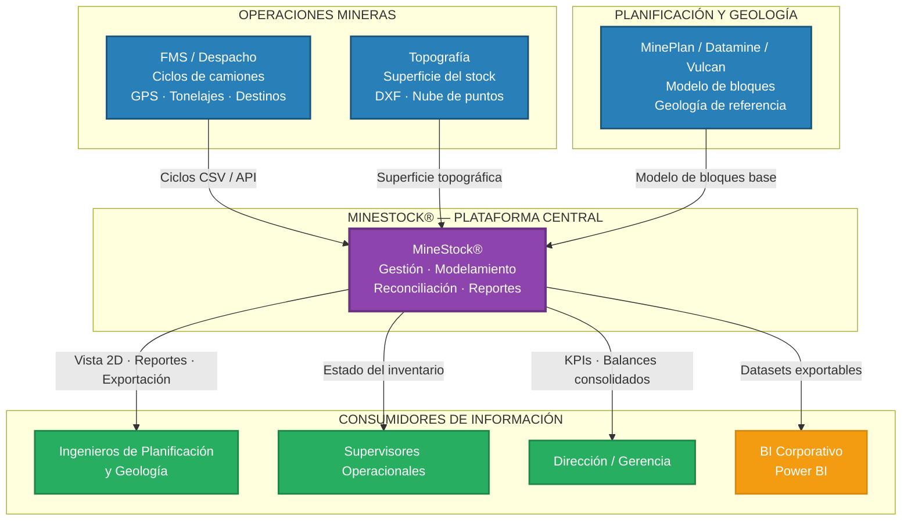
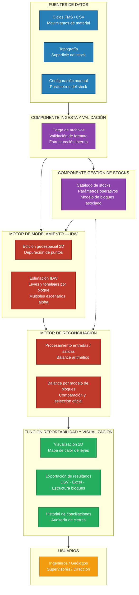
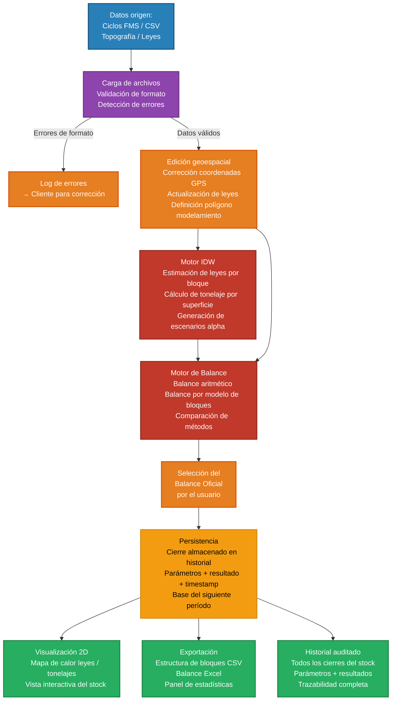
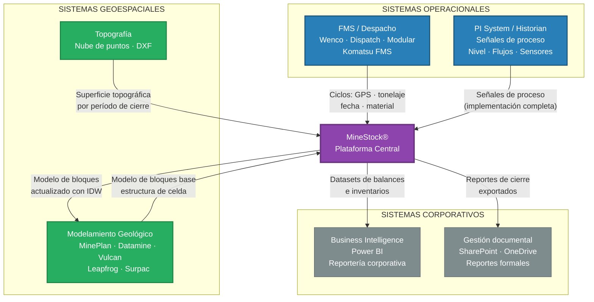

# MineStock® — Arquitectura Empresarial y Funcional

## Documento de Referencia para Equipos de Tecnología, Arquitectura Empresarial y Transformación Digital

**Versión:** 1.0
**Fecha:** 2026-06-05
**Preparado por:** ASTAY Systems
**Clasificación:** Confidencial — uso interno y cliente autorizado

> **Nota sobre alcance:** Este documento describe la arquitectura empresarial y funcional del producto MineStock®. Las integraciones con sistemas externos descritas en la Sección 6 corresponden a capacidades disponibles en implementaciones completas; durante la POC con Chinalco, la carga de información es manual mediante archivos estructurados y la plataforma opera en infraestructura ASTAY.

---

# ANEXO 1 — Arquitectura Empresarial y Funcional

---

## 1. Resumen Ejecutivo

### 1.1 Descripción del producto

**MineStock®** es una plataforma web de gestión, modelamiento y reconciliación de stocks de mineral, desarrollada por ASTAY Systems para operaciones mineras a tajo abierto. Opera como una aplicación web accesible desde navegador estándar — sin instalación en el cliente — y centraliza en una única plataforma la captura de movimientos de material, el modelamiento de leyes por bloques, la reconciliación de inventarios y la generación de reportes de balance.

### 1.2 Problema de negocio que resuelve

Las operaciones mineras gestionan volúmenes significativos de material en tránsito entre el tajo, stocks intermedios y planta de procesamiento. Esta gestión enfrenta problemas estructurales:

| Problema | Consecuencia operacional |
|---------|-------------------------|
| Información de movimientos dispersa en sistemas FMS, planillas y registros manuales | Imposibilidad de cerrar balances de material de forma oportuna y trazable |
| Ausencia de modelamiento integrado de leyes en stock | Incertidumbre en la ley de alimentación a planta; planificación de blend deficiente |
| Reconciliación manual entre tonelaje estimado y superficie topográfica | Alto esfuerzo, baja frecuencia, escasa trazabilidad |
| Falta de historial auditado de cierres y conciliaciones | Sin base para análisis de desvíos ni mejora continua del proceso |
| Herramientas de modelamiento especializadas (Vulcan, Datamine) fuera del alcance del equipo operacional | El conocimiento queda en especialistas; no está disponible en tiempo operacional |

### 1.3 Beneficios principales

- **Centralización operacional**: única plataforma para gestionar stocks, movimientos, leyes y balances — sin dependencia de múltiples herramientas especializadas.
- **Modelamiento accesible**: estimación de leyes por IDW configurable por el equipo operacional, sin requerir licencias de software especializado ni geólogos de modelamiento.
- **Trazabilidad de reconciliaciones**: historial auditado de cada cierre, con los parámetros utilizados, información cargada y resultados generados.
- **Balances comparables**: balance aritmético vs. balance por modelo de bloques, permitiendo evaluar la consistencia entre el método operacional y el modelo espacial.
- **Exportabilidad**: resultados disponibles en formatos estándar para integración con sistemas de reportería, BI y planificación.
- **Visibilidad del inventario de calidad**: distribución de leyes y tonelajes por zona dentro del stock, soportando decisiones de blend y secuenciamiento.

### 1.4 Público objetivo

| Perfil | Uso principal |
|--------|--------------|
| Ingenieros de minas / planificación | Configuración de stocks, ejecución de reconciliaciones, análisis de balances |
| Geólogos de operación | Validación de modelos de bloques, revisión de distribución de leyes |
| Supervisores de operaciones | Seguimiento de inventario, revisión de movimientos por turno/día |
| Jefes de planificación / geología | Análisis de desvíos, toma de decisiones sobre blend y secuencia de extracción |
| Equipos de Transformación Digital / Arquitectura TI | Integración con ecosistema tecnológico de la operación |

---

## 2. Capacidades de Negocio

### CB-01 — Configuración y Gestión de Stocks

| Campo | Descripción |
|-------|-------------|
| **Nombre** | Configuración y Gestión de Stocks |
| **Descripción** | Permite definir y mantener el catálogo de stocks de la operación, con sus parámetros operativos, geológicos y de modelamiento. |
| **Objetivo** | Proveer la estructura base sobre la cual se ejecutan todos los procesos de reconciliación y modelamiento. |
| **Valor para el negocio** | Estandariza la definición de cada stock de la operación, asegura que los parámetros de modelamiento sean consistentes entre períodos y auditables. |
| **Datos requeridos** | Nombre del stock, tipo de material (óxido/sulfuro/mixto), categoría, densidad, altura de lift, rangos de ley, modelo de bloques asociado, coordenadas de extensión (X min/max, Y min/max, Z min/max), tamaño de bloque, rotación/azimut. |
| **Resultados generados** | Stock configurado y disponible para reconciliación; parámetros almacenados como referencia para todos los cierres del stock. |

---

### CB-02 — Carga y Validación de Información Operacional

| Campo | Descripción |
|-------|-------------|
| **Nombre** | Carga y Validación de Información Operacional |
| **Descripción** | Ingesta de registros de movimientos de material (ciclos de camiones), información geológica, superficie topográfica y parámetros de modelamiento desde archivos estructurados. |
| **Objetivo** | Disponibilizar la información operacional en la plataforma para su procesamiento, con validación básica de formato y consistencia. |
| **Valor para el negocio** | Reduce el trabajo manual de consolidación de datos; provee un punto único de ingreso con trazabilidad sobre qué información fue cargada, cuándo y por quién. |
| **Datos requeridos** | Archivos CSV de ciclos/movimientos (coordenadas GPS de carga y descarga, fechas, tonelajes, leyes); superficie topográfica (DXF o compatible); parámetros de stock y modelamiento. |
| **Resultados generados** | Información validada y disponible en plataforma; registros de errores de formato identificados para corrección por el cliente. |

---

### CB-03 — Edición Geoespacial Interactiva

| Campo | Descripción |
|-------|-------------|
| **Nombre** | Edición Geoespacial Interactiva |
| **Descripción** | Visualización y edición manual de puntos GPS de descarga y carga sobre vista 2D, con capacidad de corregir coordenadas, actualizar leyes y definir polígonos de modelamiento. |
| **Objetivo** | Permitir al equipo técnico corregir errores de captura en campo (GPS mal calibrado, coordenadas fuera del stock) antes de ejecutar el modelamiento. |
| **Valor para el negocio** | Elimina un paso crítico de depuración de datos que habitualmente se realiza en hojas de cálculo, reduciendo el tiempo del proceso de cierre y mejorando la trazabilidad de las correcciones aplicadas. |
| **Datos requeridos** | Puntos de descarga/carga procesados desde ciclos cargados; superficie del stock como referencia visual. |
| **Resultados generados** | Conjunto de puntos depurado y validado; polígono de modelamiento definido; correcciones de coordenadas y leyes registradas con trazabilidad. |

---

### CB-04 — Modelamiento de Bloques por IDW

| Campo | Descripción |
|-------|-------------|
| **Nombre** | Modelamiento de Bloques por IDW |
| **Descripción** | Estimación de leyes y atributos por celda del modelo de bloques mediante el algoritmo IDW (Inverso de la Distancia al cuadrado), con parámetros configurables por el usuario. |
| **Objetivo** | Generar una distribución espacial de leyes dentro del stock, más representativa que el promedio aritmético, considerando la posición de cada punto de descarga y su influencia sobre el área circundante. |
| **Valor para el negocio** | Provee una estimación de la heterogeneidad de leyes dentro del stock, soportando decisiones de blend y alimentación diferenciada a planta. Permite comparar múltiples escenarios de modelamiento (variando alpha) sin reprocesar el flujo completo. |
| **Datos requeridos** | Puntos depurados con coordenadas y leyes; superficie topográfica (para cálculo de tonelaje); parámetros IDW: radio de búsqueda, min/max puntos, exponente alpha, polígono de modelamiento. |
| **Resultados generados** | Modelo de bloques con leyes estimadas, tonelajes y atributos por celda; múltiples escenarios comparables; visualización 2D de distribución de leyes. |

---

### CB-05 — Reconciliación de Stocks por Período

| Campo | Descripción |
|-------|-------------|
| **Nombre** | Reconciliación de Stocks por Período |
| **Descripción** | Análisis de entradas y salidas de material para un stock y período definido, generando balances de tonelaje y ley. |
| **Objetivo** | Cuantificar el estado real del inventario al cierre de cada período, comparando el material ingresado con el material extraído y el inventario modelado. |
| **Valor para el negocio** | Provee la base para la reconciliación metalúrgica: cierra el loop entre lo que la mina extrae, lo que se acopia en stock y lo que procesa planta. |
| **Datos requeridos** | Movimientos de entrada (descargas desde tajo) y salida (carguíos a chancadora u otros destinos) para el período; modelo de bloques configurado; parámetros de cierre. |
| **Resultados generados** | Balance de entradas y salidas por período; inventario de cierre; registro auditado del cierre almacenado en historial. |

---

### CB-06 — Balance de Materiales Comparativo

| Campo | Descripción |
|-------|-------------|
| **Nombre** | Balance de Materiales Comparativo |
| **Descripción** | Cálculo y comparación de dos tipos de balance: (1) Balance Aritmético —promedios simples de entradas y salidas— y (2) Balance por Modelo de Bloques —resultado del IDW sobre el área de modelamiento. |
| **Objetivo** | Permitir al equipo técnico comparar la estimación operacional con la estimación espacial y seleccionar el balance oficial del período. |
| **Valor para el negocio** | La comparación entre ambos métodos cuantifica el sesgo de estimación operacional, permitiendo calibrar los procesos de muestreo y captura de datos en campo. El balance oficial queda registrado y es el punto de partida del siguiente período. |
| **Datos requeridos** | Resultados del procesamiento de ciclos; modelo de bloques estimado con IDW (uno o múltiples escenarios con alpha diferente). |
| **Resultados generados** | Balance aritmético del período; balance por modelo de bloques (por escenario); comparación numérica entre métodos; balance oficial almacenado. |

---

### CB-07 — Visualización Geoespacial 2D

| Campo | Descripción |
|-------|-------------|
| **Nombre** | Visualización Geoespacial 2D |
| **Descripción** | Visualización interactiva del modelo de bloques, puntos de carga/descarga, contornos de modelamiento y resultados de distribución de leyes en vista 2D dentro de la plataforma. |
| **Objetivo** | Proveer al equipo técnico una vista espacial del estado del stock que permita identificar heterogeneidades, zonas de alta/baja ley y validar visualmente los resultados del modelamiento. |
| **Valor para el negocio** | Reduce la necesidad de exportar datos a herramientas externas (AutoCAD, MinePlan) para la revisión visual de resultados. Facilita la validación funcional y la comunicación de resultados a la operación. |
| **Datos requeridos** | Modelo de bloques procesado; puntos de descarga/carga; contornos de modelamiento. |
| **Resultados generados** | Vista 2D filtrable por variable (ley Cu, tonelaje, atributos); exportación visual de resultados. |

---

### CB-08 — Reportabilidad y Exportación

| Campo | Descripción |
|-------|-------------|
| **Nombre** | Reportabilidad y Exportación |
| **Descripción** | Generación de archivos exportables con los resultados del modelamiento, balances y conciliaciones ejecutadas durante un período. |
| **Objetivo** | Proveer salidas estándar que permitan integrar los resultados de MineStock® con sistemas de reportería, BI y planificación de la operación. |
| **Valor para el negocio** | Los resultados del cierre quedan disponibles en formatos consumibles por Excel, Power BI, MinePlan u otras herramientas de análisis, sin necesidad de reprocesamiento manual. |
| **Datos requeridos** | Resultados de cualquier proceso ejecutado: modelo de bloques, balance, conciliaciones, historial. |
| **Resultados generados** | Archivos con estructura de bloques (CSV u otro formato disponible); reportes de balance; historial de conciliaciones; panel de estadísticas. |

---

### CB-09 — Historial y Trazabilidad de Conciliaciones

| Campo | Descripción |
|-------|-------------|
| **Nombre** | Historial y Trazabilidad de Conciliaciones |
| **Descripción** | Registro persistente de todos los cierres ejecutados: stock, período, parámetros utilizados, información cargada, método de balance seleccionado y resultados. |
| **Objetivo** | Mantener un registro auditado de la evolución del inventario de cada stock a través del tiempo. |
| **Valor para el negocio** | Habilita el análisis de desvíos entre períodos, la calibración de modelos y la revisión histórica sin depender de archivos locales del usuario. |
| **Datos requeridos** | Parámetros y resultados de cada cierre ejecutado (registrado automáticamente por la plataforma). |
| **Resultados generados** | Historial filtrable de conciliaciones; base para análisis de tendencias y calibración del modelo. |

---

## 3. Procesos de Negocio Soportados

### 3.1 Mapa de procesos soportados

| Proceso de Negocio | Descripción | Capacidades MineStock® involucradas |
|-------------------|-------------|-------------------------------------|
| **Gestión de inventario de material** | Seguimiento del stock disponible en cada punto de acopio: tonelaje, ley media, distribución espacial. | CB-01, CB-02, CB-06, CB-07 |
| **Balance de materiales** | Cuantificación de entradas, salidas e inventario neto por período, con comparación aritmética vs. espacial. | CB-05, CB-06 |
| **Reconciliación de stocks** | Cierre formal del período: cruce entre movimientos operacionales y modelo topográfico/espacial. | CB-02, CB-03, CB-05, CB-06, CB-09 |
| **Modelamiento geológico de stocks** | Estimación de la distribución de leyes dentro del stock usando IDW sobre puntos de descarga. | CB-04, CB-07 |
| **Control de calidad del material apilado** | Seguimiento de la ley media ponderada del inventario y detección de heterogeneidades espaciales. | CB-04, CB-06, CB-07 |
| **Depuración y validación de datos de campo** | Corrección de coordenadas GPS, actualización de leyes, eliminación de puntos anómalos. | CB-03 |
| **Reportabilidad operacional** | Generación de reportes de balance y exportación de resultados para revisión técnica y distribución interna. | CB-08, CB-09 |
| **Auditoría y trazabilidad de cierres** | Revisión del historial de conciliaciones con parámetros y resultados registrados. | CB-09 |

### 3.2 Procesos habilitados con integración completa (producción)

> **Supuesto:** Los siguientes procesos requieren integración automática con sistemas del cliente, disponible en implementación completa — no en POC.

| Proceso extendido                                  | Sistema externo requerido     |
| -------------------------------------------------- | ----------------------------- |
| Ingesta automática de ciclos de camiones           | FMS (Fleet Management System) |
| Actualización automática de superficie topográfica | Sistema de topografía         |
| Carga de modelos de bloques actualizados           | MinePlan / Datamine / Vulcan  |
| Publicación de resultados en BI corporativo        | Power BI                      |

---

## 4. Arquitectura Funcional

### 4.1 Dominios funcionales de la plataforma

MineStock® se organiza en cinco dominios funcionales interconectados:

```
┌─────────────────────────────────────────────────────┐
│           COMPONENTE DE INGESTA DE DATOS            │
│   Carga de archivos · Validación · Estructuración   │
└────────────────────┬────────────────────────────────┘
                     │
         ┌───────────┴───────────┐
         ▼                       ▼
┌────────────────┐     ┌─────────────────────────┐
│  COMPONENTE    │     │  MOTOR DE               │
│  GESTIÓN DE    │     │  MODELAMIENTO IDW       │
│  STOCKS        │     │  Estimación por bloques │
└────────┬───────┘     └──────────┬──────────────┘
         │                        │
         └───────────┬────────────┘
                     ▼
         ┌───────────────────────┐
         │  MOTOR DE             │
         │  RECONCILIACIÓN       │
         │  Balance + Cierre     │
         └───────────┬───────────┘
                     │
         ┌───────────┴───────────┐
         ▼                       ▼
┌────────────────┐     ┌─────────────────────────┐
│  FUNCIÓN       │     │  FUNCIÓN                │
│  VISUALIZACIÓN │     │  REPORTABILIDAD         │
│  2D            │     │  Exportación + Historial│
└────────────────┘     └─────────────────────────┘
```

---

### 4.2 Componente — Ingesta y Preparación de Datos

| Campo | Descripción |
|-------|-------------|
| **Objetivo** | Recibir, validar y estructurar toda la información operacional que alimenta los procesos de modelamiento y reconciliación. |
| **Inputs** | Archivos CSV de ciclos/movimientos; archivos topográficos (DXF o compatible); archivos de leyes geológicas; parámetros de configuración provistos por el usuario. |
| **Procesamiento** | Validación de formato y estructura de archivos; detección de registros incompletos o inconsistentes; estructuración interna de datos para su uso en los dominios posteriores. |
| **Outputs** | Dataset de movimientos validado; superficie topográfica procesada; parámetros de modelamiento almacenados; log de errores de carga para corrección por el cliente. |
| **Dependencias** | Ninguna (es el componente de entrada de la cadena). Calidad de los datos depende del cliente. |

---

### 4.3 Componente — Gestión y Configuración de Stocks

| Campo | Descripción |
|-------|-------------|
| **Objetivo** | Mantener el catálogo de stocks de la operación con sus parámetros operativos y geológicos. |
| **Inputs** | Parámetros del stock ingresados por el usuario: nombre, tipo de material, densidad, lift height, rangos de ley, modelo de bloques asociado, extensión geográfica y tamaño de bloque. |
| **Procesamiento** | Almacenamiento y versionado de parámetros; asociación del stock con modelo de bloques y superficie topográfica; disponibilización del stock para el proceso de reconciliación. |
| **Outputs** | Stock configurado y disponible en la plataforma; parámetros persistidos como referencia para todos los cierres. |
| **Dependencias** | Componente de Ingesta (superficie topográfica y modelo de bloques deben estar cargados). |

---

### 4.4 Motor — Modelamiento de Bloques (IDW)

| Campo | Descripción |
|-------|-------------|
| **Objetivo** | Estimar la distribución espacial de leyes y tonelajes dentro del stock mediante interpolación IDW sobre los puntos de descarga. |
| **Inputs** | Puntos de descarga con coordenadas GPS y leyes (depurados en edición geoespacial); superficie topográfica; parámetros IDW: radio de búsqueda, min/max puntos, alpha, polígono de modelamiento. |
| **Procesamiento** | (1) Determinación de bloques dentro del polígono de modelamiento. (2) Para cada bloque: identificación de puntos vecinos según radio y tipo de búsqueda (circular/elíptico). (3) Estimación de ley promedio ponderada por distancia (peso = 1/d^alpha). (4) Cálculo de tonelaje por bloque usando superficie topográfica o porcentaje de volumen externo (CSV). (5) Asignación de variables categóricas por moda. |
| **Outputs** | Modelo de bloques con leyes estimadas, tonelajes y atributos por celda; uno o múltiples escenarios según variaciones de alpha; disponible para balance y visualización. |
| **Dependencias** | Componente de Ingesta (datos de ciclos y topografía); Componente de Gestión de Stocks (parámetros del stock y estructura del bloque). |

---

### 4.5 Motor — Reconciliación y Balance

| Campo | Descripción |
|-------|-------------|
| **Objetivo** | Ejecutar el cierre del período calculando el balance aritmético y el balance por modelo de bloques, permitiendo seleccionar el balance oficial. |
| **Inputs** | Movimientos de entrada (descargas desde tajo) y salida (carguíos a chancadora u otros destinos) para el período; modelo de bloques estimado; balance del cierre anterior. |
| **Procesamiento** | **Paso 1** — Selección de stock y período: el inicio es el último cierre oficial (no editable); el fin lo define el usuario. **Paso 2** — Procesamiento de entradas y salidas: agrupación de ciclos por fecha, hora y ubicación; identificación de entradas (descargas desde tajo) y salidas (carguíos a chancadora). **Paso 3** — Edición geoespacial de puntos (CB-03). **Paso 4** — Estimación IDW (Motor de Modelamiento). **Paso 5** — Cálculo de dos balances: aritmético (promedios simples) y por modelo de bloques (resultado IDW). **Paso 6** — Selección del balance oficial; almacenamiento en historial. |
| **Outputs** | Balance aritmético del período (tonelaje + ley media); balance por modelo de bloques (uno o más escenarios); inventario de cierre; registro auditado en historial. |
| **Dependencias** | Componente de Ingesta; Componente de Gestión de Stocks; Motor de Modelamiento de Bloques. |

---

### 4.6 Función — Visualización, Reportabilidad y Exportación

| Campo | Descripción |
|-------|-------------|
| **Objetivo** | Proveer visualización 2D interactiva de resultados y exportar información para sistemas de reportería y análisis externos. |
| **Inputs** | Modelo de bloques procesado; resultados de balance; historial de conciliaciones. |
| **Procesamiento** | Renderización del modelo de bloques en visualizador 2D filtrable; generación de estadísticas del stock; preparación de archivos exportables en formatos disponibles. |
| **Outputs** | Vista 2D del stock con distribución de leyes y tonelajes; archivos exportables (estructura de bloques, balances); panel de estadísticas; historial de conciliaciones consultable. |
| **Dependencias** | Todos los dominios anteriores. |

---

## 5. Arquitectura de Información

### 5.1 Fuentes de datos

| Fuente | Tipo | Descripción | Modalidad de carga |
|--------|------|-------------|-------------------|
| **FMS / Sistema de despacho** | Operacional | Ciclos de camiones: coordenadas GPS de carga y descarga, fecha/hora, tonelaje, material, destino. | Manual CSV (POC) / API automática (producción) |
| **Sistema de topografía** | Geoespacial | Superficie topográfica del stock en fecha de cierre. Formato DXF o compatible. | Manual por cierre (POC) / ingesta automática (producción) |
| **Modelo de bloques (MinePlan / Datamine / Vulcan)** | Geológico | Estructura base del modelo de bloques para el stock. | Configuración manual en plataforma |
| **Operador / Usuario** | Manual | Parámetros de stock, polígonos de modelamiento, correcciones de puntos. | Ingreso directo en plataforma |

### 5.2 Entidades principales del modelo de información

| Entidad | Descripción | Atributos clave |
|---------|-------------|-----------------|
| **Stock** | Punto de acopio de material. Unidad central del sistema. | Nombre, tipo de material, categoría, densidad, lift height, rangos de ley, extensión XYZ, tamaño de bloque |
| **Modelo de Bloques** | Grilla tridimensional asociada a un stock. | Nombre, tipo, representación, dimensiones XYZ, tamaño de celda, rotación/azimut, cantidad de bloques |
| **Ciclo / Movimiento** | Registro de un movimiento de camión: entrada o salida del stock. | Fecha/hora, tipo (entrada/salida), coordenadas GPS origen y destino, tonelaje, ley, material |
| **Punto de Descarga** | Localización geoespacial de un ciclo de descarga sobre el stock. | Coordenadas XY, ley(es) asociadas, fecha, estado (validado / corregido / eliminado) |
| **Superficie Topográfica** | DEM o superficie del stock en una fecha dada. | Fecha del levantamiento, formato, extensión, resolución |
| **Conciliación / Cierre** | Registro de un cierre de período para un stock. | Stock, fecha inicio, fecha fin, balance aritmético, balance IDW, parámetros usados, balance oficial seleccionado, usuario, timestamp |
| **Bloque Estimado** | Celda del modelo de bloques con atributos estimados por IDW. | Coordenadas XYZ, ley estimada, tonelaje, atributos, escenario IDW |
| **Escenario IDW** | Configuración de parámetros para una corrida de modelamiento. | Alpha, radio de búsqueda, min/max puntos, tipo de búsqueda, polígono de modelamiento |

### 5.3 Flujos de información

```
[FMS / Ciclos CSV]
        │
        ▼
[Ingesta y Validación] ──→ [Log de errores al cliente]
        │
        ▼
[Edición Geoespacial] ──→ [Puntos depurados + polígono]
        │
        ├──────────────────────────────┐
        ▼                              ▼
[Motor IDW]                    [Procesamiento Aritmético]
[Modelo de Bloques]            [Entradas / Salidas]
        │                              │
        └──────────────┬───────────────┘
                       ▼
              [Motor de Balance]
              [Comparación Aritmético vs. IDW]
                       │
           ┌───────────┴───────────┐
           ▼                       ▼
   [Balance Oficial]        [Historial de
   [almacenado]             Conciliaciones]
           │
           ▼
   [Exportación / Reportes]
   [Visualización 2D]
```

### 5.4 Consumidores de información

| Consumidor | Información consumida | Canal |
|-----------|----------------------|-------|
| Equipo de planificación mina | Balance por período, inventario de cierre, distribución de leyes | Plataforma web + exportación |
| Geólogos de operación | Modelo de bloques, distribución de leyes 2D, escenarios IDW | Plataforma web + exportación |
| Supervisores de turno | Estado del inventario, movimientos del período | Plataforma web |
| Sistemas de BI corporativo | Balances, inventarios, historial de cierres | Exportación CSV/Excel (POC) / API REST (producción) |
| Sistemas de planificación | Modelo de bloques oficial del período | Exportación de estructura de bloques |

---

## 6. Integraciones

> **Nota:** La tabla siguiente describe las integraciones disponibles en una implementación completa de MineStock®. En la POC con Chinalco, **todas las cargas son manuales** mediante archivos estructurados.

| Sistema externo                                 | Tipo de integración                   | Datos consumidos por MineStock®                                                 | Datos generados por MineStock®                                  |
| ----------------------------------------------- | ------------------------------------- | ------------------------------------------------------------------------------- | --------------------------------------------------------------- |
| **FMS** (Wenco, Dispatch, Modular, Komatsu FMS) | API REST / Archivo CSV                | Ciclos de camiones: GPS origen/destino, fecha/hora, tonelaje, material, destino | —                                                               |
| **Sistema de topografía**                       | Archivo (DXF, CSV nube de puntos)     | Superficie topográfica del stock por fecha de levantamiento                     | —                                                               |
| **MinePlan / Datamine / Vulcan**                | Archivo de exportación (CSV, DXF, DM) | Modelo de bloques base para configuración del stock                             | Modelo de bloques actualizado con estimaciones IDW              |
| **Power BI**                                    | Conector ODBC                         | —                                                                               | Balances, inventarios, historial de cierres, modelos de bloques |
| **SharePoint / OneDrive**                       | Archivo                               | —                                                                               | Reportes de cierre exportados en PDF/Excel                      |

---

## 7. Flujo End-to-End

### 7.1 Descripción paso a paso

El flujo completo de MineStock®, desde los datos de origen hasta los reportes finales, se describe a continuación:

---

**FASE 1 — Preparación del período (actividad previa al cierre)**

1. El responsable de planificación / geología accede a MineStock® desde navegador web.
2. Verifica que el stock a conciliar esté configurado con los parámetros vigentes (densidad, rangos de ley, modelo de bloques asociado).
3. Si hay cambios en la infraestructura (nuevo modelo de bloques, nuevo topográfico), los carga mediante archivo antes de iniciar el cierre.

---

**FASE 2 — Carga de información operacional**

4. Se descarga del FMS (o se prepara manualmente) el archivo CSV de ciclos del período a conciliar: registros de descarga en el stock (entradas) y carguíos desde el stock (salidas), con coordenadas GPS, tonelajes y leyes disponibles.
5. Se carga el archivo CSV de ciclos en MineStock®. El sistema valida formato, detecta registros incompletos y genera un log de errores si aplica.
6. Si hay leyes de laboratorio disponibles para el período, se carga el archivo correspondiente.
7. Se carga la superficie topográfica actualizada del stock si está disponible para el período.

---

**FASE 3 — Validación y depuración geoespacial**

8. El sistema muestra en vista 2D los puntos GPS de descarga y carguío sobre la extensión del stock.
9. El usuario revisa visualmente los puntos: detecta puntos fuera del polígono del stock, coordenadas anómalas o leyes inconsistentes.
10. Corrige coordenadas y leyes directamente en la vista 2D. Elimina puntos inválidos. Define el contorno/polígono de modelamiento.
11. Las correcciones quedan registradas con trazabilidad (usuario, timestamp, valor original vs. corregido).

---

**FASE 4 — Modelamiento IDW**

12. El usuario configura los parámetros IDW para el cierre: radio de búsqueda, min/max puntos por bloque, exponente alpha, tipo de búsqueda (circular/elíptico).
13. El sistema ejecuta el algoritmo IDW: para cada bloque dentro del polígono, identifica los puntos vecinos dentro del radio, estima la ley ponderada por distancia y calcula el tonelaje usando la superficie topográfica.
14. Opcionalmente, el usuario genera múltiples escenarios variando alpha (p.ej. alpha=2 y alpha=3) para comparar resultados antes de seleccionar el modelo oficial.
15. Los resultados del modelamiento se muestran en vista 2D como mapa de calor de leyes y tonelajes.

---

**FASE 5 — Cálculo de balance y selección del cierre oficial**

16. El sistema calcula automáticamente dos balances para el período:
    - **Balance Aritmético**: promedio simple de leyes ponderado por tonelaje de los ciclos.
    - **Balance por Modelo de Bloques**: tonelaje y ley derivados del IDW.
17. El usuario compara ambos balances en pantalla. Analiza las diferencias. Puede volver a editar puntos o ajustar parámetros IDW si la diferencia es excesiva.
18. Selecciona el balance oficial del período. Este balance queda almacenado como punto de inicio del siguiente período (no modificable).

---

**FASE 6 — Revisión, exportación y distribución**

19. El usuario revisa el modelo de bloques en el visualizador 2D filtrable.
20. Exporta los resultados en los formatos disponibles: estructura de bloques (CSV), balance del período (Excel), estadísticas del stock.
21. El cierre queda registrado en el historial de conciliaciones con todos sus parámetros, información utilizada y resultados.
22. Los archivos exportados se distribuyen a los equipos de planificación, geología y dirección; o se publican en BI corporativo.

---

# ANEXO 2 — Diagrama de arquitectura empresarial

---

## Diagrama 1 — Contexto Empresarial



---

## Diagrama 2 — Arquitectura Funcional



---

## Diagrama 3 — Flujo de Información End-to-End



---

## Diagrama 4 — Ecosistema de Integración



---

## Diagrama 5 — Mapa de Capacidades de Negocio

```mermaid
flowchart TD
    classDef cap1 fill:#2980b9,color:#fff,stroke:#1a5276,stroke-width:1px
    classDef cap2 fill:#8e44ad,color:#fff,stroke:#6c3483,stroke-width:1px
    classDef cap3 fill:#c0392b,color:#fff,stroke:#922b21,stroke-width:1px
    classDef cap4 fill:#27ae60,color:#fff,stroke:#1e8449,stroke-width:1px
    classDef cap5 fill:#f39c12,color:#000,stroke:#d68910,stroke-width:1px
    classDef cap6 fill:#7f8c8d,color:#fff,stroke:#616a6b,stroke-width:1px
    classDef grupo fill:#ecf0f1,color:#2c3e50,stroke:#bdc3c7,stroke-width:2px

    subgraph CAPTURA["CAPTURA DE DATOS"]
        C1["CB-02
        Carga de archivos
        estructurados"]:::cap1
        C2["CB-03
        Edición geoespacial
        interactiva"]:::cap1
        C3["Validación y
        depuración de
        datos de campo"]:::cap1
    end

    subgraph GESTION["GESTIÓN DE STOCKS"]
        G1["CB-01
        Configuración de
        stocks y parámetros"]:::cap2
        G2["CB-09
        Historial y
        trazabilidad de
        conciliaciones"]:::cap2
        G3["Control de
        inventario por
        punto de acopio"]:::cap2
    end

    subgraph MODELAMIENTO["MODELAMIENTO ESPACIAL"]
        M1["CB-04
        Estimación IDW
        de leyes por bloque"]:::cap3
        M2["Modelamiento
        multi-escenario
        (alpha variable)"]:::cap3
        M3["Visualización
        2D distribución
        de leyes"]:::cap3
    end

    subgraph RECONCILIACION["RECONCILIACIÓN"]
        R1["CB-05
        Reconciliación
        de stocks por período"]:::cap4
        R2["CB-06
        Balance comparativo
        aritmético vs. IDW"]:::cap4
        R3["Selección y registro
        de balance oficial
        auditado"]:::cap4
    end

    subgraph ANALITICA["ANALÍTICA OPERACIONAL"]
        A1["CB-07
        Visualización 2D
        interactiva"]:::cap5
        A2["CB-09
        Análisis de desvíos
        entre períodos"]:::cap5
        A3["Panel de control
        y estadísticas
        del stock"]:::cap5
    end

    subgraph REPORTABILIDAD["REPORTABILIDAD"]
        P1["CB-08
        Exportación de
        resultados (CSV/Excel)"]:::cap6
        P2["Reportes de balance
        por período"]:::cap6
        P3["Integración con BI
        corporativo"]:::cap6
    end

    CAPTURA --> GESTION
    CAPTURA --> MODELAMIENTO
    GESTION --> RECONCILIACION
    MODELAMIENTO --> RECONCILIACION
    RECONCILIACION --> ANALITICA
    RECONCILIACION --> REPORTABILIDAD
    ANALITICA --> REPORTABILIDAD
```



---

## Oportunidades de integración y escalabilidad

### Integración automática (producción post-POC)

| Oportunidad                                      | Sistema                        | Valor operacional                                                              |
| ------------------------------------------------ | ------------------------------ | ------------------------------------------------------------------------------ |
| Ingesta automática de ciclos FMS                 | FMS vía API o SFTP             | Elimina carga manual; cierre del período en horas en lugar de días             |
| Actualización automática de topografía           | Software de topografía | Cierre topográfico sin intervención manual; mayor frecuencia de reconciliación |
| Publicación de KPIs en BI corporativo            | Power BI vía API REST          | Visibilidad de inventario y balance en dashboards de gerencia                  |
| Retroalimentación al modelo de bloques geológico | MinePlan / Datamine            | El IDW operacional retroalimenta el modelo geológico de largo plazo            |

### Escalabilidad del producto

| Dimensión | Estado POC | Estado producción |
|-----------|-----------|-------------------|
| Número de stocks | Acotado (casos de uso definidos) | Ilimitado según licencia |
| Períodos históricos | Solo período de prueba | Histórico completo desde inicio del sistema |
| Usuarios | Limitado a participantes POC | Todos los perfiles operacionales de la mina |
| Integración de datos | Manual (archivos CSV/DXF) | Automática vía APIs y conectores |
| Despliegue | ASTAY infrastructure (POC) | On-Premise o cloud (según acuerdo de licencia) |
| Funciones adicionales | Solo funciones del POC | Funciones avanzadas según edición de licencia |

---

*Preparado por: Juan Mansilla — ASTAY Systems*
*Fecha: 2026-06-05*
*Fuente base: Borrador Propuesta Técnica POC MineStock® — Minera Chinalco Perú S.A. (PT-MCP-001-2026)*
*Clasificación: Confidencial*
