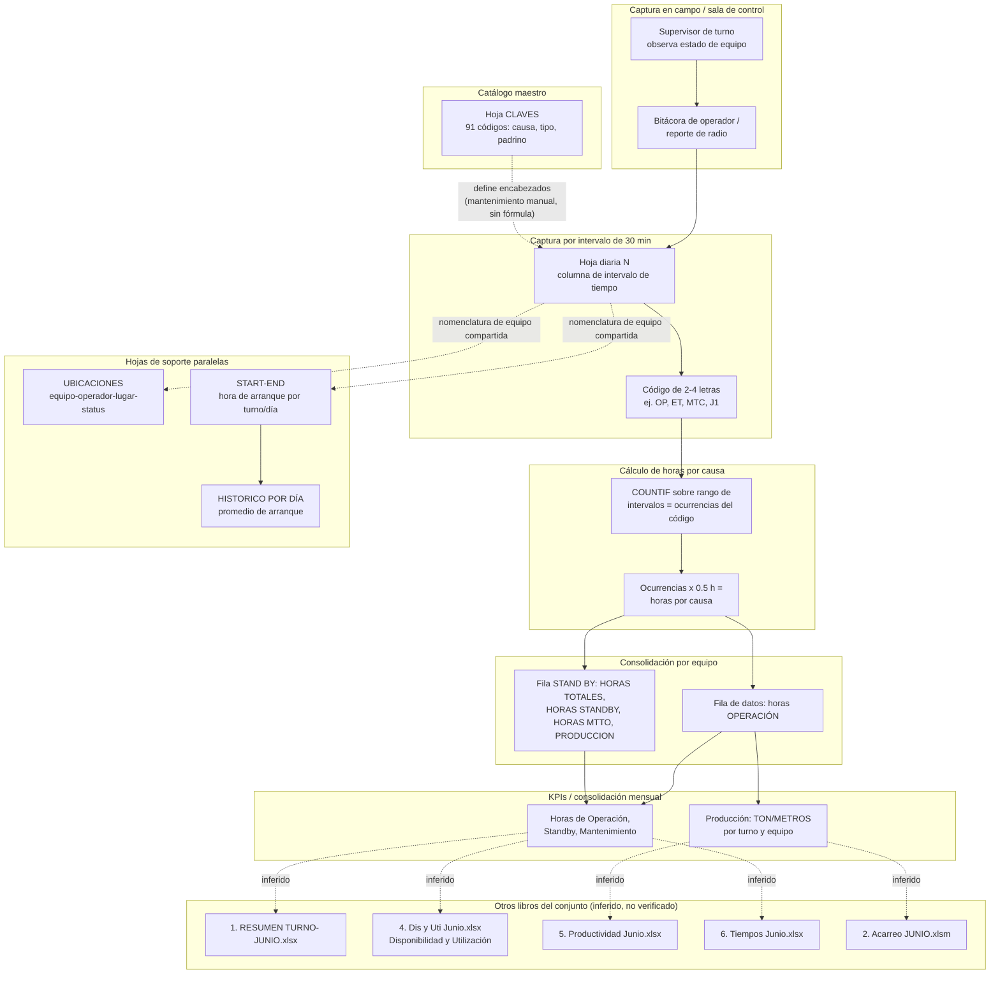

# Análisis Técnico del Libro "1. Demoras Junio.xlsx"

**Empresa:** CAPSTONE GOLD S.A. DE C.V. (nombre confirmado en celda de la hoja "Hoja2"; se infiere posible vínculo con el proyecto minero subterráneo Cozamin, Zacatecas, México, sin confirmación documental directa dentro de este archivo — requiere validación con el usuario de negocio).
**Periodo de datos:** junio de 2026 (fechas confirmadas en hojas UBICACIONES, START-END e HISTORICO POR DÍA).
**Archivo analizado:** `1. Demoras Junio.xlsx` (37 hojas, ~6.9 MB).
**Fecha de este análisis:** 2 de julio de 2026.

---

## Resumen ejecutivo

El libro "1. Demoras Junio.xlsx" es el **registro operacional diario de demoras (paros y tiempos improductivos) de la flota de equipos mina** de una operación subterránea de oro/cobre, correspondiente al mes de junio de 2026. Su función central es capturar, para cada equipo y cada intervalo de 30 minutos de los dos turnos de trabajo (primera y segunda), un código de 2 a 4 letras que describe el estado del equipo (operación, tránsito, standby, falla mecánica, falla eléctrica, falta de insumos, causas operativas diversas, etc.), y a partir de ello calcular automáticamente, mediante fórmulas `COUNTIF`, las horas acumuladas por causa y los totales de horas de operación, standby y mantenimiento por equipo y por turno.

El libro contiene **31 hojas diarias** (una por día del mes, "1" a "31"), cada una estructurada como una matriz ancha de aproximadamente 151 columnas por hasta ~110 filas de equipos, más **6 hojas de soporte/maestro**: CLAVES (catálogo de causas de demora), UBICACIONES (asignación diaria de equipo-operador-lugar), START-END (hora de arranque por equipo/turno/día), HISTORICO POR DÍA (promedio de arranque agregado), LISTA DE CONTACTOS (directorio telefónico con una tabla de producción residual no relacionada) y Hoja2 (área de cálculo/borrador).

Se confirmó la existencia de un **catálogo formal de 91 códigos de demora** (columna CLAVES), clasificados en tres tipos: OPERATIVA, MECANICA y ELECTRICA, cada uno con un "padrino" o responsable asignado por familia de equipo (scoops, jumbos, solos, ancladores, tumi, servicios). Las fórmulas de la hoja diaria usan `COUNTIF` sobre el rango de intervalos de 30 minutos comparando contra el código de cada causa, multiplicado por 0.5 horas, lo que **confirma matemáticamente el mecanismo de conversión de eventos discretos (código por intervalo) a horas acumuladas**.

**No se encontró evidencia de lógica de merma, dilución, recuperación metalúrgica, ley de mineral o reconciliación de tonelaje** dentro de este libro. El libro registra tiempos y, de forma secundaria, avances en metros/toneladas por turno, pero no contiene cálculos de balance metalúrgico. Se detectó además un error de fórmula (`#REF!`) en la hoja "LISTA DE CONTACTOS", evidencia de fragilidad y de contenido probablemente heredado de otro libro.

---

## Propósito del libro

El libro cumple la función de **bitácora operativa diaria de campo (control de sala / control de operaciones mina)** para registrar, turno a turno y equipo a equipo, el estado de cada máquina en intervalos de 30 minutos durante el mes de junio de 2026. Su propósito de negocio es:

1. Capturar en campo (o en sala de control) el código de estado de cada equipo cada media hora.
2. Convertir automáticamente esos códigos en horas de Operación, Standby y Mantenimiento por causa específica.
3. Servir de fuente/insumo para reportes derivados de disponibilidad, utilización, productividad y tiempos, que aparentemente se consolidan en otros libros del mismo conjunto documental (ver sección de flujo de negocio).
4. Asignar trazabilidad y responsabilidad ("padrino") por causa de demora y familia de equipo, para gestión de causas raíz y seguimiento gerencial.

---

## Áreas o procesos involucrados

- **Operaciones mina / control de sala**: captura de datos por turno, códigos de estado de equipos.
- **Mantenimiento mina (mecánico y eléctrico)**: causas de demora tipo MECANICA y ELECTRICA, con padrinos de mantenimiento.
- **Planeación / Ingeniería de minas**: seguimiento de avances (metros de desarrollo, sección 1/sección 2, budget vs. forecast) visible en la cabecera de cada hoja diaria.
- **Recursos Humanos / asignación de personal**: columna OPERADOR/LUGAR, hoja UBICACIONES con operador asignado por turno.
- **Supervisión y gerencia de producción**: columnas de TON/METROS, PRODUCCION, y agregados de MINERAL/MANTEO/ACARREO en Hoja2.
- **Administración / directorio interno**: hoja LISTA DE CONTACTOS (función auxiliar, no operativa).

---

## Inventario de pestañas

| Nombre de hoja | Tipo / Rol | Diaria o especial | Estado |
|---|---|---|---|
| "1" a "31" | Registro diario de demoras por equipo e intervalo de 30 min (turno 1ra y 2da) | 31 hojas diarias (una por día del mes) | Visible |
| CLAVES | Catálogo maestro de códigos de demora (causa, clave, tipo, padrino por familia) | Especial (maestro) | Visible |
| UBICACIONES | Registro diario de ubicación, pueble y operador asignado por equipo y turno | Especial (maestro/soporte) | Visible |
| START-END | Matriz de hora de arranque de cada equipo por turno y día del mes | Especial (maestro/soporte) | Visible |
| HISTORICO POR DÍA | Cálculo agregado de hora promedio de arranque por turno y día | Especial (agregado/derivado) | Visible |
| LISTA DE CONTACTOS | Directorio telefónico + tabla residual de producción/lavados/barrenados SOLO (no relacionada) | Especial (mixta / "cajón de sastre") | Visible |
| Hoja2 | Área de cálculo/borrador con totales sueltos (mineral, manteo, acarreo, personal por empresa/contratista) | Especial (borrador) | Visible |

Todas las 37 hojas están marcadas como visibles (`sheet_state = visible`); no se detectaron hojas ocultas o muy ocultas en el archivo.

**Observación de tamaño:** las hojas diarias no tienen un número de filas idéntico. La mayoría usa 112 filas, pero se detectaron variaciones: hoja "7" con 147 filas, hoja "11" con 122, hoja "15" con 118, hoja "24" con 135, hoja "30" con 119 y hoja "31" con 116. Esto sugiere que en ciertos días se agregaron filas adicionales (equipos extra, notas, o filas insertadas manualmente), lo cual se documenta como riesgo de consistencia en la sección correspondiente.

---

## Análisis detallado por pestaña

### Patrón común de las 31 hojas diarias ("1" a "31")

Cada hoja diaria comparte una plantilla estructural verificada por muestreo en las hojas "1", "15" y "30" (no adyacentes), confirmando encabezados idénticos en fila 1 y fila 8 en las tres muestras.

**Bloque de cabecera (filas 1-6, columnas C-X aprox.):**
- Título "CAPTURAR DATOS DEL SEGUIMIENTO AL PLAN".
- Sub-bloques PRIMERA y SEGUNDA con columnas SECCIÓN 1, SECCIÓN 2, TOTAL y METROS DLLOS (metros desarrollados), es decir avance de desarrollo por turno.
- Columnas Budget 1ra / Forecast 1ra / Budget 2da / Forecast 2da: comparación de avance planeado vs. logrado por turno.
- TOTAL AVANCES, TOTAL SECCION 1, TOTAL SECCION 2: agregados del día.
- Fila 2, columna C: texto libre "UBICACIÓN: [código de labor]" (ej. "AC92"), variable día a día.

**Bloque principal — matriz de equipos x tiempo (a partir de fila 7):**
- Fila 5: encabezado "FAMILIA / EQUIPOS" (columna A) y "DISTRIBUCION DE TIEMPOS" (columna C).
- Fila 7: encabezados de sub-bloques — "SCOOP TRAMS" (columna A, primera familia), "OPERADOR / LUGAR", "COMENTARIOS", "TURNO DE PRIMERA" (columnas G-Z), "TON/METROS" (columna AA), luego se repite para "TURNO DE SEGUNDA" (columnas AF-AY aprox.) con su propio "TON/METROS", y finalmente los bloques "OPERACIÓN" (inicio de columnas de totales por código, col. 53), "MECANICAS" (col. 91) y "ELECTRICAS" (col. 124).
- Fila 8: encabezados de detalle — horas de intervalo de 30 minutos desde las 08:00 hasta las 17:30 (turno primera, columnas G-Z) y desde las 20:00 hasta las 05:30 del día siguiente (turno segunda, columnas AF-AY), seguidas de los ~91 códigos abreviados de causa (columnas BA en adelante) que replican el catálogo de la hoja CLAVES, y finalmente las columnas resumen: OPERACIÓN, STAND BY, MTTO, HORAS TOTALES, HORAS STANDBY, HORAS MTTO, PRODUCCION.

**Cada equipo ocupa dos filas consecutivas:**
1. **Fila de datos (impar dentro del par, ej. fila 9 para ST-07, fila 11 para ST-10):** columna A = ID del equipo (ej. ST-07, ST-10, ST-12…); columna C = nombre del operador; columna D = hora u observación de inicio; columnas G-Z y AF-AY = código de 2-4 letras por intervalo de 30 minutos (ej. "J1", "OP", "ET", "TP"); columnas AA/AZ = TON/METROS logrados en el turno; columnas BA en adelante = conteo de horas por código (fórmula `COUNTIF`); columnas de resumen = horas de Operación y de Producción de esa fila.
2. **Fila "STAND BY" (par, ej. fila 10, fila 12):** repite en columnas C/D el rótulo "STAND BY"; en las columnas de intervalo de tiempo (G-Z, AF-AY) contiene la **traducción en texto largo** del código de la fila anterior (ej. "Operación", "Equipo en transito", "Traslado de personal", "Stand by") — funciona como fila de apoyo visual/legible, no como dato primario; en columnas de resumen consolida HORAS TOTALES, HORAS STANDBY, HORAS MTTO y PRODUCCION del equipo, sumando ambas filas del par.

**Familias de equipo identificadas** (columna A, agrupadas verticalmente): SCOOP TRAMS (ST-07, ST-10, ST-12, ST-15 a ST-21), BARRENACION LINEAL (JUMBO-01 a 03), BARRENACION LARGA (SOLO-01 a 05), TUMI, ANCLADORES (ANCLADOR-03,04,06,07,08), EQUIPOS DE SERVICIOS (TELEHANDLER-01/02/03, RETRO-EXCAVADORA-02/03, EPAUS-01/02, GETMAN, MACLEAN), y un bloque adicional "BARENOS/METROS/MALLAS REPORTADAS CADA DOS HORAS" para los jumbos.

**Códigos observados en celdas de datos:** J1 (posible inicio/fin de jornada o standby de arranque, coincide con clave "Stand by" del catálogo), OP (Operación), ET (Equipo en tránsito), TP (Traslado de personal), MTC (Mantenimiento correctivo), ME1 (Mantenimiento programado), FUGA (Fuga de aceite), D1 (Reposición de diesel/aceite), entre otros — todos trazables al catálogo CLAVES (ver tabla siguiente).

**Unidades de medida:** horas (fraccionadas en bloques de 0.5 h) para todas las columnas de tiempo; metros o toneladas para la columna TON/METROS y PRODUCCION (unidad ambigua, depende del tipo de equipo — desarrollo vs. acarreo — no se encontró un rótulo que distinga metros de toneladas de forma sistemática).

**Granularidad:** intervalo de 30 minutos por equipo, por turno, por día. Cada hoja = 1 día natural, con dos turnos (primera ~08:00-17:30, segunda ~20:00-05:30 del día siguiente).

**Dependencias con otras pestañas:** aparentemente los códigos abreviados de las columnas BA en adelante y el encabezado de fila 8 replican manualmente el catálogo de la hoja CLAVES (no se detectó fórmula de referencia cruzada tipo `VLOOKUP` hacia CLAVES; el contenido parece copiado/mantenido en paralelo). Los nombres de equipo (columna A) son consistentes con los usados en UBICACIONES y START-END, sugiriendo una lista maestra de equipos compartida informalmente, no vía fórmula.

**Fuente de datos probable:** captura manual en campo o en sala de control por parte del capataz/supervisor de turno, posiblemente transcrita desde bitácoras de operador o reportes de radio, dado el patrón de texto libre en columnas COMENTARIOS y OPERADOR/LUGAR.

**Salidas/reportes que alimenta:** se infiere, sin confirmarlo directamente (no se analizaron esos libros), que esta hoja es insumo de "4. Dis y Uti Junio.xlsx" (disponibilidad y utilización) y "6. Tiempos Junio.xlsx" (tiempos), dado que las columnas OPERACIÓN, STAND BY y MTTO son los tres componentes clásicos de un cálculo de disponibilidad mecánica y utilización efectiva. También podría alimentar "5.Productividad Junio.xlsx" a través de la columna PRODUCCION/TON-METROS. Esta relación es una inferencia razonable basada en nomenclatura de archivos del mismo directorio, **no fue verificada abriendo esos libros**.

---

### Hoja CLAVES

**Descripción funcional:** catálogo maestro (diccionario) de causas de demora y su clasificación, con asignación de responsable ("padrino") por familia de equipo/rol.

**Estructura de columnas (fila de encabezado en fila 2):**

| Columna | Campo |
|---|---|
| B | NUMERO (correlativo, con nota "mantenerlo ordenado de menor a mayor") |
| C | DEMORAS (descripción de la causa) |
| D | CLAVE (código de 2-4 letras) |
| E | TIPO (OPERATIVA / MECANICA / ELECTRICA) |
| H-N | Nombre del "padrino" por familia de operador: OPERADOR DE SCOOPS, OPERADOR DE JUMBO, OPERADOR DE SOLO, OPERADOR DE ANCLADOR, OPERADOR TUMI, SERVICIOS, PADRINOS |
| P-W | Segundo bloque de responsables por área: ACARREO, DESARROLLOS, BL, NITRO, CAPITANES, CAP. SR, SERVICIOS MINA, PASTA |

**Granularidad:** un registro por código de causa (no por fecha ni por equipo).

**Flujo asumido:** es la tabla de referencia usada para definir manualmente los encabezados de código en la fila 8 de cada hoja diaria y para asignar responsabilidad de seguimiento por causa.

**Dependencias:** alimenta conceptualmente (sin fórmula activa detectada) los encabezados de las hojas diarias.

**Fuente de datos probable:** definida y mantenida por el área de planeación/gerencia de mina; requiere actualización manual cuando se agregan nuevas causas o cambian responsables.

**Salidas que alimenta:** sirve de leyenda para todos los reportes derivados de este libro y probablemente de los otros libros del conjunto (Tiempos, Dis y Uti).

**Riesgo detectado:** al final de la tabla (fila ~95 en adelante) aparecen filas anómalas: una fila con valor "FIN" repetido en las cuatro columnas, dos filas duplicadas con contenido "OP, AB, AR, AM" (parecen ser residuos de copia/pegado o pruebas), y una fila final con valores booleanos `True` en las cuatro columnas — evidencia de que la hoja tiene "basura" residual al final que debe limpiarse. Además, dos causas (CD1 "Conector dañado" y FGE "Falla general eléctrica") tienen NUMERO vacío (`None`), rompiendo la correlatividad numérica.

**Catálogo completo de códigos identificados (91 registros válidos + 2 sin número):**

| # | Descripción (DEMORAS) | Clave | Tipo |
|---|---|---|---|
| 1 | Operación | OP | OPERATIVA |
| 2 | Acceso bloqueado | AB | OPERATIVA |
| 3 | Amacice / Regado | AR | OPERATIVA |
| 4 | Amacice mecanizado | AM | OPERATIVA |
| 5 | Cambio de Pueble | CL | OPERATIVA |
| 6 | Cargado de voladuras | CV | OPERATIVA |
| 7 | Equipo en transito | ET | OPERATIVA |
| 8 | Falta de acero | FA | OPERATIVA |
| 9 | Falta de energia | FE | OPERATIVA |
| 10 | Falta de limpia | FL | OPERATIVA |
| 11 | Falta de material | FM | OPERATIVA |
| 12 | Falta de operador / ayudante | FO | OPERATIVA |
| 13 | Falta de planilla | FP | OPERATIVA |
| 14 | Falta de Soporte | FSP | OPERATIVA |
| 15 | Falta de agua | FA1 | OPERATIVA |
| 16 | Falta de aire | FA2 | OPERATIVA |
| 17 | Ingenierias (TOP,MDR,GEO) | TGM1 | OPERATIVA |
| 18 | Instalacion/desinstalacion de equipo | IE | OPERATIVA |
| 19 | Operador de incapacidad | OI | OPERATIVA |
| 20 | Operador de vacaciones | OV | OPERATIVA |
| 21 | Rezagado | R1 | OPERATIVA |
| 22 | Servicios (Acoplamiento) | SER1 | OPERATIVA |
| 23 | Stand by | J1 | OPERATIVA |
| 24 | Traslado de personal | TP | OPERATIVA |
| 25 | Ventilacion/Gas | VE1 | OPERATIVA |
| 26 | Zarpeo | ZP | OPERATIVA |
| 27 | Daño por operador | DO1 | OPERATIVA |
| 28 | Desagüe | DS | OPERATIVA |
| 29 | Espera de Área | EA | OPERATIVA |
| 30 | Cambio de ploga | CPL | OPERATIVA |
| 31 | Barras Atoradas | BA1 | OPERATIVA |
| 32 | Area inestable | AI | OPERATIVA |
| 33 | Sondeo | S1 | OPERATIVA |
| 34 | Ventilador dañado | VD | OPERATIVA |
| 35 | Investigacion | INV | OPERATIVA |
| 36 | Libranza | L1 | OPERATIVA |
| 37 | Movimiento de extensión | EXT1 | OPERATIVA |
| 38 | Falta de ganchos dieléctricos | GDIE | OPERATIVA |
| 39 | Alineacion | AL1 | MECANICA |
| 40 | Baterias descargadas | BD | MECANICA |
| 41 | Cable de Avance/Retroceso | CAR | MECANICA |
| 42 | Clima dañado | CM | MECANICA |
| 43 | Cambio de centralizador | CAC | MECANICA |
| 44 | Cambio de Joystick | CAJ | ELECTRICA |
| 45 | Cambio de filtros/valvulas/Palanca/Nariz | CAFV | MECANICA |
| 46 | Cambio de Zanco/BARRA | CZ | MECANICA |
| 47 | Cilindro dañado | CD | MECANICA |
| 48 | Daño de acumulador/compresor | DA | MECANICA |
| 49 | Daño de Neumatico | DN | MECANICA |
| 50 | Daño de Perforadora | DP | MECANICA |
| 51 | Estabilizadores/Stinger/Patines | EST1 | MECANICA |
| 52 | Falla en el turbo | FT | MECANICA |
| 53 | Falla en sistema ANSUL | ANS | MECANICA |
| 54 | Fuga de aceite | FUGA | MECANICA |
| 55 | Lubricacion y Engrasado | LE | MECANICA |
| 56 | Mangueras | FMG | MECANICA |
| 57 | Mangueron / Tubo de bolis | MTB | MECANICA |
| 58 | Mantenimiento Programado | ME1 | MECANICA |
| 59 | Mordazas | MOR1 | MECANICA |
| 60 | Motor Diesel | MD1 | MECANICA |
| 61 | Reposición de Diesel / Aceite | D1 | MECANICA |
| 62 | Reposición de soldadura | RS1 | MECANICA |
| 63 | Sensor Mecanico | SM1 | MECANICA |
| 64 | Tornilleria | TOR1 | MECANICA |
| 65 | Polea Dañada | PD | MECANICA |
| 66 | Mantenimiento Basico | MB | MECANICA |
| 67 | Mantenimiento Preventivo | MP | MECANICA |
| 68 | Falla en la rotacion | FR | MECANICA |
| 69 | Sellos de Agua | SDA | MECANICA |
| 70 | Percusión | PER | MECANICA |
| 71 | Mantenimiento correctivo | MTC | MECANICA |
| — | Conector dañado | CD1 | MECANICA |
| 72 | Daño al control | DCONT | MECANICA |
| 73 | Falla en percuciones | FPER | ELECTRICA |
| 74 | Giro invertido | GI1 | ELECTRICA |
| 75 | Conector dañado | CND | ELECTRICA |
| 76 | Motor Electrico | MEL1 | ELECTRICA |
| 77 | Movimientos | MOV | ELECTRICA |
| 78 | Paros de emergencia | PDM | ELECTRICA |
| 79 | Cambio de sensor Electrico | SE1 | ELECTRICA |
| 80 | Tablero desenergizado | TDO1 | ELECTRICA |
| 81 | Compresor dañado | CPD | ELECTRICA |
| 82 | Carrete electrico | CE1 | ELECTRICA |
| 83 | Cable electrico dañado | CED | ELECTRICA |
| 84 | Falla en la transmisión | FT1 | ELECTRICA |
| 85 | Falla en Sistema de Frenos | FSF | ELECTRICA |
| 86 | Alternador dañado | AD | ELECTRICA |
| 87 | Avance rápido | AR1 | ELECTRICA |
| 88 | Extension dañada | ED | ELECTRICA |
| 89 | Falla en el carrusel | FCR | ELECTRICA |
| — | Falla general electrica | FGE | ELECTRICA |
| 90 | Bloqueo del equipo | BE | ELECTRICA |

*Nota: se excluyeron de la tabla las filas residuales/anómalas detectadas al final del rango (fila con "FIN" repetido, dos filas duplicadas "OP/AB/AR/AM" y una fila de valores booleanos), documentadas como hallazgo de calidad de datos en la sección de riesgos.*

---

### Hoja UBICACIONES

**Descripción funcional:** bitácora diaria de asignación de equipo, ubicación física en mina (pueble/labor) y operador, por turno.

**Columnas principales:** FECHA, EQUIPO, PUEBLE, UBICACIÓN, OPERADOR, TURNO, STATUS — el patrón se repite dos veces en el ancho de la hoja (columnas B-M y N-Y aprox.), aparentemente un bloque por cada mitad de turno o por una segunda vista de los mismos datos.

**Datos de muestra observados:** fecha 18 de junio de 2026, equipo ST-07 en ubicación "CFTE 10.6EUK", turno 1ra, y en el bloque paralelo (turno 2da) el mismo equipo con STATUS "MTTO". Esto confirma que UBICACIONES registra también el estado general del equipo (operativo/mantenimiento) a nivel de turno, en un grano más agregado que la hoja diaria de Demoras.

**Granularidad:** un registro por equipo, por turno, por día.

**Unidades de medida:** no aplica (campos categóricos/texto).

**Flujo asumido:** aparentemente es alimentada de forma independiente a las hojas diarias de Demoras (no se detectaron fórmulas de referencia cruzada), probablemente por el mismo proceso de captura de sala de control, sirviendo como registro paralelo de trazabilidad de equipo-operador-ubicación.

**Dependencias:** comparte nomenclatura de equipos (ST-07, ST-10, etc.) con las hojas diarias y con START-END, pero no se confirmó vínculo por fórmula.

**Fuente de datos probable:** control de sala / despacho de equipos mina.

**Salidas que alimenta:** posible insumo de reportes de trazabilidad de operador o de asignación de flota; no confirmado directamente.

---

### Hoja START-END

**Descripción funcional:** matriz de hora de arranque ("HORA DE ARRANQUE DE EQUIPOS") por equipo, organizada en pares de columnas 1a/2a turno para cada fecha del mes.

**Estructura:** fila 4 título; fila 5 fechas (una fecha cada 2 columnas, turno 1a y 2a); fila 6 encabezado "Familia / Equipo / 1a / 2a" repetido por fecha; a partir de fila 7, una fila por equipo con la hora de arranque (formato hora) para cada turno de cada día del mes completo (columnas hasta BV, es decir cobertura de los 31 días).

**Datos de muestra:** ST-10 con arranque 10:25 (1ra) el día correspondiente a la primera columna, valores 00:00 interpretados como "sin arranque registrado" o "no operó" ese turno.

**Granularidad:** un valor de hora por equipo, por turno, por día — para el mes completo en una sola hoja (vista "ancha").

**Unidades de medida:** hora del día (formato `datetime.time`).

**Flujo asumido:** aparenta ser el registro fuente de la hora de inicio real de cada equipo, dato que probablemente se usa para calcular demoras de arranque (tiempo entre inicio de turno teórico y arranque real), aunque **no se detectó una fórmula explícita de esa comparación dentro de este libro**.

**Dependencias:** alimenta la hoja HISTORICO POR DÍA (ver siguiente), que calcula el promedio de arranque por turno y día a partir de estos datos crudos.

**Fuente de datos probable:** control de sala, mismo proceso de captura que alimenta las hojas diarias.

**Salidas que alimenta:** HISTORICO POR DÍA (dentro de este mismo libro) y, se infiere sin confirmar, posiblemente KPIs de "hora de arranque" usados en "6. Tiempos Junio.xlsx".

---

### Hoja HISTORICO POR DÍA

**Descripción funcional:** cálculo agregado de la hora promedio de arranque de la flota SCOOP, por turno (primera y segunda) y por día del mes.

**Columnas:** FECHA, PRIMERA (hora promedio), SEGUNDA (hora promedio).

**Datos de muestra:** 1 de junio de 2026 → primera 10:29:10, segunda 22:20:00; valores con segundos y microsegundos (ej. 21:58:42.857000), lo que **confirma que el valor es resultado de un promedio calculado** (probablemente `=AVERAGE()` sobre la hoja START-END), no una captura directa.

**Granularidad:** un registro por día del mes (30-31 filas de datos).

**Unidades de medida:** hora del día (promedio).

**Flujo asumido:** START-END → HISTORICO POR DÍA (agregación). Es un KPI derivado de puntualidad/arranque de turno.

**Dependencias:** depende de START-END como fuente. No se abrió con fórmulas (`data_only=False`) para confirmar la fórmula exacta de promedio; se infiere por el formato de los valores (fracciones de segundo) que es un cálculo automático.

**Salidas que alimenta:** posible insumo de reportes gerenciales de cumplimiento de horario de arranque; no confirmado fuera de este libro.

---

### Hoja LISTA DE CONTACTOS

**Descripción funcional:** hoja mixta que combina (a) un directorio telefónico interno (extensión, departamento, nombre, teléfono) y (b) una tabla no relacionada de producción diaria (lavados y barrenados) para equipos SOLO, con una columna de fechas de junio 2025 (no 2026) que sugiere que es contenido residual de un mes/año anterior copiado en este libro.

**Columnas del directorio:** EXTENCIÓN, DEPARTAMENTO, nombre de contacto, teléfono.

**Columnas de la tabla residual:** encabezados "SOLO 1 / LAVADOS", "SOLO 1/2 / BARRENADOS", "SOLO 2 / LAVADOS", etc., con una serie de 31 columnas de fecha (1 jun 2025 a 1 jul 2025).

**Hallazgo crítico:** la columna correspondiente al 4º día de la serie contiene el valor de error `#REF!` en múltiples filas, indicando una referencia rota a una celda o rango eliminado en el libro original de donde se copió esta tabla.

**Granularidad:** mixta — un registro por persona/departamento (directorio) y un registro por equipo SOLO con valores diarios (tabla de producción).

**Flujo asumido:** esta hoja no parece alimentar ni ser alimentada por el resto del libro; es contenido histórico/auxiliar que quedó incluido, probablemente por copia de una plantilla o libro anterior.

**Fuente de datos probable:** desconocida / heredada de un archivo anterior (año 2025).

**Salidas que alimenta:** ninguna identificada dentro de este libro.

---

### Hoja Hoja2

**Descripción funcional:** área de cálculo/borrador con totales sueltos de indicadores de producción mina (MINERAL, MANTEO, ACARREO) desglosados por turno (PRIMERA, SEGUNDA, TOTAL), y una segunda tabla de personal (FTE) por contratista/empresa.

**Datos de muestra:** MINERAL 2,348.89 (primera) + 1,516.42 (segunda) = 3,865.31 total; MANTEO 781.79 + 587.17 = 1,368.96; ACARREO 1,567.10 + 929.25 = 2,496.35 (unidad no rotulada explícitamente, se infiere toneladas). Tabla de personal por empresa: **CAPSTONE, COMINVI, SMM, JAUREGUI, GRUPO PLATA** — con conteos de personal, número de scoops y jumbos asignados por empresa (ej. CAPSTONE 140 personas, 21 scoops, 3 jumbos).

**Hallazgo relevante:** esta hoja confirma el nombre "CAPSTONE" como una de las entidades operativas/contratistas de la mina, y revela un **modelo mixto de operación con contratistas** (COMINVI, SMM, JAUREGUI, GRUPO PLATA), información valiosa para entender la estructura organizacional detrás de los datos de demoras (los "padrinos" de CLAVES probablemente pertenecen a estas distintas empresas).

**Granularidad:** totales agregados del mes o de un corte no explícito (no se identificó una columna de fecha en esta hoja).

**Flujo asumido:** parece ser un espacio de cálculo manual/borrador para conciliar cifras de producción y dotación de personal, sin conexión por fórmula visible con las hojas diarias de Demoras.

**Fuente de datos probable:** consolidación manual, posiblemente copiada de otro reporte (por ejemplo, "5.Productividad Junio.xlsx" o "2. Acarreo JUNIO.xlsm").

**Salidas que alimenta:** no identificadas; parece un área de trabajo interno sin conexión de salida documentada.

---

## Flujo de negocio inferido

El siguiente diagrama representa el flujo de datos inferido dentro del libro, desde la captura en campo hasta la generación de KPIs, incluyendo las relaciones con hojas de soporte y la inferencia (no verificada) de conexión con otros libros del conjunto documental.

**Nota sobre el diagrama:** las flechas sólidas representan relaciones confirmadas dentro del libro analizado (fórmulas `COUNTIF` y estructura verificada). Las flechas punteadas representan relaciones inferidas por convención de nombres de columnas y de archivos, **no verificadas mediante apertura de los libros externos**, por lo que requieren validación con el usuario de negocio.

---

## Lógicas de negocio identificadas

| Lógica | Descripción | Evidencia |
|---|---|---|
| Conteo de eventos a horas | Cada código capturado en un intervalo de 30 min se cuenta con `COUNTIF` sobre el rango de columnas de tiempo del turno correspondiente, multiplicado por 0.5, para obtener horas por causa | Fórmula `=COUNTIF($G$9:$Z$9,BA8)*0.5` confirmada en hoja "1", fila 9, columna 53 (BA) |
| Consolidación de horas por equipo | La fila "STAND BY" (segunda fila del par por equipo) suma las horas de Operación (`=SUM(BB9:CL9)`), Standby y Mantenimiento (`=SUM(CM9:EL9)`) de ambas filas del par (turno 1 + turno 2) | Fórmulas `=+EO9+EO10`, `=+EP9+EP10`, `=+EQ9+EQ10` confirmadas en hoja "1", fila 10 |
| Producción consolidada | La columna PRODUCCION suma el TON/METROS de ambos turnos del mismo equipo | Fórmula `=+AA10+AZ10` confirmada en hoja "1", fila 10, columna 151 |
| Clasificación tripartita de causas | Toda causa de demora se clasifica en OPERATIVA, MECANICA o ELECTRICA, cada una con su propio bloque de columnas de totales en la hoja diaria (columnas 53, 91 y 124 respectivamente) | Estructura de columnas confirmada en fila 7 de hoja "1": "OPERACIÓN" (col. 53), "MECANICAS" (col. 91), "ELECTRICAS" (col. 124) |
| Asignación de responsable por causa y familia | Cada causa de demora tiene un responsable ("padrino") potencialmente distinto según la familia de equipo afectada (scoop, jumbo, solo, anclador, tumi, servicios) | Estructura de columnas H-N de hoja CLAVES, con nombres de personas distintos por fila/causa |
| Hora promedio de arranque | Se calcula un promedio de hora de arranque por turno y día a partir de los datos crudos de START-END | Valores con fracciones de segundo en HISTORICO POR DÍA, propios de un cálculo `AVERAGE`, no de captura manual |
| Doble bloque de turno por hoja diaria | Cada hoja diaria repite la misma estructura de columnas dos veces: turno primera (columnas G-Z aprox.) y turno segunda (columnas AF-AY aprox.) | Confirmado en fila 7/8 de hoja "1" |

---

## Tratamiento de merma

Se realizó una búsqueda dirigida de términos relacionados con merma, pérdida, dilución, recuperación metalúrgica, ley de mineral, humedad, ajuste y reconciliación de tonelaje, revisando encabezados y muestras de datos en las 37 hojas del libro (hojas diarias, CLAVES, UBICACIONES, START-END, HISTORICO POR DÍA, LISTA DE CONTACTOS y Hoja2).

**No se observa evidencia suficiente para confirmar la existencia de lógica de merma, dilución, recuperación o reconciliación de ley/tonelaje dentro de este libro.** Los únicos campos relacionados con volumen de material son:

- La columna **TON/METROS** de cada hoja diaria (avance logrado por equipo/turno), sin distinción explícita de unidad (toneladas para acarreo/scoops, metros para desarrollo/jumbos, presumiblemente).
- Los totales **MINERAL, MANTEO, ACARREO** de la hoja Hoja2, sin desagregación de ley, dilución o pérdida.
- Las columnas **BUDGET / FORECAST** de avance en metros en la cabecera de cada hoja diaria, que comparan plan vs. logrado, pero se refieren a metros de desarrollo, no a tonelaje de mineral ni a ley.

Este libro está enfocado en **tiempos de equipo y sus causas**, no en balance metalúrgico ni en reconciliación mina-planta. Es razonable inferir que la lógica de merma y reconciliación de tonelaje/ley, si existe, se encuentra en otros sistemas o libros del conjunto documental (por ejemplo, en el módulo de acarreo "2. Acarreo JUNIO.xlsm" o en sistemas de despacho/planta no incluidos en este análisis), pero **esto no puede confirmarse sin revisar esos archivos directamente**. Se recomienda validar este punto con el usuario de negocio.

---

## KPIs o métricas derivadas

| KPI / métrica | Cómo se calcula (según evidencia) | Unidad | Nivel de agregación |
|---|---|---|---|
| Horas de Operación por equipo/turno | `COUNTIF` de código "OP" (y otros códigos operativos) x 0.5 h, sumado por bloque OPERACIÓN | Horas | Equipo, turno, día |
| Horas de Standby | Suma de horas de causas tipo OPERATIVA no productivas (ej. J1, TP, ET) en columna STAND BY | Horas | Equipo, turno, día |
| Horas de Mantenimiento (MTTO) | Suma de horas de causas tipo MECANICA + ELECTRICA (columna MTTO / HORAS MTTO) | Horas | Equipo, turno, día |
| Horas totales | Suma de horas de operación + standby + mantenimiento del equipo (ambos turnos consolidados) | Horas | Equipo, día |
| Producción (TON/METROS) | Suma de TON/METROS de ambos turnos por equipo | Toneladas o metros (ambiguo) | Equipo, día |
| Avance de desarrollo (Sección 1 / Sección 2) | Total de metros desarrollados por sección y turno, comparado contra Budget/Forecast | Metros | Labor/frente, turno, día |
| Hora promedio de arranque por turno | Promedio de hora de arranque de la flota SCOOP (u otra familia) por turno y día | Hora del día | Turno, día (mensual en HISTORICO POR DÍA) |
| Distribución de causas de demora | Conteo de horas por cada uno de los 91 códigos del catálogo CLAVES, por equipo | Horas | Equipo, causa, día |
| Dotación de personal y flota por contratista | Personal, scoops y jumbos asignados por empresa (CAPSTONE, COMINVI, SMM, JAUREGUI, GRUPO PLATA) | Conteo | Empresa/contratista (Hoja2, agregación no fechada) |

**Nota:** disponibilidad mecánica y utilización efectiva (KPIs típicos de la industria minera: Disponibilidad = Horas disponibles / Horas totales; Utilización = Horas operando / Horas disponibles) **no se calculan explícitamente dentro de este libro**, pero los tres componentes necesarios (Operación, Standby, Mantenimiento) están presentes y estructurados de forma que permiten ese cálculo aguas abajo — muy probablemente en el libro "4. Dis y Uti Junio.xlsx" (inferencia por nombre de archivo, no verificada).

---

## Riesgos, brechas y observaciones

| Riesgo / brecha | Descripción | Impacto potencial |
|---|---|---|
| Inconsistencia de filas entre hojas diarias | La mayoría de hojas usa 112 filas, pero "7" tiene 147, "11" tiene 122, "15" tiene 118, "24" tiene 135, "30" tiene 119 y "31" tiene 116 | Riesgo de que fórmulas de totales o rangos fijos (`$G$9:$Z$9` etc.) no se hayan actualizado consistentemente en hojas con filas insertadas; requiere validación fila por fila en hojas atípicas |
| Catálogo CLAVES con filas residuales/basura | Filas finales con "FIN" repetido, filas duplicadas "OP/AB/AR/AM" y una fila de valores booleanos `True` al final del rango de causas | Riesgo de que fórmulas o validaciones de datos que referencian todo el rango de CLAVES arrastren texto "FIN" o duplicados como si fueran causas válidas |
| Numeración no correlativa en CLAVES | Dos causas (CD1 "Conector dañado" y FGE "Falla general eléctrica") no tienen número asignado (`None`) | Ruptura de la nota de la propia hoja ("mantenerlo ordenado de menor a mayor"); dificulta auditoría y trazabilidad del catálogo |
| Error `#REF!` en LISTA DE CONTACTOS | Múltiples celdas con error de referencia rota en la tabla de producción residual de esa hoja | Indica que la hoja fue copiada de otro libro sin limpiar dependencias; el contenido de esa tabla no es confiable |
| Contenido "cajón de sastre" en LISTA DE CONTACTOS | Mezcla un directorio telefónico con una tabla de producción de fecha 2025 no relacionada con el objetivo del libro | Confunde el propósito de la hoja; riesgo de que datos obsoletos se interpreten como vigentes |
| Sin catálogo formal de fórmula-referencia entre CLAVES y hojas diarias | Los encabezados de código en fila 8 de cada hoja diaria parecen copiados manualmente del catálogo CLAVES, sin `VLOOKUP` u otra fórmula de sincronización | Si se agrega o modifica un código en CLAVES, el cambio no se propaga automáticamente a las 31 hojas diarias, generando riesgo de desalineación |
| Ausencia de lógica de merma/reconciliación | No se observa evidencia suficiente para confirmar tratamiento de merma, dilución o ley de mineral en este libro | Si el negocio requiere este dato, deberá buscarse en otro sistema; este libro no lo cubre |
| Unidad ambigua en TON/METROS y PRODUCCION | La misma columna se usa para tonelaje (scoops/acarreo) y metros (jumbos/desarrollo) sin distinción explícita de unidad por fila | Riesgo de sumar magnitudes de distinta naturaleza si se consolida sin filtrar por familia de equipo |
| Relación con otros libros del conjunto no verificada | Las relaciones con "1. RESUMEN TURNO- JUNIO.xlsx", "2. Acarreo JUNIO.xlsm", "4. Dis y Uti Junio.xlsx", "5.Productividad Junio.xlsx" y "6. Tiempos Junio.xlsx" son inferencias por nombre de archivo | Requiere validación directa abriendo esos libros para confirmar fórmulas de importación/vínculo real |
| Tamaño de archivo y complejidad de fórmulas | Libro de ~6.9 MB, 151 columnas por hoja diaria, con formato condicional y validación de datos que openpyxl reporta como "no soportado" al abrir (extensiones ignoradas al leer) | Puede haber reglas de formato condicional (ej. semáforos de color por código) que documentan lógica de negocio adicional no capturable por este análisis programático |

---

## Recomendaciones para documentación, automatización o modelamiento de datos

1. **Normalizar el catálogo CLAVES**: eliminar las filas residuales ("FIN", duplicados, booleanos) y completar la numeración faltante (CD1, FGE) antes de usar esta hoja como fuente de un modelo de datos o de una validación de lista desplegable.

2. **Migrar a un modelo de datos relacional (formato largo)**: transformar la matriz ancha (equipo x intervalo de tiempo) de cada hoja diaria en una tabla larga con columnas `fecha, equipo, familia, turno, intervalo_hora, codigo, horas` — esto facilitaría el análisis en herramientas de BI y eliminaría la dependencia de fórmulas `COUNTIF` sobre rangos fijos que son frágiles ante inserción de filas.

3. **Vincular CLAVES a las hojas diarias mediante fórmula (`VLOOKUP`/`XLOOKUP` o validación de datos con lista)** en lugar de mantener copias manuales del catálogo en cada hoja, para asegurar que actualizaciones de causas/responsables se propaguen automáticamente.

4. **Estandarizar el número de filas y el layout entre las 31 hojas diarias**, documentando explícitamente por qué ciertos días (7, 11, 15, 24, 30, 31) tienen más filas que el estándar de 112, y validando que las fórmulas de esas hojas atípicas referencien los rangos correctos.

5. **Separar el contenido de LISTA DE CONTACTOS** en dos hojas independientes (directorio vigente vs. archivo histórico de producción SOLO), corrigiendo o eliminando las celdas con error `#REF!`.

6. **Confirmar y documentar formalmente las unidades de la columna TON/METROS y PRODUCCION** por familia de equipo (toneladas para scoops/acarreo, metros para jumbos/desarrollo), idealmente separando en dos columnas distintas para evitar sumas incorrectas de magnitudes distintas.

7. **Validar con el usuario de negocio** las relaciones inferidas con los otros libros del conjunto ("1. RESUMEN TURNO- JUNIO.xlsx", "2. Acarreo JUNIO.xlsm", "4. Dis y Uti Junio.xlsx", "5.Productividad Junio.xlsx", "6. Tiempos Junio.xlsx"), idealmente mediante una sesión de trazabilidad de datos (data lineage) que confirme si existen fórmulas de importación (Power Query, referencias externas) entre estos archivos.

8. **Aclarar el alcance de merma/reconciliación**: si el negocio requiere trazabilidad de merma, dilución o ley de mineral, se recomienda identificar el sistema o libro específico que la gestiona (posiblemente fuera de este conjunto de archivos de Excel), ya que este libro no la contempla.

9. **Revisar las reglas de formato condicional y validación de datos** directamente en Excel (no capturables vía openpyxl en este análisis, dado el warning de "extensión no soportada"), ya que podrían contener lógica de negocio adicional (ej. semáforos de estado, alertas de causas críticas) relevante para la documentación funcional completa.

10. **Considerar la automatización de la captura** (por ejemplo, mediante formularios móviles o tablets en sala de control) para reducir el riesgo de error de transcripción manual de códigos por intervalo, dado el volumen de datos (más de 100 equipos-fila x 44 intervalos x 31 días).

