# Análisis Técnico — Libro "1. RESUMEN TURNO- JUNIO.xlsx"

**Empresa (inferida):** CAPSTONE GOLD S.A. DE C.V. — Se infiere una posible relación con el proyecto minero Cozamin (Zacatecas, México), pero esto **no se confirma dentro del propio libro** y requiere validación con el usuario de negocio.
**Periodo de datos:** Junio 2026
**Tipo de operación:** Mina subterránea de metales (oro/cobre), con evidencia de operaciones de anclaje (sostenimiento de terreno), perforación (jumbos), acarreo con equipos LHD/scooptram y equipos tipo "Solo" (probablemente equipos de acarreo/transporte auxiliar).
**Fecha de este análisis:** 2 de julio de 2026

---

## Resumen ejecutivo

El libro **"1. RESUMEN TURNO- JUNIO.xlsx"** es un reporte operativo diario de **productividad y disponibilidad de equipos mina** para el mes de junio de 2026. Su función central es presentar, por fecha y por turno, el estado de cada equipo (disponibilidad, horas de mantenimiento, horas operativas, factores de disponibilidad/utilización) y el cumplimiento de metas de avance físico (anclas, barrenos, metros, cucharones) frente a un plan.

El libro contiene tres pestañas: **RESUMEN** (vista de consulta por fecha, con fórmulas), **HOROMETROS** (bitácora de consumo de diésel por equipo/turno) y **ACM** (hoja **oculta** que opera como base de datos transaccional subyacente, con un registro por equipo-turno-fecha).

Se confirmó, mediante inspección directa de fórmulas, que **RESUMEN no contiene datos originales**: es enteramente una vista calculada que consulta la hoja ACM mediante fórmulas matriciales `INDEX/MATCH`. Esto valida la hipótesis de trabajo de que ACM es la fuente/base de datos real del libro.

Se detectó un **hallazgo crítico no anticipado**: numerosas fórmulas dentro de ACM contienen errores de referencia rota (`#REF!`) en columnas clave (Inicio, Paro, Hrs. Mtto., Hrs. Op., REAL, Comentarios, Horas de Stand By). Esto sugiere que el libro sufrió una eliminación de filas/columnas o de una hoja fuente anterior sin actualizar correctamente las fórmulas dependientes, lo cual **compromete la integridad de los cálculos de disponibilidad y cumplimiento** para varias familias de equipos.

No se encontró evidencia, en ninguna de las tres pestañas, de lógica relacionada con merma, ley, dilución, recuperación metalúrgica, humedad o reconciliación de tonelaje. El libro parece enfocado exclusivamente en gestión de equipos (mantenimiento/operación), no en variables geometalúrgicas.

---

## Propósito del libro

Se infiere que el propósito del libro es servir como **reporte diario de turno** (probablemente impreso o revisado en reunión de cambio de turno / reunión de producción) para:

1. Registrar el estatus operativo de cada equipo crítico de mina (ancladores, jumbos, equipos "Solo", scooptrams) por turno.
2. Calcular indicadores de disponibilidad mecánica y utilización operativa por equipo y por familia de equipos.
3. Comparar el avance físico real contra el plan diario (anclas colocadas, barrenos perforados, metros avanzados, cucharones movidos).
4. Registrar el consumo/horómetro de diésel por equipo y turno como control de combustible y de horas de uso.
5. Habilitar, mediante un mecanismo de "cambio de fecha", la consulta de cualquier día del mes sin necesidad de duplicar hojas.

Es una herramienta de **control operativo diario/por turno**, no de planeación de largo plazo ni de reporte financiero.

---

## Áreas o procesos involucrados

- **Mantenimiento de equipo mina** (horas de mantenimiento, estatus DISPONIBLE/NO DISPONIBLE/RECONSTRUCCION).
- **Operaciones mina subterránea** — específicamente:
  - **Sostenimiento de terreno** (ancladores, unidad de medida "Anclas").
  - **Perforación** (jumbos, unidad de medida "# Bnos" = número de barrenos).
  - **Acarreo/transporte auxiliar** (equipos "Solo", unidad de medida "Mts" = metros).
  - **Carga/acarreo con LHD** (scooptrams ST-07 a ST-21, unidad de medida "# CUCHARONES").
- **Control de combustible / horómetros** (consumo de diésel por equipo y turno).
- Indirectamente, **planeación de turno** (columna PLAN) y **control de cumplimiento** (% CUMPL.).

---

## Inventario de pestañas

| Nombre de pestaña | Estado | Rol inferido |
|---|---|---|
| RESUMEN | Visible | Vista de consulta/reporte para una fecha específica; capa de presentación calculada a partir de ACM. Es la pestaña que probablemente se imprime o revisa en reuniones de turno. |
| HOROMETROS | Visible | Bitácora de horómetro de diésel por equipo, por turno (inicio/fin), organizada por familia de equipo. Aparentemente independiente de ACM en su mecanismo de captura. |
| ACM | **Oculta** | Base de datos transaccional (una fila por equipo-turno-fecha) que alimenta RESUMEN vía fórmulas. Contiene un área de captura primaria (columnas A-P aprox.) y un área auxiliar reestructurada en bloques por familia de equipo (columnas B, R, AH, AX en adelante) que sirve como tabla de búsqueda para las fórmulas INDEX/MATCH de RESUMEN. |

---

## Análisis detallado por pestaña

### Pestaña RESUMEN

**Descripción funcional:** Vista de "tablero de turno" para una fecha seleccionada (celda `B3`, formateada como fecha; en el estado guardado del archivo correspondía al 18 de junio de 2026). Presenta dos bloques de columnas en paralelo: uno para el turno PRIMERA (columnas A-M) y otro casi idéntico para el turno SEGUNDA (columnas N-Z en adelante), permitiendo comparar ambos turnos del mismo día en una sola vista.

**Tipo de información:** Calculada / derivada. No contiene datos capturados manualmente en el cuerpo de la tabla (la fecha en B3 sí parece ser un valor editable manualmente, posiblemente el mecanismo real de "cambiar fecha").

**Columnas / campos principales (por bloque de turno):**

| Columna | Campo | Descripción |
|---|---|---|
| A | EQUIPO | Nombre/ID del equipo |
| B | STATUS | DISPONIBLE / NO DISPONIBLE, derivado de si Hrs. Mtto. ≥ 10 |
| C | Inicio | Hora de inicio de turno u operación (vía fórmula a ACM) |
| D | Paro | Hora/registro de paro (vía fórmula a ACM) |
| E | Hrs. Mtto. | Horas de mantenimiento (vía fórmula a ACM) |
| F | Hrs. Op. | Horas operativas (vía fórmula a ACM) |
| G | D.F. | Factor de disponibilidad = (10 − Hrs. Mtto.) / 10 |
| H | U.D. | Factor de utilización = Hrs. Op. / (10 − Hrs. Mtto.) |
| I | UM | Unidad de medida del avance (Anclas, # Bnos, Mts, # CUCHARONES) |
| J | PLAN | Meta planeada del turno (vía fórmula a ACM) |
| K | REAL | Avance real logrado (vía fórmula a ACM) |
| L | % CUMPL. | REAL / PLAN |
| M | COMENTARIOS | Texto libre (vía fórmula a ACM) |

**Unidades de medida:** Horas (para Hrs. Mtto. / Hrs. Op., con base aparente de turno de 10 horas), factores adimensionales (D.F., U.D., % CUMPL.), y unidades físicas de avance según familia de equipo (Anclas, # Bnos, Mts, # CUCHARONES).

**Granularidad:** Una fila por equipo, por turno, para **una única fecha a la vez** (la fecha activa está controlada por la celda B3). No es una serie histórica visible simultáneamente; es una "ventana" sobre ACM.

**Equipos identificados (confirmado por exploración completa de la columna A, filas 5-31):**

| Familia | Equipos | Subtotal |
|---|---|---|
| ANCLADORES | ANCLADOR 03, 04, 06, 07, 08 | Fila "ANCLADORES" (fila 10) |
| JUMBOS | JU-01, JU-02, JU-03 | Fila "JUMBOS" (fila 14) |
| SOLOS | SOLO DL 310 #01, SOLO DL 311 #02, SOLO DL 331 #03, SOLO DL 311 #04, SOLO DL 411 #05 | Fila "SOLOS" (fila 20) |
| SCOOPS | ST-07, ST-10, ST-12, ST-15, ST-16, ST-17, ST-18, ST-19, ST-20, ST-21 | Fila "SCOOPS" (fila 31) |

No se encontraron equipos adicionales tipo "TUMI" o "CAMIONES" en esta hoja — la hipótesis inicial de exploración no se confirma; el inventario completo de RESUMEN se limita a estas cuatro familias (23 equipos individuales + 4 subtotales).

Existe además un bloque adicional (filas 33-50, columnas M-O) etiquetado **"PROMEDIOS"**, marcado explícitamente con la nota *"TODO ESTE APARTADO ESTA FORMULADO"* (celda J34), que calcula el promedio de D.F. y U.D. entre ambos turnos (PRIMERA y SEGUNDA) para cada equipo, usando fórmulas `AVERAGE` que combinan las columnas del bloque turno 1 y turno 2 (p. ej. `=AVERAGE(G5,U5)`).

**Flujo asumido:** El usuario (probablemente supervisor de turno o jefe de mina) cambia la fecha en B3 → las fórmulas INDEX/MATCH recalculan y traen el registro correspondiente desde ACM → se visualiza el estatus consolidado del día.

**Dependencias con otras pestañas:** Dependencia **directa y total** de ACM (ver fórmulas documentadas abajo). No se detectaron fórmulas que referencien HOROMETROS desde RESUMEN.

**Fuentes de datos probables:** Hoja ACM exclusivamente (para el cuerpo de la tabla); la fecha en B3 parece ser edición manual o pegado de valor.

**Salidas/reportes que alimenta:** Se infiere que esta hoja es el "producto final" visual del libro — probablemente se imprime, se comparte como captura de pantalla, o se usa como fuente visual para una reunión operativa diaria. No hay evidencia de que otros libros del conjunto (Demoras, Acarreo, Dis y Uti, Productividad, Tiempos) consuman esta hoja directamente vía fórmulas (no se probó eso porque excede el alcance de este archivo individual), pero por nomenclatura de archivos es razonable inferir relación temática.

---

### Pestaña HOROMETROS

**Descripción funcional:** Bitácora de lectura de horómetro de diésel por equipo y por turno, organizada por familia de equipo (se observó explícitamente la familia "SCOOP TRAMS" con equipos ST-07 a ST-21 o más).

**Tipo de información:** Aparentemente captura semi-manual (valores numéricos "duros" observados en varias celdas, ej. `O10=11927`, `E13=14007`, sin fórmula), a diferencia de RESUMEN que es 100% calculado.

**Columnas / campos principales:**

| Campo | Descripción |
|---|---|
| Familia / Equipo | Nombre del equipo, agrupado por familia (ej. SCOOP TRAMS) |
| HOROMETRO | Tipo de medición — se observó el valor "DIESEL" en todas las filas revisadas, sugiriendo que el horómetro registrado es específicamente de consumo/uso de motor diésel |
| PRIMER TURNO — INICIA / FINAL | Lectura de horómetro al inicio y fin del primer turno |
| SEGUNDO TURNO — INICIA / FINAL | Lectura de horómetro al inicio y fin del segundo turno |

La hoja presenta el mismo bloque de información **duplicado en dos conjuntos de columnas** (izquierda, ej. columnas B-H, y derecha, ej. columnas L-R), donde el segundo bloque incluye además una celda de fecha explícita (`O6` = 1 de junio de 2026). Se infiere que el bloque izquierdo podría ser una plantilla fija/de referencia y el bloque derecho la captura activa para el día vigente, aunque **esto requiere validación con el usuario de negocio**, ya que no se hallaron fórmulas que confirmen la relación entre ambos bloques.

**Unidades de medida:** Horas-motor acumuladas (horómetro), no calendario.

**Granularidad:** Una fila por equipo; columnas repetidas por turno (1° y 2°) para una fecha determinada. La hoja tiene 187 filas, compatible con múltiples familias de equipo repetidas o con un registro extendido a lo largo de varios días (no se confirmó cuál).

**Flujo asumido:** El operador o supervisor anota manualmente el horómetro al iniciar y finalizar cada turno; la diferencia (FINAL − INICIA) sería el consumo/uso de horas-motor del turno, aunque **no se observó una columna de cálculo automático de esa diferencia** en el rango inspeccionado.

**Dependencias con otras pestañas:** No se detectaron fórmulas cruzadas entre HOROMETROS y RESUMEN o ACM en las celdas revisadas. Aparenta ser una hoja de captura **independiente**, sin integración automática con los cálculos de disponibilidad de RESUMEN — un punto de posible desconexión entre el dato de "horas operativas" (calculado en ACM/RESUMEN) y el dato de "horas-motor real" (capturado aquí), que en teoría deberían conciliarse.

**Salidas/reportes que alimenta:** Se infiere relación temática con el archivo relacionado **"2. Acarreo JUNIO.xlsm"** y/o **"6. Tiempos Junio.xlsx"** del mismo conjunto, dado que el control de horómetro suele usarse para programar mantenimientos preventivos y calcular consumo de combustible — pero esto **no se puede confirmar sin abrir esos libros**.

---

### Pestaña ACM (oculta)

**Descripción funcional:** Base de datos transaccional del libro. Contiene el registro operativo "crudo" por equipo, turno y fecha, y adicionalmente un área reestructurada en bloques por familia de equipo que funciona como tabla de búsqueda optimizada para las fórmulas de RESUMEN.

**Tipo de información:** Mixta — combina fórmulas de cálculo local (estatus, D.F., U.D., % CUMPL.) con valores que deberían ser de captura pero que actualmente están **rotos** (ver Riesgos).

**Estructura identificada — dos zonas dentro de la misma hoja:**

1. **Zona de captura primaria** (aprox. columnas A-P, filas 4 en adelante): contiene columnas Fecha, Turno, Equipo, STATUS, Inicio, Paro, Hrs. Mtto., Hrs. Op., D.F., U.D., PLAN, REAL, % CUMPL., COMENTARIOS, "Horas de Stand by". La celda **A4 contiene el texto "CAMBIAR FECHA"**, confirmando la hipótesis de que existe un mecanismo manual (probablemente el usuario pega o escribe la fecha en B4, y el resto de filas del bloque replican esa fecha vía fórmula `=B4`).

2. **Zona auxiliar en bloques por familia** (columnas B, R, AH y AX en adelante, fila 1 con etiquetas **SCOOPS, JUMBOS, SOLOS, ANCLADORES** respectivamente): cada bloque replica la estructura Fecha/Turno/Equipo/STATUS/Inicio/Paro/Hrs. Mtto./Hrs. Op./D.F./U.D./PLAN/REAL/%CUMPL./COMENTARIOS/Horas de Stand by/Mallas, extendida hasta la fila 933 (cobertura de todo el mes, considerando ~23 equipos × 2 turnos × 30 días). **Este es el rango que consultan las fórmulas `INDEX/MATCH` de RESUMEN** (ej. `ACM!$BA$4:$BM$468` para el bloque ANCLADORES).

**Columnas/campos principales (bloque auxiliar ANCLADORES, como referencia representativa):**

| Columna ACM | Campo |
|---|---|
| AX | Fecha |
| AY | Turno |
| AZ | Equipo |
| BA | STATUS |
| BB | Inicio |
| BC | Paro |
| BD | Hrs. Mtto. |
| BE | Hrs. Op. |
| BF | D.F. |
| BG | U.D. |
| BH | PLAN |
| BI | REAL |
| BJ | % CUMPL. |
| BK | COMENTARIOS |
| BL | Horas de Stand by |
| BM | Mallas (campo adicional, específico de ancladores; no presente en el resto de familias) |

**Unidades de medida:** Iguales a RESUMEN (horas, factores adimensionales, unidades de avance físico por familia).

**Granularidad:** Una fila por combinación **equipo × turno × fecha** — el nivel de detalle transaccional más fino del libro (nivel operativo/turno).

**Flujo asumido:**
1. Se captura o se genera (posiblemente por copia desde otro sistema/hoja) un registro por equipo-turno-día en la zona primaria (columnas A-P).
2. Un proceso de fórmulas replica y reorganiza esos datos en los cuatro bloques auxiliares por familia (columnas B/R/AH/AX en adelante), generando una clave de búsqueda concatenada (Fecha + Turno + Equipo).
3. RESUMEN, para la fecha activa en B3, ejecuta `INDEX/MATCH` contra estos bloques auxiliares para traer cada campo.

**Dependencias con otras pestañas:** Es la **fuente de datos exclusiva** de RESUMEN. La relación se confirmó mediante inspección directa de fórmulas — ejemplo real extraído de la celda `RESUMEN!C5`:

```
=INDEX(ACM!$BA$4:$BM$468,
   MATCH(RESUMEN!$B$3&RESUMEN!$D$3&RESUMEN!$A$5,
         ACM!$AX$4:$AX$468&ACM!$AY$4:$AY$468&ACM!$AZ$4:$AZ$468,0),
   MATCH(RESUMEN!$C$4,ACM!$BA$3:$BK$3,0))
```

Esta es una fórmula matricial (Array Formula) que concatena Fecha+Turno+Equipo como clave compuesta de búsqueda — un patrón funcionalmente equivalente a una consulta `SELECT ... WHERE fecha=? AND turno=? AND equipo=?` en una base de datos relacional, implementado íntegramente en Excel.

**Fuentes de datos probables:** No se identificó, dentro de este libro, el origen de los valores capturados en la zona primaria de ACM (columnas F, G, H, I, M, O, P). Es razonable inferir captura manual por supervisor de turno, o importación desde otro sistema/libro (posiblemente relacionado con "6. Tiempos Junio.xlsx" o "1. Demoras Junio.xlsx" del mismo conjunto, dado que comparten conceptos de horas de paro/mantenimiento), pero **no se observa evidencia suficiente dentro de este archivo para confirmarlo**.

**Salidas/reportes que alimenta:** RESUMEN (confirmado). Posiblemente reportes gerenciales consolidados de fin de mes en otros libros del conjunto (inferido por nomenclatura, no confirmado).

---

## Flujo de negocio inferido

```mermaid
flowchart TD
    subgraph Captura["Captura operativa (manual / por turno)"]
        A1["Supervisor de turno<br/>captura datos en ACM<br/>(zona primaria, cols A-P)<br/>Fecha, Turno, Equipo,<br/>Inicio, Paro, Hrs. Mtto.,<br/>Hrs. Op., PLAN, REAL, Comentarios"]
        A2["Lecturas de horómetro diésel<br/>en hoja HOROMETROS<br/>(INICIA / FINAL por turno)"]
    end

    subgraph ACM["Hoja ACM (OCULTA) — Base de datos transaccional"]
        B1["Zona primaria<br/>1 fila = equipo x turno x fecha"]
        B2["Cálculo local:<br/>STATUS, D.F., U.D., % CUMPL."]
        B3["Zona auxiliar en 4 bloques<br/>por familia: SCOOPS, JUMBOS,<br/>SOLOS, ANCLADORES<br/>(clave: Fecha+Turno+Equipo)"]
    end

    subgraph Resumen["Hoja RESUMEN — Vista de consulta"]
        C1["Celda B3: fecha activa<br/>('CAMBIAR FECHA')"]
        C2["Fórmulas INDEX/MATCH<br/>consultan bloques ACM"]
        C3["Tabla por turno<br/>(PRIMERA / SEGUNDA)<br/>y por equipo"]
        C4["Subtotales por familia<br/>+ bloque PROMEDIOS<br/>(D.F. / U.D. combinados)"]
    end

    D1["Reunión de turno /<br/>reporte gerencial diario<br/>(salida visual / impresión)"]

    E1["Otros libros del conjunto<br/>(inferido por nombre):<br/>Demoras, Acarreo, Dis y Uti,<br/>Productividad, Tiempos"]

    A1 --> B1
    B1 --> B2
    B2 --> B3
    B3 -->|"INDEX/MATCH"| C2
    C1 --> C2
    C2 --> C3
    C3 --> C4
    C4 --> D1
    A2 -.->|"sin integración detectada"| D1
    B3 -.->|"relación inferida, no confirmada"| E1

    style ACM fill:#3a2a2a,stroke:#c0392b,stroke-width:2px
    style Resumen fill:#1e3a5f,stroke:#2980b9,stroke-width:2px
    style Captura fill:#2c3e2c,stroke:#27ae60,stroke-width:2px
```



---

## Lógicas de negocio identificadas

| Lógica | Fórmula / regla observada | Ubicación | Interpretación de negocio |
|---|---|---|---|
| Disponibilidad de equipo | `=IF(Hrs.Mtto>=10,"NO DISPONIBLE","DISPONIBLE")` | RESUMEN col. B; ACM col. E/BA | Un equipo se considera "no disponible" si acumuló 10 o más horas de mantenimiento en el turno — sugiere que el turno base se mide sobre una jornada de 10 horas. |
| Factor de Disponibilidad (D.F.) | `=(10-Hrs.Mtto.)/10`, con excepción `IF(...="RECONSTRUCCION","-",...)` | RESUMEN col. G; ACM col. J/BF | Disponibilidad mecánica clásica = (horas totales − horas de mantenimiento) / horas totales. Se excluye del cálculo cuando el equipo está en estatus "RECONSTRUCCION" (probable overhaul mayor, fuera de la operación normal). |
| Factor de Utilización (U.D.) | `=IF(Hrs.Mtto=10,"MTTO",Hrs.Op./(10-Hrs.Mtto.))` | RESUMEN col. H; ACM col. K/BG | Utilización = horas operativas / horas disponibles. Si el equipo estuvo en mantenimiento las 10 horas, se marca explícitamente "MTTO" en vez de dividir por cero. |
| Cumplimiento de plan | `=IF(PLAN=0,"",REAL/PLAN)` | RESUMEN col. L; ACM col. N/BJ | % de cumplimiento del avance físico contra la meta diaria, con manejo de división por cero. |
| Meta (PLAN) fija por equipo tipo scoop | `=IF(Hrs.Op.>0,50,0)` | ACM col. L (bloque scoops) | La meta de "cucharones" parece ser un valor fijo (50) condicionado únicamente a que el equipo haya operado, no una meta variable por planeación real — posible simplificación o placeholder. |
| Meta (PLAN) fija por equipo tipo anclador | `=IF(Hrs.Op.>0,60,0)` | ACM col. BH (bloque ancladores) | Mismo patrón que scoops, con meta fija de 60 (unidades "Anclas"), condicionada a horas operadas > 0. |
| Subtotal de disponibilidad por familia | `=COUNTIF(rango,"DISPONIBLE")` | RESUMEN fila de subtotal (ej. B10, B14, B20, B31) | Cuenta cuántos equipos de la familia están disponibles ese turno — indicador de flota operativa. |
| Cumplimiento consolidado por familia | `=SUMA(REAL)/SUMA(PLAN)` | RESUMEN col. L filas de subtotal | Cumplimiento agregado por familia, no promedio simple de los % individuales — metodológicamente correcto (evita sesgo por equipos con bajo denominador). |
| Promedio de indicadores entre turnos | `=AVERAGE(G_turno1,U_turno1)` (patrón repetido) | RESUMEN filas 35-50 (bloque "PROMEDIOS") | Combina D.F. y U.D. de ambos turnos del día para obtener un indicador diario consolidado por equipo. |
| Clave de búsqueda compuesta | Concatenación `Fecha & Turno & Equipo` como criterio de `MATCH` | Fórmulas array en RESUMEN, referenciando ACM | Patrón de "clave compuesta" típico de modelado relacional, implementado manualmente en Excel en ausencia de una base de datos real. |

---

## Tratamiento de merma

**No se observa evidencia suficiente para confirmar** la existencia de lógica de merma, pérdida, dilución, recuperación metalúrgica, ley (grade), humedad, ajuste o reconciliación de tonelaje en ninguna de las tres pestañas del libro "1. RESUMEN TURNO- JUNIO.xlsx".

La búsqueda de palabras clave relacionadas (merma, pérdida, dilución, recuperación, ley, humedad, ajuste, reconciliación, diferencia, tonelaje, onza, oro, cobre, grado) en los encabezados, comentarios y etiquetas visibles de RESUMEN y ACM no arrojó coincidencias. El libro está orientado exclusivamente a **gestión de equipos** (disponibilidad, utilización, horas, avance físico en unidades operativas como anclas, barrenos, metros y cucharones), no a variables geometalúrgicas de mineral.

Es razonable inferir que el tratamiento de merma, ley y reconciliación de tonelaje —si existe en la operación— se documenta en otro libro del conjunto no analizado en este informe (posiblemente relacionado con planta/procesamiento, fuera del alcance de los seis archivos listados, que parecen enfocados en mina). **Esto requiere validación con el usuario de negocio.**

---

## KPIs o métricas derivadas

| KPI | Fórmula | Rango típico esperado | Nivel de agregación |
|---|---|---|---|
| Disponibilidad Mecánica (D.F.) | (10 − Hrs. Mtto.) / 10 | 0 a 1 (0% a 100%) | Por equipo, por turno; promediable por familia y por día |
| Utilización de Disponibilidad (U.D.) | Hrs. Op. / (10 − Hrs. Mtto.) | 0 a 1 (0% a 100%) | Por equipo, por turno |
| % Cumplimiento de Plan | REAL / PLAN | 0% a >100% | Por equipo, por familia (agregado como suma REAL/suma PLAN) |
| Conteo de equipos disponibles | COUNTIF(STATUS="DISPONIBLE") | 0 a N equipos de la familia | Por familia, por turno |
| Indicador diario combinado (D.F. / U.D. promedio) | Promedio simple entre turno 1 y turno 2 | 0 a 1 | Por equipo, por día |
| Horas de mantenimiento acumuladas | SUM(Hrs. Mtto.) | 0 a 10+ horas | Por familia, por turno |
| Horas operativas acumuladas | SUM(Hrs. Op.) | 0 a 10 horas | Por familia, por turno |
| Consumo/uso de horómetro (diésel) | FINAL − INICIA (cálculo no confirmado como automatizado) | Horas-motor | Por equipo, por turno (hoja HOROMETROS) |

---

## Riesgos, brechas y observaciones

| Riesgo / Observación | Severidad | Detalle |
|---|---|---|
| **Hoja fuente (ACM) oculta** | Alta | ACM es la base de datos real del libro pero está oculta al usuario estándar. Es un patrón frágil: cualquier persona que audite, migre o dé mantenimiento al archivo puede no darse cuenta de su existencia, editarla accidentalmente, o eliminarla al "limpiar" el libro, rompiendo todas las fórmulas de RESUMEN. |
| **Fórmulas con referencias rotas (`#REF!`)** | Crítica | Se confirmó directamente en ACM (ej. celdas F4, G4, H4, I4, M4, O4, P4, y sus equivalentes en el bloque auxiliar AV4, BB4-BD4, BI4, BK4-BM4) que múltiples columnas clave (Inicio, Paro, Hrs. Mtto., Hrs. Op., REAL, Comentarios, Horas de Stand by, Mallas) devuelven error `#REF!`. Esto indica que una hoja, rango o columna fuente fue eliminada en algún momento sin actualizar las fórmulas dependientes. **Cualquier cálculo de disponibilidad o cumplimiento que dependa de estas columnas está potencialmente corrupto o mostrando datos obsoletos/en caché.** |
| **Dependencia total de RESUMEN sobre ACM vía fórmulas array complejas** | Alta | Las fórmulas `INDEX/MATCH` con clave concatenada (Fecha&Turno&Equipo) son difíciles de auditar, propensas a error si se inserta o elimina una fila en ACM (desalinea los rangos fijos `$BA$4:$BM$468`), y no escalables si crece el número de equipos o días. |
| **Metas de PLAN aparentemente fijas (hardcoded)** | Media | Se observaron fórmulas como `=IF(Hrs.Op.>0,50,0)` y `=IF(Hrs.Op.>0,60,0)` que asignan una meta fija en vez de traer un plan variable por equipo/día. Si la meta real de negocio varía, este libro **no la refleja correctamente**. Requiere validación con el usuario de negocio. |
| **Doble bloque de columnas en HOROMETROS sin relación de fórmula clara** | Media | No se encontró evidencia de fórmula que vincule el bloque izquierdo y derecho de HOROMETROS, ni una columna de cálculo automático del consumo (FINAL−INICIA). Sugiere captura manual sin validaciones cruzadas. |
| **Sin integración entre HOROMETROS y ACM/RESUMEN** | Media | Las horas operativas calculadas en RESUMEN (vía ACM) y las horas-motor reales capturadas en HOROMETROS no parecen conciliarse automáticamente, lo cual podría generar inconsistencias entre "horas reportadas" y "horas reales de uso de equipo" sin que el sistema lo detecte. |
| **Mecanismo "CAMBIAR FECHA" no documentado ni automatizado** | Media | La celda ACM!A4 = "CAMBIAR FECHA" sugiere un procedimiento manual (posiblemente editar B4 y "arrastrar" fórmulas, o pegar valores) sin automatización (no se detectaron macros VBA — el archivo es `.xlsx` puro, sin `vbaProject`). El proceso de actualización mensual/diario depende de la disciplina del usuario. |
| **Archivo sin macros pero con fórmulas array complejas equivalentes a lógica de programación** | Baja-Media | Confirmado: el archivo es `.xlsx` estándar (no `.xlsm`), por lo que no contiene VBA. Toda la "lógica de negocio" está implementada en fórmulas de hoja de cálculo, lo cual es más frágil y menos auditable que código versionable. |
| **No hay evidencia de control de datos geometalúrgicos en este libro** | Informativa | Ver sección "Tratamiento de merma". Si la organización requiere esa información, probablemente vive en otro sistema no incluido en este conjunto de archivos. |

---

## Recomendaciones para documentación, automatización o modelamiento de datos

1. **Migrar ACM a una fuente de datos real** (base de datos relacional, tabla en SQL Server/PostgreSQL, o al menos una tabla estructurada de Excel/Power Query) en lugar de una hoja oculta con fórmulas `INDEX/MATCH` de clave concatenada. Esto eliminaría la fragilidad actual y permitiría auditoría real.

2. **Corregir de inmediato las referencias rotas (`#REF!`)** identificadas en ACM antes de continuar usando el libro para reportes de junio 2026 — actualmente los indicadores de disponibilidad y cumplimiento de varias familias de equipos pueden estar mostrando valores incorrectos o congelados en el último cálculo válido antes de la ruptura.

3. **Despejar la hoja ACM** (quitar el atributo "oculta") o, mínimamente, protegerla con contraseña y documentarla explícitamente, de modo que quede claro para cualquier usuario o auditor que es la fuente real de datos y no debe eliminarse ni reordenarse.

4. **Modelar la estructura de ACM como tabla de hechos** (fact table) con grano equipo-turno-fecha, y las familias de equipo como dimensión, en lugar de bloques de columnas paralelos (SCOOPS, JUMBOS, SOLOS, ANCLADORES repetidos horizontalmente). Este cambio facilitaría construir un modelo de datos tipo estrella y conectar herramientas de BI (Power BI, Tableau) directamente, evitando la dependencia de fórmulas array frágiles.

5. **Automatizar el cálculo de consumo de horómetro** en la hoja HOROMETROS (columna FINAL − INICIA) y **vincularla formalmente con ACM/RESUMEN** para poder conciliar horas operativas reportadas vs. horas-motor reales — actualmente son dos fuentes de verdad desconectadas.

6. **Externalizar las metas (PLAN) a una tabla configurable** en lugar de fórmulas con valores fijos (`50`, `60`) embebidas directamente en la lógica de cálculo, de modo que cambios en la meta de negocio no requieran editar fórmulas.

7. **Validar con el usuario de negocio** los siguientes puntos identificados como inferencias no confirmadas en este análisis: (a) relación real entre este libro y los otros cinco del conjunto (Demoras, Acarreo, Dis y Uti, Productividad, Tiempos); (b) mecanismo exacto de actualización de fecha en ACM/RESUMEN; (c) relación entre los dos bloques de columnas de HOROMETROS; (d) existencia (en otro sistema) de control de ley, dilución o merma de mineral que complemente este reporte de equipos.

8. **Documentar formalmente el mecanismo "CAMBIAR FECHA"** como procedimiento operativo estándar (SOP), incluyendo capacitación al usuario final, dado que es un paso manual crítico para la validez de todo el reporte RESUMEN.

9. Si se planea una futura automatización o migración a un sistema dedicado (ERP minero, sistema de gestión de flota, dispatch), este libro es un buen candidato de **primer caso de uso**, dado que ya tiene una estructura transaccional razonable (ACM) que puede traducirse directamente a un esquema de base de datos con mínima refactorización conceptual.

---

*Documento generado mediante análisis programático (Python/openpyxl) del archivo original. Las afirmaciones marcadas como inferencia deben validarse con el equipo de operaciones de mina antes de tomar decisiones basadas en este documento.*
