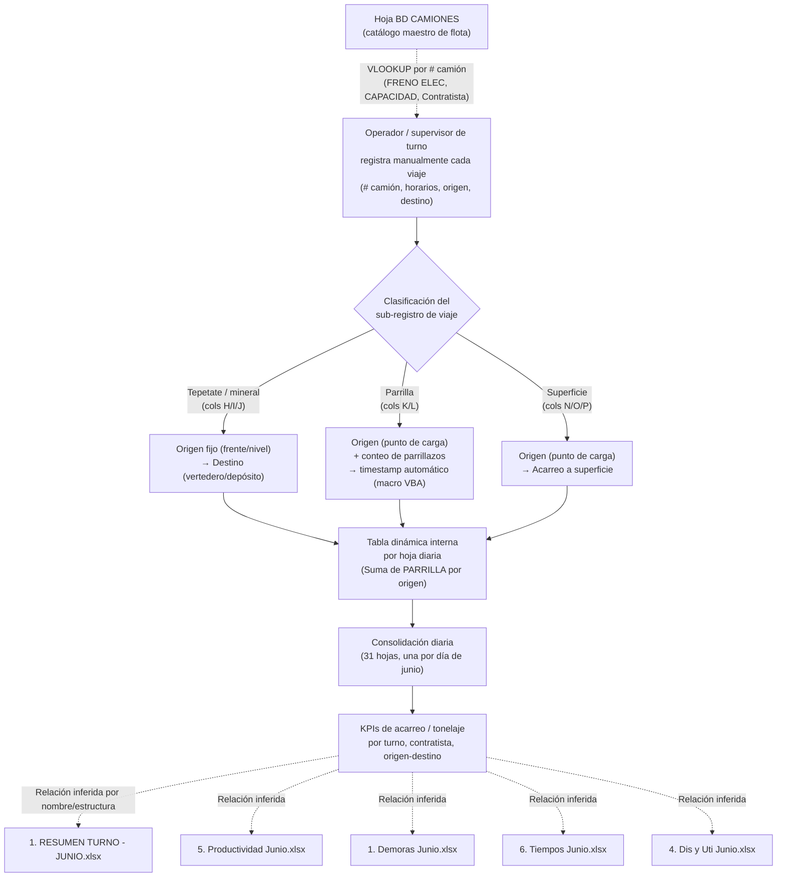

# Análisis Técnico — Libro "2. Acarreo JUNIO.xlsm"

**Empresa (inferida de contenido/estructura):** CAPSTONE GOLD S.A. DE C.V. — se infiere que corresponde a una operación minera subterránea de oro/cobre, posiblemente asociada al proyecto Cozamin, Zacatecas, México. No se afirma como hecho confirmado: la inferencia se basa en el nombre de la empresa y en el contexto documental provisto por el usuario, no en evidencia interna explícita del archivo (no se halló razón social ni ubicación geográfica dentro de las celdas exploradas).

**Periodo de datos:** Junio 2026.

**Archivo analizado:** `/sessions/ecstatic-affectionate-bohr/mnt/01_Datos/2. Acarreo JUNIO.xlsm` (formato .xlsm, con macros VBA habilitadas).

---

## Resumen ejecutivo

El libro "2. Acarreo JUNIO.xlsm" es el registro operativo diario del **acarreo de material con camiones** dentro de una mina subterránea, capturado turno a turno (Primera y Segunda) para cada día del mes de junio 2026. Contiene 33 hojas: 31 hojas diarias (nombradas "1" a "31", una por día calendario), una hoja maestra de flota ("BD CAMIONES") y una hoja oculta ("Hoja2") de propósito técnico/auxiliar sin datos operativos activos.

Cada hoja diaria registra, por viaje de camión, el número de unidad, si tiene freno eléctrico, su capacidad nominal, el contratista/operador, horarios de ingreso y salida, y el par origen-destino del material movido, clasificado en tres sub-registros distintos (tepetate/mineral hacia vertedero, "parrilla" y superficie). La asignación de campos se resuelve mediante fórmulas `VLOOKUP` contra la hoja `BD CAMIONES`, y cada hoja diaria incluye tablas dinámicas internas que resumen toneladas de "parrilla" por origen.

**Hallazgo relevante:** la captura de datos operativos reales se detiene en la hoja "19" (19 de junio); las hojas 20 a 31 están vacías, conservando solo la plantilla y fórmulas. No se encontró evidencia textual de conceptos de reconciliación metalúrgica (merma, ley, dilución, recuperación, humedad) en ninguna celda, fórmula o comentario del libro — es un libro estrictamente logístico de acarreo, no de control metalúrgico. El libro depende de un macro VBA (auto-timestamp) replicado en ~27 hojas, sin indicios de riesgo de seguridad, pero sí de riesgo de mantenibilidad y migración.

---

## Propósito del libro

Se infiere que el propósito central del libro es servir como **bitácora operativa diaria de acarreo de material** (tepetate/estéril y posiblemente mineral) dentro de la mina, registrando cada viaje de camión entre un punto de origen (frente, nivel o punto de carga) y un punto de destino (vertedero, superficie o punto de descarga tipo "parrilla"). Este registro alimenta, aparentemente:

- El control de disponibilidad y utilización de la flota de camiones (cruce con `BD CAMIONES`).
- El cálculo de toneladas movidas por turno, por origen y por destino (mediante las tablas dinámicas embebidas en cada hoja).
- Posibles reportes derivados de productividad, tiempos de ciclo y demoras (ver sección de relaciones inferidas con otros libros del conjunto).

No se observa evidencia de que el libro calcule directamente indicadores de ley de mineral, dilución o recuperación metalúrgica; su función parece limitarse al dominio logístico (transporte interno de material), no al dominio geológico-metalúrgico.

---

## Áreas o procesos involucrados

| Área / proceso | Rol inferido en el libro |
|---|---|
| Operaciones mina / acarreo subterráneo | Generación de los datos: captura manual de cada viaje de camión por turno |
| Mantenimiento / flota | Insumo indirecto vía columna FRENO ELEC y comentarios de incidencias mecánicas (fallas, sobrecalentamiento, pérdida de potencia) |
| Contratistas de transporte | Sujetos de la captura (Contratista/operador de cada camión, con 15 contratistas/operadores identificados) |
| Planeación / control de producción | Consumidor probable de los resúmenes de tonelaje por origen-destino (tablas dinámicas internas) |
| Sistemas / TI de reportabilidad | Responsable de la plantilla y macros VBA; punto de riesgo de mantenibilidad |
| Supervisión de turno | Registro y validación de horarios de ingreso/salida y comentarios operativos por turno |

---

## Inventario de pestañas

| Nombre de hoja | Estado | Rol inferido |
|---|---|---|
| "1" a "19" | Visible | Hojas diarias con datos operativos capturados (viajes de camión, turno 1 y turno 2) |
| "20" a "31" | Visible | Hojas diarias con plantilla y fórmulas preparadas, **sin datos capturados** (vacías) |
| BD CAMIONES | Visible | Catálogo maestro de la flota de camiones y tabla dinámica de conteo de camiones por contratista |
| Hoja2 | **Oculta** | Hoja técnica/auxiliar con una secuencia numérica (1-30) y fórmulas VLOOKUP residuales; sin datos operativos activos |

**Nota sobre la hoja "11":** su dimensión reportada por Excel es anómala (`A1:AO1048491`, prácticamente todo el rango de filas posible). Esto es un artefacto típico de formato de celda aplicado accidentalmente hasta el límite de la hoja, no evidencia de datos reales masivos; el contenido operativo de esa hoja termina en un rango normal, similar al resto.

---

## Análisis detallado por pestaña

### Hojas diarias (patrón único, ej. "1", "15", "19")

Cada hoja diaria lleva el título "TURNO DE PRIMERA" en su bloque principal (columnas B en adelante) y un bloque espejo para "TURNO DE SEGUNDA" más a la derecha (normalmente iniciando en columna S, aunque en la hoja "19" inicia en columna R con una columna menos — evidencia de que la plantilla **no es perfectamente uniforme** entre hojas).

**Headers del bloque de turno (15 columnas, ejemplo hoja "1", B a P):**

| Columna | Campo | Descripción inferida |
|---|---|---|
| B | # CAMION | Número de unidad (clave de cruce con BD CAMIONES) |
| C | FRENO ELEC | SI/NO — autocompletado por VLOOKUP desde BD CAMIONES |
| D | CAPACIDAD | Toneladas nominales (7, 14 o 25) — autocompletado por VLOOKUP |
| E | Contratista | Nombre del operador — autocompletado por VLOOKUP |
| F | Hra Ingreso | Hora de inicio del viaje/turno del camión |
| G | Hora Salida | Hora de término |
| H | ORIGEN | Punto de carga (sub-bloque tepetate/mineral) |
| I | DESTINO | Punto de descarga (sub-bloque tepetate/mineral) |
| J | TEPETATE | Valor numérico (toneladas o viajes) del material acarreado en ese sub-bloque |
| K | ORIGEN | Punto de carga (sub-bloque "parrilla") |
| L | PARRILLA | Conteo de "parrillazos" cargados (activa el macro de timestamp, ver más abajo) |
| M | HORA | Timestamp automático generado por macro al capturar L |
| N | ORIGEN | Punto de carga (sub-bloque "superficie") |
| O | SUPERFICIE | Indicador/valor del acarreo hacia superficie |
| P | COMENTARIOS | Contiene, en la práctica, un número de 4 dígitos (posible ID de viaje/turno) más, ocasionalmente, comentarios de celda con incidencias mecánicas |

El bloque "TURNO DE SEGUNDA" replica exactamente esta estructura (columnas S/T/U/V/W/X/Y/Z/AA/AB/AC/AD/AE/AF/AG en las hojas 1, 15 y 30; con offset distinto en la hoja "19").

**Hallazgo estructural clave:** dentro de cada bloque de turno no hay una sola tabla de viajes, sino **tres sub-registros verticalmente concatenados bajo el mismo encabezado**, cada uno usando su propio par/trío de columnas:
1. Sub-bloque tepetate/mineral (columnas H/I/J): origen fijo tipo "10E" o "EST86" hacia destinos tipo "EUK11.6", "SJ11.6", "FWZ12.5".
2. Sub-bloque "parrilla" (columnas K/L): origen tipo "SJ11.8", "GPNA13.5", con conteo de parrillazos (valor entero, comúnmente 1) y activación del macro de timestamp en columna M.
3. Sub-bloque "superficie" (columnas N/O/P): origen tipo "EUK10.6", "CAL9.4", con indicador de acarreo a superficie.

Las columnas B-G (identificación de camión, contratista y horarios) son comunes a las tres filas de cualquier sub-bloque.

**Fórmulas:** cada hoja diaria contiene entre ~430 y ~665 fórmulas `VLOOKUP` (más su versión `IFERROR`) que completan automáticamente FRENO ELEC, CAPACIDAD y Contratista a partir del número de camión, consultando el rango `BD CAMIONES!$B$3:$E$112`. Adicionalmente, cada hoja trae un pequeño bloque de fórmulas `GETPIVOTDATA` que extraen de una tabla dinámica interna la "Suma de PARRILLA" por origen, multiplicada por 20 (posible factor toneladas/parrillazo). El libro completo contiene **51 pivot caches y 100 tablas dinámicas** internas —aproximadamente 3 por hoja diaria— dedicadas a estos resúmenes.

**Consistencia de plantilla:** headers conceptualmente idénticos entre hojas 1, 15 y 19, pero con variaciones de offset de columnas y número de columnas del segundo bloque (ej. hoja 19 con un bloque de turno 2 de 14 columnas en lugar de 15, e iniciando en columna R en vez de S). Esto indica que la plantilla se ha editado manualmente hoja por hoja a lo largo del mes, sin control estricto de versión/formato.

**Validaciones de datos:** no se detectaron listas desplegables (data validation) en ninguna de las columnas clave (ORIGEN, DESTINO, CONTRATISTA), lo que explica la alta variabilidad de grafías observada en los valores de ubicación (texto libre).

**Volumen de datos:** hoja "1" con 92 viajes en turno 1 y 72 en turno 2; hoja "15" con 87 y 64 respectivamente; hoja "19" con datos solo en turno 1 (turno 2 vacío, sugiriendo que la captura se detuvo a media jornada); hojas "20" a "31" completamente vacías de datos operativos.

### Hoja "BD CAMIONES"

Catálogo maestro de flota, rango de datos B2:K112 (111 camiones listados).

| Columna | Campo |
|---|---|
| B | # CAMIÓN |
| C | FRENO ELEC (SI/NO) |
| D | CAPACIDAD (7, 14 o 25 toneladas) |
| E | CONTRATISTA |
| F | STATUS (únicamente "Activo" observado) |
| G | Iniciales del contratista (sin header propio) |

A la derecha (columnas I-J) hay una **tabla dinámica** de conteo de camiones por contratista (15 contratistas únicos), con un total general de 110 camiones — una unidad menos que las 111 filas del catálogo base, discrepancia menor que **requiere validación con el usuario de negocio** (posible fila duplicada o camión sin contratista asignado).

No se detectaron fórmulas propias, comentarios ni validaciones de datos en esta hoja; es una tabla estática más una tabla dinámica de resumen.

### Hoja "Hoja2" (oculta)

Rango de datos B1:AG43, pero con contenido real únicamente en las primeras filas: un contador incremental de 1 a 30 (fórmulas tipo `=+D2+1`) bajo el encabezado "TURNO DE PRIMERA — NUMERO MAXIMO DE CAMIONES QUE INGRESAN", y un pequeño bloque de fórmulas VLOOKUP residuales sin poblar en la fila 34.

Se infiere que esta hoja fue un **borrador o utilitario de diseño** (posiblemente para definir el número máximo de camiones esperado por turno) que quedó oculto tras dejar de usarse activamente. No contiene datos operativos del mes de junio. Aparentemente permanece oculta porque ya no forma parte del flujo de captura normal, pero no fue eliminada — probablemente por precaución o porque otras fórmulas del libro aún la referencian indirectamente. **Requiere validación con el usuario de negocio** sobre si es segura de eliminar o si conserva alguna dependencia oculta.

---

## Flujo de negocio inferido

Se infiere el siguiente flujo de datos, desde la captura en campo hasta la consolidación de indicadores de acarreo:

**Aclaración:** las relaciones con los libros "1. Demoras Junio.xlsx", "1. RESUMEN TURNO- JUNIO.xlsx", "4. Dis y Uti Junio.xlsx", "5.Productividad Junio.xlsx" y "6. Tiempos Junio.xlsx" son **inferencias basadas en nomenclatura y en la naturaleza de los datos capturados** (horarios de ingreso/salida sugieren un origen común para cálculos de tiempos y demoras; el conteo de camiones y contratistas sugiere insumo para disponibilidad/utilización y productividad). No se encontró en este libro ninguna fórmula, referencia externa o vínculo (`externalLink`) que confirme una integración directa con esos archivos. **Requiere validación con el usuario de negocio** para confirmar si existe vinculación real (copiar/pegar manual, Power Query, fórmulas de referencia externa, o si son completamente independientes).

---

## Lógicas de negocio identificadas

| Lógica | Descripción | Ubicación en el libro |
|---|---|---|
| Autocompletado de atributos de camión | `VLOOKUP` de FRENO ELEC, CAPACIDAD y Contratista contra `BD CAMIONES` a partir del # de camión capturado | Todas las hojas diarias, columnas C/D/E y T/U/V (o equivalentes) |
| Timestamp automático en captura de "parrilla" | Macro VBA `Worksheet_Change`: al capturar un valor numérico en columna L (o AC en turno 2), se inserta automáticamente la hora del sistema en la columna M (o AD); al borrar el valor, se limpia el timestamp | ~27 módulos de hoja (VBA), replicado por hoja diaria |
| Clasificación de viaje por sub-bloque de columnas | El tipo de acarreo (tepetate/mineral, parrilla, superficie) se determina por en qué trío de columnas se registra el viaje (H/I/J vs K/L vs N/O/P), no por un campo explícito de "tipo" | Estructura de columnas de cada hoja diaria |
| Resumen de tonelaje de parrilla por origen | Tabla dinámica interna por hoja + fórmula `GETPIVOTDATA(...)*20`, sugiriendo un factor de 20 (posiblemente toneladas por parrillazo) | Zona de resumen de cada hoja diaria (aprox. filas 115-130) |
| Asignación origen-destino | **No se observa una regla formal codificada** (no hay tabla de mapeo válido origen→destino, ni validación de datos que restrinja combinaciones); el par origen-destino se captura como texto libre por el usuario en cada viaje | Columnas H/I (y equivalentes) de cada hoja diaria |
| Identificador de viaje/turno | Columna "COMENTARIOS" (P) contiene sistemáticamente un número de 4 dígitos en casi todas las filas, sugiriendo un ID de viaje o folio, en lugar de texto descriptivo | Columna P (o N/O en hoja 19) |

### Tabla de flujo origen-destino (ejemplos representativos observados)

| Sub-bloque | Origen (ejemplos observados) | Destino / punto de acarreo (ejemplos observados) | Material / medida inferida |
|---|---|---|---|
| Tepetate/mineral (H/I/J) | 10E, EST86, GPNA19.8, 14.5GPNA | EUK11.6, SJ11.6, FWZ12.5, GPNA15.2 | TEPETATE (valor numérico, posiblemente toneladas o viajes) |
| Parrilla (K/L) | SJ11.8, 14.2GPNA, GPNA13.5 | (implícito: punto de parrilla/chimenea de vaciado) | PARRILLA (conteo de parrillazos, valor entero ~1 por fila) |
| Superficie (N/O/P) | EUK10.6, CAL9.4, GPNA9.0 | Superficie (destino genérico, sin desglose de punto exacto) | SUPERFICIE (indicador/valor de acarreo) |

**Observación sobre nomenclatura:** los valores de ORIGEN y DESTINO combinan un número decimal (posible elevación, nivel o distancia, ej. "11.6", "14.5") con un prefijo o sufijo de zona minera (EUK, SJ, GPNA, CAL, FWZ, CFTE, EST, SANRAFAEL, V10), sin estandarización de formato: se observan variantes como "10.6 EUK", "10.6EUK", "10.6euk" y "EUK10.6" para lo que aparenta ser la misma ubicación física. Esto es consistente con la ausencia de listas desplegables (data validation) en estas columnas — la captura es de texto libre. **Se infiere** que EUK, SJ, GPNA, CAL, FWZ podrían representar niveles, rampas, frentes o vertederos identificados por código de zona, pero **no se observa evidencia suficiente para confirmar** el significado exacto de cada prefijo sin apoyo del glosario operativo de la mina.

---

## Tratamiento de merma

Se realizó una búsqueda exhaustiva (case-insensitive) de las siguientes palabras clave en la totalidad del libro: **merma, pérdida/perdida, dilución/dilucion, recuperación/recuperacion, ley, humedad, ajuste, reconciliación/reconciliacion, diferencia, factor.**

- **En valores de celda de las 33 hojas:** 0 coincidencias.
- **En fórmulas de las 33 hojas:** 0 coincidencias.
- **En comentarios de celda:** 2 coincidencias, ambas de contexto mecánico y no metalúrgico:
  - Hoja "1", celda B32: *"8.6 SANRAFAEL 12:42 POR DIFERENCIAL"* — se refiere a una falla del diferencial mecánico de un camión, no a una diferencia de tonelaje.
  - Hoja "19", celda S8: *"PERDIDA DE POTENCIA 1:14, QUEDA EN SUPERFICIE"* — se refiere a pérdida de potencia del motor de un camión averiado, no a pérdida de material.

**Conclusión explícita:** no se observa evidencia suficiente para confirmar que este libro trate, calcule o registre merma, dilución, recuperación metalúrgica, ley de mineral, humedad o factores de ajuste de tonelaje. El único "factor" identificable es el multiplicador `*20` en las fórmulas `GETPIVOTDATA` del resumen de parrilla, que aparenta ser un factor de conversión toneladas-por-parrillazo, no un factor de merma o ajuste metalúrgico. Si la organización requiere el tratamiento de merma o reconciliación de tonelaje (cargado vs. descargado, capacidad nominal vs. real transportada), **esta lógica no reside en este libro** y debe buscarse en otro sistema o proceso — se recomienda validar directamente con el usuario de negocio dónde se gestiona ese control, si existe.

---

## KPIs o métricas derivadas

| KPI / métrica | Cómo se infiere del libro | Nivel de confianza |
|---|---|---|
| Toneladas o viajes de tepetate por origen-destino | Suma de columna TEPETATE (J) agrupada por par origen-destino | Inferido de estructura de columnas |
| Toneladas de parrilla por origen | `GETPIVOTDATA("PARRILLA", ...)  * 20`, tabla dinámica embebida por hoja | Confirmado por fórmula observada |
| Número de viajes por camión / contratista | Conteo de filas por # CAMION o Contratista dentro de cada turno | Inferido de estructura tabular |
| Utilización de flota por contratista | Cruce entre viajes registrados y el total de camiones por contratista en `BD CAMIONES` (110-111 camiones, 15 contratistas) | Inferido, requiere validación |
| Horas de operación por camión/turno | Diferencia entre "Hra Ingreso" y "Hora Salida" | Inferido, no se observó fórmula de cálculo explícita en el libro |
| Disponibilidad mecánica | Inferible de comentarios de incidencias (fallas de cajón, sobrecalentamiento, pérdida de potencia, diferencial) pero sin campo estructurado dedicado | Baja confianza, dato no estructurado |
| Consolidado mensual de acarreo | Suma acumulada de las 31 hojas diarias (actualmente solo 19 con datos) | Inferido de la arquitectura de "una hoja por día" |

**Nota:** no se observó, dentro de este libro, una hoja de consolidación mensual automática (no hay una pestaña "Resumen" o "Total Junio" visible); se infiere que dicha consolidación ocurre en otro libro del conjunto (ej. "1. RESUMEN TURNO- JUNIO.xlsx"), pero esto requiere validación con el usuario de negocio.

---

## Riesgos, brechas y observaciones

| Riesgo / brecha | Detalle | Severidad inferida |
|---|---|---|
| Dependencia de macros VBA no versionadas | El libro contiene `xl/vbaProject.bin` con un macro `Worksheet_Change` (auto-timestamp) replicado en ~27 módulos de hoja. El código VBA no está versionado como texto, es opaco fuera de Excel, y su lógica (aunque simple) es indispensable para el timestamp automático de la columna PARRILLA. Migrar este libro a una plataforma de reportabilidad moderna (BI, base de datos, Power BI/Query) requeriría reimplementar esta lógica fuera de VBA | Alta — riesgo de migración/automatización |
| Datos de captura incompletos en el periodo | Las hojas 20 a 31 están vacías (sin viajes capturados); la hoja 19 solo tiene datos en el turno 1. La fecha de última modificación del archivo es 2026-06-30, pero sin datos posteriores al día 19 | Alta — impacta cualquier análisis de junio completo |
| Ausencia de validaciones de datos (listas desplegables) | ORIGEN, DESTINO y COMENTARIOS son campos de texto libre sin listas controladas, generando alta variabilidad de grafías (ej. "10.6 EUK", "10.6EUK", "EUK10.6") que dificulta la agregación automática sin normalización previa | Alta — calidad de datos |
| Plantilla no perfectamente uniforme entre hojas | Offset de columnas y número de columnas del segundo turno varía entre hojas (ej. hoja 19 vs hojas 1/15/30), lo que puede romper procesos de consolidación automatizada que asuman rangos fijos | Media-Alta |
| Sin trazabilidad de merma/reconciliación de tonelaje | No existe en este libro ningún control de diferencia entre tonelaje cargado y descargado, ni factor de merma; si este control es requerido por el negocio, no está cubierto aquí | Media — depende de si el control existe en otro sistema |
| Discrepancia menor en conteo de camiones | La tabla dinámica de `BD CAMIONES` totaliza 110 camiones mientras el catálogo base lista 111 filas | Baja-Media |
| Relación con otros libros del conjunto no confirmada técnicamente | No se hallaron referencias externas (`externalLink`) ni fórmulas que vinculen este libro con "1. Demoras Junio.xlsx", "1. RESUMEN TURNO- JUNIO.xlsx", "4. Dis y Uti Junio.xlsx", "5.Productividad Junio.xlsx" o "6. Tiempos Junio.xlsx"; la relación es solo inferida por nomenclatura y estructura de datos compartidos (horarios, camiones, contratistas) | Media — afecta el entendimiento del ecosistema de reportes |
| Complejidad de tablas dinámicas embebidas | 51 pivot caches y 100 pivot tables distribuidos en el libro (aprox. 3 por hoja diaria) añaden peso y complejidad de mantenimiento, y son una fuente adicional de fragilidad si se edita la estructura de columnas | Media |
| Identidad de la empresa/proyecto no confirmada en el archivo | El nombre "CAPSTONE GOLD S.A. DE C.V." y la posible relación con Cozamin, Zacatecas, son datos de contexto aportados externamente, no verificados dentro del contenido del libro (no se hallaron metadatos de razón social o ubicación) | Baja — aclaración de alcance del análisis |

---

## Recomendaciones para documentación, automatización o modelamiento de datos

1. **Normalizar el catálogo de ubicaciones (ORIGEN/DESTINO).** Definir un catálogo maestro único de zonas/niveles/frentes con código estandarizado (evitando variantes como "10.6EUK" vs "EUK10.6") y aplicar listas desplegables (data validation) o, idealmente, migrar la captura a un formulario estructurado que fuerce selección de catálogo en lugar de texto libre.

2. **Formalizar la clasificación de tipo de material/destino.** Actualmente el tipo de viaje (tepetate/mineral, parrilla, superficie) se infiere únicamente por la posición de columna en la que se captura el dato. Se recomienda introducir un campo explícito "Tipo de acarreo" para facilitar la trazabilidad, el modelamiento en base de datos relacional y la construcción de reportes automatizados.

3. **Migrar la lógica del macro VBA de auto-timestamp a una capa de aplicación versionable.** Si se moderniza la captura (por ejemplo, a un formulario web, Power Apps, o base de datos con triggers), replicar el comportamiento de timestamp automático de forma explícita y documentada, evitando la dependencia de VBA no versionado.

4. **Diseñar un modelo de datos relacional (largo/normalizado) en lugar de la estructura ancha actual.** Cada viaje de camión debería ser una fila única con campos: fecha, turno, # camión, contratista, tipo de material, origen, destino, cantidad, hora ingreso, hora salida, ID de viaje. Esto reemplazaría la actual concatenación de tres sub-bloques por columnas y los offsets variables entre hojas, facilitando la consolidación y el cálculo de KPIs sin depender de tablas dinámicas embebidas por hoja.

5. **Confirmar y documentar formalmente la relación con los demás libros del conjunto** ("1. Demoras Junio.xlsx", "1. RESUMEN TURNO- JUNIO.xlsx", "4. Dis y Uti Junio.xlsx", "5.Productividad Junio.xlsx", "6. Tiempos Junio.xlsx"), idealmente mediante entrevista con el usuario de negocio, para establecer si existe un flujo de copiado manual, Power Query, o si son fuentes independientes que se concilian fuera de Excel.

6. **Cerrar la brecha de captura de datos del periodo.** Investigar por qué las hojas 20-31 de junio no tienen datos capturados (¿proceso manual pendiente, cambio de sistema, archivo en construcción?) antes de usar este libro como fuente de verdad para KPIs mensuales completos.

7. **Evaluar y documentar explícitamente el propósito de la hoja oculta "Hoja2".** Confirmar con el usuario de negocio si aún es funcional o es un remanente de diseño seguro de eliminar, y registrar la decisión para evitar ambigüedad en futuras migraciones.

8. **Si existe un requerimiento de control de merma o reconciliación de tonelaje**, establecer explícitamente en qué sistema/proceso se gestiona (no se encontró en este libro) y evaluar si conviene incorporarlo al nuevo modelo de datos de acarreo, dado que la información de capacidad nominal por camión (7/14/25 t) ya está disponible como base de comparación contra tonelaje real transportado.
