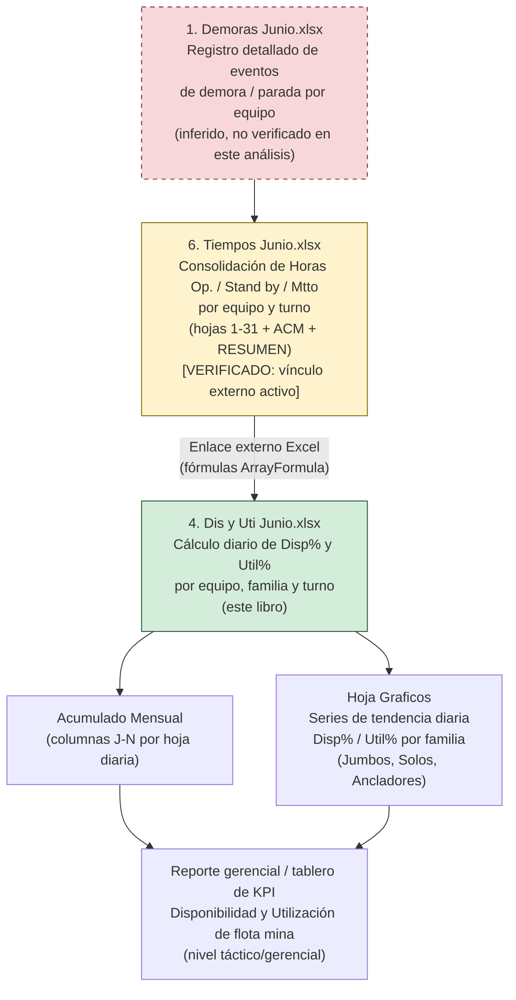

# Análisis Técnico del Libro Excel: "4. Dis y Uti Junio.xlsx"

**Empresa (inferida):** CAPSTONE GOLD S.A. DE C.V.
**Proyecto (inferido, no confirmado):** Posible relación con el proyecto Cozamin, Zacatecas, México — inferido a partir de la ruta de red del enlace externo detectado (`.../261906 Reportabilidad Capstone Copper - Cozamin/03 Reportes/...`). Se recomienda validar esta asociación con el usuario de negocio antes de citarla como hecho confirmado.
**Periodo de datos:** Junio 2026.
**Archivo analizado:** `4. Dis y Uti Junio.xlsx`

---

## Resumen ejecutivo

El libro `4. Dis y Uti Junio.xlsx` es un tablero de **Disponibilidad Mecánica (Disp%) y Utilización (Util%)** de equipos mina subterránea, organizado en 31 hojas diarias (una por día del mes de junio) más una hoja `Graficos` de series de tendencia. Cada hoja diaria despliega, por familia de equipo (Scoop Trams, Jumbos/Barrenación Lineal, Equipos de Barrenación Larga/Solos, Ancladores, Malacate) y por turno (Primera y Segunda), las horas operativas, en stand-by y de mantenimiento, junto con los porcentajes de Disponibilidad y Utilización calculados mediante fórmulas estándar de la industria minera.

Se confirmó **evidencia directa** (no solo inferencia) de que este libro consume datos crudos de horas de equipo desde un libro externo llamado **"6. Tiempos Junio.xlsx"**, vinculado vía SharePoint corporativo (Microsoft 365 / OneDrive de Astay Systems), a través de fórmulas de tipo `='[1]1'!$GT$9:$GU$20`. Esto posiciona a "4. Dis y Uti Junio.xlsx" como un **libro derivado/consolidado de KPI**, no como fuente primaria de datos operativos.

No se encontró evidencia alguna de lógica relacionada con merma, dilución, ley, humedad, ajuste, reconciliación o tonelaje en ninguna de las 32 hojas del libro — su alcance es exclusivamente de horómetros y disponibilidad/utilización de equipo mina, no de metalurgia ni de control de mineral.

---

## Propósito del libro

El libro tiene como propósito consolidar y reportar, a nivel diario y con acumulado mensual, dos KPI operativos clásicos de mantenimiento minero:

- **Disponibilidad mecánica (Disp%):** proporción del tiempo total en que el equipo estuvo disponible para operar (es decir, no estuvo en mantenimiento).
- **Utilización (Util%):** proporción del tiempo disponible en que el equipo efectivamente operó.

Estos indicadores se calculan por equipo individual, se agregan por familia de equipo (TOTAL), se desglosan por turno (Primera y Segunda) y se acumulan a lo largo del mes, sirviendo como insumo para seguimiento gerencial/táctico de la flota de equipos subterráneos de la operación minera.

---

## Áreas o procesos involucrados

- **Mantenimiento / Confiabilidad de equipos mina:** medición de horas de mantenimiento (Mtto) vs. horas operativas y stand-by.
- **Planeación mina / Operaciones subterráneas:** seguimiento de utilización efectiva de la flota (Scoop Trams, Jumbos, equipos de barrenación larga, ancladores, malacate).
- **Control de gestión / Reportabilidad ejecutiva:** consolidación de KPI diarios y mensuales para reporte gerencial, aparentemente dentro de un paquete más amplio de reportabilidad operativa (dado el nombre de la carpeta de origen "Reportabilidad Capstone Copper - Cozamin").
- **TI/Sistemas de reporte:** la existencia de vínculos externos entre libros sugiere un proceso semi-automatizado de consolidación de datos entre archivos Excel individuales gestionados en SharePoint.

No se observa evidencia de que el libro participe en procesos de planta, metalurgia, geología o control de leyes/tonelaje.

---

## Inventario de pestañas (tabla)

| Hoja | Tipo | Contenido |
|---|---|---|
| `1` a `31` | Hoja diaria | Una hoja por día calendario de junio 2026. Estructura idéntica (verificada en hojas 1, 15 y 30): tabla de Disp%/Util% por familia/equipo, por turno (Primera y Segunda), con bloque "INFORMACIÓN DEL DÍA" y "ACUMULADO MENSUAL". |
| `Graficos` | Hoja de series de tendencia | Series de Disponibilidad y Utilización por día (1 a 31) para las familias **Jumbos**, **Solos** y **Ancladores** (ver limitación en sección de riesgos: no cubre Scoop Trams ni Malacate). Alimenta gráficos de tendencia mensual. |

Total: 32 hojas (31 diarias + 1 de gráficos).

---

## Análisis detallado por pestaña

### Hojas diarias (patrón único "1" a "31")

Se verificó consistencia estructural exacta entre las hojas `1`, `15` y `30` (fórmulas y catálogo de equipos idénticos), confirmando que las 31 hojas comparten una única plantilla replicada día a día.

**Encabezados generales (fila 2-4):**
- `CAPSTONE GOLD S.A. DE C.V.` / `DISPONIBILIDAD Y UTILIZACION`, repetido en tres bloques de columnas: uno consolidado (columnas B en adelante) y dos desagregados por turno — `TURNO DE PRIMERA` (columna AA) y `TURNO DE SEGUNDA` (columna AM).

**Estructura de columnas (fila 6-8), por cada bloque de turno/consolidado:**

| Bloque | Columnas (bloque consolidado, ejemplo) | Contenido |
|---|---|---|
| Familia/Equipo | B | Nombre de familia (ej. SCOOP TRAMS) e ID de equipo (ej. ST-07) |
| Información del día | D–H | Horas Op., Horas Stand by, Horas Mtto, Disp %, Util % |
| Acumulado mensual | J–N | Horas Op., Horas Inactivo, Horas Mtto, Disp %, Util % (acumulados) |
| Día (staging interno) | O–R | Réplica de D-F más columna R = suma total de horas del día |
| Acumulado (staging interno) | T–W | Réplica de J-L más columna W = suma total de horas acumuladas |

Los bloques de turno (Primera: columnas Y–AI; Segunda: columnas AK–AU) replican esta misma lógica, con la particularidad de que sus columnas de horas (`Horas Op.`, `Horas Stand by`, `Horas Mtto`) **no son valores capturados manualmente sino fórmulas de tipo Array Formula** que apuntan a un libro externo (ver sección "Flujo de negocio inferido").

**Catálogo de familias / equipos identificado (idéntico en las 3 hojas verificadas):**

| Familia | Equipos (IDs) |
|---|---|
| SCOOP TRAMS | ST-07, ST-10, ST-12, ST-15, ST-16, ST-17, ST-18, ST-19, ST-20, ST-21 |
| BARRENACIÓN LINEAL (Jumbos) | JU-01, JU-02, JU-03 |
| BARRENACIÓN LARGA | SOLO DL 310, SOLO DL 311, SOLO DL 331, SOLO DL 311 (04), SOLO DL 411 (05), TUMI |
| ANCLADORES | ANCLADOR 03, 04, 06, 07, 08 |
| MALACATE | MALACATE (una unidad) |

Cada familia tiene una fila `TOTAL` que agrega los valores de sus equipos individuales.

**Fórmulas verificadas (idénticas en filas de detalle, ejemplo fila 10, equipo ST-07):**

- `G10` (Disp% del día) = `=IF(R10=0,0,(R10-Q10)/R10*100)`
- `H10` (Util% del día) = `=IFERROR(IF(R10=0,0,O10/(R10-Q10)*100),0)`
- `M10` (Disp% acumulado) = `=IF(W10=0,0,(W10-V10)/W10*100)`
- `N10` (Util% acumulado) = `=IFERROR(IF(W10=0,0,T10/(W10-V10)*100),0)`
- `R10` (Horas totales del día) = `=SUM(O10:Q10)` (Op + Inactivo/Stand by + Mtto)
- `W10` (Horas totales acumuladas) = `=SUM(T10:V10)`

En la fila `TOTAL` de cada familia (ej. fila 22 para SCOOP TRAMS), las columnas de horas acumuladas (`J22`, `K22`, `L22`) se calculan como `=SUM(J10:J21)`, es decir, suma de los equipos individuales de la familia; las columnas de porcentaje (`G22`, `H22`, `M22`, `N22`) replican la misma fórmula relativa de Disp%/Util% aplicada sobre los totales agregados de horas de la familia, no un promedio simple de los porcentajes individuales — lo cual es la práctica correcta en este tipo de KPI (evita distorsión por promediar porcentajes de equipos con distinta base de horas).

**Bloques de turno (Primera y Segunda):** Sus columnas de horas contienen fórmulas de tipo `ArrayFormula`/referencia externa (ej. `AA10 = '[1]1'!$GT$9:$GU$20`), evidenciando que estas celdas **no se capturan manualmente en este libro**, sino que se traen automáticamente desde un libro externo (ver sección de flujo de datos).

### Hoja `Graficos`

Estructura de bloque por familia de equipo, con una fila de números de día (1 a 31) como cabecera de serie, y dos filas debajo con los valores de Disponibilidad y Utilización, respectivamente, para cada día del mes:

| Familia cubierta en `Graficos` | Fila cabecera "día" | Fila "Disponibilidad" | Fila "Utilización" |
|---|---|---|---|
| Jumbos | 3 | 4 | 5 |
| Solos | 27 | 28 | 29 |
| Ancladores | 51 | 52 (parcial, solo Disp. verificada) | — |

Se verificó que las celdas de esta hoja son fórmulas que referencian directamente la fila `TOTAL` de la familia correspondiente en cada hoja diaria. Ejemplo confirmado:
- `Graficos!D4` = `='1'!$G$29` (Disp% Día 1, TOTAL Barrenación Lineal/Jumbos, fila 29 de la hoja "1")
- `Graficos!E4` = `='2'!$G$29` (mismo dato, día 2)
- `Graficos!D28` = `='1'!$G$39` (Disp% Día 1, TOTAL Barrenación Larga/Solos)
- `Graficos!D51` = `='1'!$G$47` (Disp% Día 1, TOTAL Ancladores)

**Limitación observada:** la hoja `Graficos` solo cubre 3 de las 5 familias de equipo presentes en las hojas diarias (Jumbos, Solos, Ancladores). No se encontró evidencia de series de tendencia para **Scoop Trams** ni **Malacate** dentro de los primeros 60 renglones inspeccionados. Esto podría deberse a que dichas series existen más abajo en la hoja (fuera del rango revisado) o a que efectivamente no se graficaron. Requiere validación con el usuario de negocio.

---

## Flujo de negocio inferido

Se infiere el siguiente flujo de datos, con base en evidencia directa de fórmulas y vínculos externos hallados en el archivo (no se tuvo acceso directo a abrir "6. Tiempos Junio.xlsx" ni "1. Demoras Junio.xlsx" en este análisis; su contenido se infiere por el nombre, la estructura de hojas idéntica "1"-"31" + "ACM"/"RESUMEN", y la naturaleza de las referencias).

Evidencia técnica concreta encontrada en el paquete del archivo (`xl/externalLinks/`):
- El libro tiene un vínculo externo activo hacia **`6. Tiempos Junio.xlsx`**, cuya ruta completa registrada es una carpeta de SharePoint: `.../261906 Reportabilidad Capstone Copper - Cozamin/03 Reportes/6. Tiempos Junio.xlsx`.
- El libro externo referenciado contiene hojas nombradas `1` a `31`, más `ACM` y `RESUMEN` — coincidiendo con la convención de nombres de hoja usada también en este libro (`1`-`31`).
- Las fórmulas de horas por turno (columnas AA-AU y AM-AU) apuntan a celdas del libro externo en columnas muy alejadas del rango normal (ej. `GT9:GU20`, `HD9:HD20`), lo que sugiere que "6. Tiempos Junio.xlsx" contiene una zona de cálculo/staging extendida (posiblemente tablas dinámicas o fórmulas de resumen) de la cual "4. Dis y Uti Junio.xlsx" extrae únicamente los totales de horas ya procesados.

Con esta evidencia, y aplicando el contexto de negocio conocido (el conjunto de archivos incluye también "1. Demoras Junio.xlsx", que por nombre se infiere contiene el registro detallado de eventos de demora/parada por equipo), se infiere el siguiente flujo:

**Nota de confiabilidad del diagrama:** el nodo "6. Tiempos Junio.xlsx" y su vínculo hacia "4. Dis y Uti Junio.xlsx" están **verificados directamente** mediante inspección del XML interno del archivo (`externalLinks`). El nodo "1. Demoras Junio.xlsx" y su relación con "6. Tiempos Junio.xlsx" son **inferencia** basada en la convención de nombres del conjunto de archivos del mismo directorio y en el conocimiento general de procesos mineros (el registro de demoras suele ser la fuente primaria de la que se derivan horas de mantenimiento/stand-by). Esta relación no pudo confirmarse en este análisis porque no se abrió el contenido de "1. Demoras Junio.xlsx". Requiere validación con el usuario de negocio.

---

## Lógicas de negocio identificadas (tabla, incluye fórmulas de Disp%/Util%)

| KPI / Lógica | Definición de negocio | Fórmula inferida/confirmada (Excel) | Unidades | Confianza |
|---|---|---|---|---|
| **Disponibilidad (Disp%) — diaria** | Proporción del tiempo total del equipo en que estuvo disponible para operar (no estuvo en mantenimiento) | `=IF(Horas_Totales=0,0,(Horas_Totales - Horas_Mtto)/Horas_Totales*100)` — celda real: `G10 = IF(R10=0,0,(R10-Q10)/R10*100)` | % | Confirmado (fórmula leída directamente de celdas) |
| **Utilización (Util%) — diaria** | Proporción del tiempo disponible (total menos mantenimiento) en que el equipo efectivamente operó | `=IFERROR(IF(Horas_Totales=0,0,Horas_Op/(Horas_Totales - Horas_Mtto)*100),0)` — celda real: `H10 = IFERROR(IF(R10=0,0,O10/(R10-Q10)*100),0)` | % | Confirmado |
| **Disponibilidad (Disp%) — acumulado mensual** | Igual definición que la diaria, pero aplicada sobre las horas acumuladas del mes hasta la fecha de la hoja | `M10 = IF(W10=0,0,(W10-V10)/W10*100)` | % | Confirmado |
| **Utilización (Util%) — acumulado mensual** | Igual definición que la diaria, sobre horas acumuladas | `N10 = IFERROR(IF(W10=0,0,T10/(W10-V10)*100),0)` | % | Confirmado |
| **Horas Totales del día (base de cálculo)** | Suma de horas operativas + stand by/inactivo + mantenimiento reportadas en el día | `R10 = SUM(O10:Q10)` | Horas | Confirmado |
| **Horas Totales acumuladas** | Suma de horas operativas + inactivo + mantenimiento acumuladas del mes | `W10 = SUM(T10:V10)` | Horas | Confirmado |
| **Total por familia de equipo** | Agregación de horas de todos los equipos de una familia (ej. todos los Scoop Trams) | `J22 = SUM(J10:J21)` (horas); Disp%/Util% de fila TOTAL recalculadas sobre horas agregadas, no promedio de %s individuales | Horas / % | Confirmado |
| **Horas por turno (Primera / Segunda)** | Desagregación de horas Op./Stand by/Mtto por turno de trabajo | Fórmulas de tipo ArrayFormula/referencia a libro externo `'[1]1'!$GT$9:$GU$20` (bloque Primera) y equivalente para Segunda | Horas | Confirmado (origen externo verificado); el detalle interno del libro fuente no fue auditado |
| **Consolidación desde libro externo** | Las horas base (Op., Stand by, Mtto) del bloque general y de turnos parecen originarse en "6. Tiempos Junio.xlsx" | Vínculo externo activo (`externalLink1.xml`) apuntando a SharePoint | N/A | Confirmado el vínculo; el mecanismo interno de cálculo en el libro fuente es inferido |

**Aclaración importante:** en las columnas D, E, F (Horas Op., Stand by, Mtto) del bloque "INFORMACIÓN DEL DÍA" general de la hoja "1", los valores observados estaban en blanco para la mayoría de los equipos al momento del análisis (excepto Malacate, con ceros). Esto puede deberse a que (a) el archivo fue guardado sin actualizar los vínculos externos, (b) el link externo no logró resolverse por falta de acceso a la ruta de SharePoint al momento de la última apertura/guardado, o (c) la captura de esas celdas específicas corresponde a otro mecanismo (entrada manual o vínculo adicional no detectado). Se recomienda validar con el usuario de negocio el estado de "actualización de vínculos" del archivo y confirmar si D/E/F se alimentan igualmente del libro externo o de una fuente distinta a las columnas de turno (AA-AU/AM-AU).

---

## Tratamiento de merma

Se realizó una búsqueda exhaustiva de texto (insensible a mayúsculas/minúsculas) en el contenido de las 32 hojas del libro, incluyendo los siguientes términos: *merma, pérdida, dilución, recuperación, ley, humedad, ajuste, reconciliación, tonelaje, tonelada*.

**Resultado: no se encontró ninguna coincidencia** con estos términos en ninguna celda del libro.

Esto es consistente con el propósito del archivo: es un tablero de **disponibilidad y utilización mecánica de equipo** (KPI de mantenimiento/operación), no un libro de control metalúrgico, geológico ni de reconciliación de tonelaje/ley. No se observa evidencia suficiente para confirmar que este libro tenga relación alguna con procesos de merma o dilución de mineral — dichos procesos, de existir en la operación, probablemente se gestionan en otros libros del conjunto (por ejemplo, "5. Productividad Junio.xlsx" u otro no incluido en este análisis) o en sistemas fuera del alcance de este archivo.

---

## KPIs o métricas derivadas (tabla)

| KPI | Nivel de agregación | Frecuencia | Fuente de cálculo |
|---|---|---|---|
| Disponibilidad % por equipo | Equipo individual (ej. ST-07) | Diaria | Hoja del día correspondiente |
| Utilización % por equipo | Equipo individual | Diaria | Hoja del día correspondiente |
| Disponibilidad % acumulada por equipo | Equipo individual | Acumulado mensual (a la fecha de la hoja) | Hoja del día correspondiente, bloque "ACUMULADO MENSUAL" |
| Utilización % acumulada por equipo | Equipo individual | Acumulado mensual | Hoja del día correspondiente |
| Disponibilidad % por familia (TOTAL) | Familia de equipo (ej. SCOOP TRAMS) | Diaria y acumulada | Fila TOTAL de cada bloque en la hoja del día |
| Utilización % por familia (TOTAL) | Familia de equipo | Diaria y acumulada | Fila TOTAL de cada bloque |
| Disponibilidad/Utilización por turno (Primera/Segunda) | Equipo y familia | Diaria y acumulada | Bloques de turno (columnas Y-AI y AK-AU) |
| Tendencia mensual de Disp%/Util% por familia | Familia (solo Jumbos, Solos, Ancladores) | Serie diaria (1 a 31) | Hoja `Graficos` |

---

## Riesgos, brechas y observaciones (tabla)

| # | Observación | Tipo | Impacto / riesgo |
|---|---|---|---|
| 1 | Columnas D/E/F (Horas Op., Stand by, Mtto) del bloque general en la hoja "1" aparecen vacías para casi todos los equipos, salvo Malacate | Brecha de datos / posible vínculo roto | Si el vínculo externo no está actualizado, el reporte diario general podría no reflejar datos reales al momento de apertura sin refresco manual |
| 2 | Dependencia fuerte de un archivo externo vía SharePoint ("6. Tiempos Junio.xlsx") | Riesgo de integridad de datos | Si la ruta de SharePoint cambia, se renombra el archivo fuente, o el usuario no tiene acceso, las fórmulas fallarán o quedarán con valores obsoletos (típico de vínculos externos de Excel) |
| 3 | La hoja `Graficos` solo cubre 3 de 5 familias de equipo (Jumbos, Solos, Ancladores); no se confirmó cobertura de Scoop Trams ni Malacate | Brecha potencial de reporte | Los Scoop Trams —family con mayor número de unidades (10 equipos)— podrían no tener visibilidad de tendencia mensual gráfica, lo cual es relevante dado su peso en la flota |
| 4 | No existe trazabilidad documentada (comentarios, hoja de notas) de la relación entre este libro y "1. Demoras Junio.xlsx" / "6. Tiempos Junio.xlsx" dentro del propio archivo | Brecha de documentación | Dificulta el mantenimiento del modelo por personal no involucrado en su creación original; alto riesgo de "conocimiento tribal" |
| 5 | Las fórmulas de horas por turno usan referencias a rangos de columnas muy alejadas del libro fuente (ej. columna GT, HD) | Complejidad / fragilidad del modelo | Sugiere una arquitectura de cálculo compleja en el libro fuente que es difícil de auditar sin abrir dicho archivo; alto riesgo de error si se reestructuran esas columnas |
| 6 | El archivo no contiene datos de merma, ley, dilución o reconciliación de tonelaje | Fuera de alcance (no es un riesgo, es una aclaración de alcance) | Cualquier análisis de pérdidas metalúrgicas o de mineral debe buscarse en otros libros del conjunto, no en este |
| 7 | No se auditó el contenido de "1. Demoras Junio.xlsx" ni "6. Tiempos Junio.xlsx" directamente (solo se infiere su rol por nombre y por el vínculo externo detectado) | Limitación del análisis | Las conclusiones sobre el flujo de datos completo (Demoras → Tiempos → Disp y Uti) deben considerarse hipótesis a validar, no hechos confirmados |
| 8 | Relación con el proyecto "Cozamin" es inferida únicamente de la ruta de carpeta de SharePoint ("...Capstone Copper - Cozamin...") | Limitación del análisis | No se confirmó explícitamente en el contenido del libro; requiere validación con el usuario de negocio |

---

## Recomendaciones para documentación, automatización o modelamiento de datos

1. **Documentar formalmente el linaje de datos (data lineage)** entre "1. Demoras Junio.xlsx", "6. Tiempos Junio.xlsx" y "4. Dis y Uti Junio.xlsx", idealmente con un diagrama validado por el equipo de operaciones/mantenimiento, confirmando qué libro es la fuente primaria de horas y cuál es el mecanismo exacto de cálculo en "6. Tiempos Junio.xlsx" (dado que este análisis solo pudo inferir su existencia y estructura de hojas, no su lógica interna).

2. **Migrar la consolidación de horas por equipo a una fuente de datos estructurada** (base de datos relacional, Power BI dataset, o al menos un modelo de datos en Power Query) en lugar de vínculos externos de Excel (`externalLink`), que son frágiles ante cambios de ruta, renombrado de archivos o pérdida de conectividad a SharePoint.

3. **Estandarizar y completar la hoja `Graficos`** para que cubra las 5 familias de equipo (agregar Scoop Trams y Malacate si actualmente no están graficadas), garantizando visibilidad de tendencia para la familia con mayor cantidad de unidades operativas.

4. **Investigar y resolver la brecha de datos en las columnas D/E/F** de la hoja "1" (y posiblemente en las demás hojas diarias), confirmando si corresponde a un vínculo externo no actualizado o a un proceso de captura manual pendiente.

5. **Incorporar validaciones automáticas de refresco de vínculos** (por ejemplo, mediante macro VBA o Power Automate) que alerten cuando el archivo se abre con vínculos externos desactualizados, dado el riesgo identificado de reportes con datos obsoletos.

6. **Evaluar la migración del cálculo de Disp%/Util% a un modelo semántico centralizado** (Power BI / Tabular Model) que aplique la misma lógica de negocio ya validada en este libro (`Disp% = (Horas Totales - Horas Mtto) / Horas Totales`; `Util% = Horas Op. / (Horas Totales - Horas Mtto)`), eliminando la necesidad de mantener 31 hojas idénticas por archivo y reduciendo el riesgo de error de copiado/pegado entre hojas diarias.

7. **Confirmar con el usuario de negocio** la relación real con el proyecto Cozamin y la vigencia del nombre de carpeta "Reportabilidad Capstone Copper - Cozamin", ya que esta asociación fue inferida únicamente de metadatos de ruta de archivo y no debe presentarse como hecho verificado en documentación oficial sin dicha confirmación.

8. **Documentar el alcance del libro explícitamente como "fuera de alcance de control metalúrgico"** (sin merma, ley, dilución, reconciliación de tonelaje) para evitar que usuarios de negocio busquen erróneamente esta información en este archivo.
