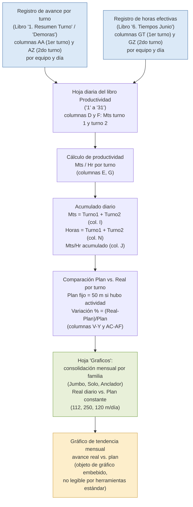

# Análisis Técnico del Libro "5.Productividad Junio.xlsx"

**Empresa (inferida):** CAPSTONE GOLD S.A. DE C.V. — el dominio SharePoint embebido en las referencias externas del archivo (`capstoneminingcorp.sharepoint.com/sites/MOM/...`) confirma vínculo con **Capstone Mining Corp**. Se infiere relación con el proyecto Cozamin (Zacatecas, México), dado el contexto operativo típico de mina subterránea de oro/cobre con equipos Scoop, Jumbo y Ancladores. Esto es una inferencia razonable, no un hecho confirmado documentalmente dentro del propio archivo.

**Periodo de datos:** Junio 2026.

**Archivo analizado:** `5.Productividad Junio.xlsx` (33 hojas, ~785 KB).

---

## Resumen ejecutivo

El libro "5.Productividad Junio.xlsx" es un **tablero operativo diario de productividad de avance minero** (metros perforados/avanzados por equipo y turno) para una mina subterránea. Contiene 31 hojas diarias (una por cada día calendario de junio, nombradas "1" a "31"), una hoja "Graficos" que consolida tendencias mensuales de avance real vs. plan para tres familias de equipo (Jumbos, equipos "Solo" de barrenación larga y Ancladores), y una hoja "Hoja1" vacía sin uso aparente.

El libro **no calcula datos primarios**: actúa como capa de presentación y cálculo de productividad (metros/hora) que consume, vía fórmulas de referencia externa (`='[1]...'` y `='[2]...'`), datos de avance (metros) desde un libro de "Resumen Turno" y datos de horas efectivas de trabajo desde un libro de "Tiempos". Esta arquitectura de múltiples libros vinculados es el patrón central del proceso.

**Hallazgo crítico:** se detectó que las referencias externas (external links) del libro apuntan, de forma explícita en la ruta SharePoint, a los archivos **"1. Demoras Mayo.xlsx"** y **"6. Tiempos Mayo.xlsx"** — es decir, al mes anterior — en lugar de a los equivalentes de junio. Esto sugiere que el libro de junio fue creado copiando la plantilla de mayo y que los vínculos externos no fueron re-apuntados al mes vigente, o que las hojas conservan datos cacheados de mayo que podrían no coincidir con el periodo declarado en el nombre del archivo. Requiere validación urgente con el usuario de negocio.

No se encontró evidencia de lógica de merma, dilución, ley, recuperación, humedad, ajuste o reconciliación de tonelaje/metraje en ninguna de las 33 hojas del libro.

---

## Propósito del libro

Se infiere que el propósito del libro es servir como **reporte diario/mensual de productividad de avance** (metros lineales) por equipo, orientado a supervisión de operaciones mina y a la generación de un gráfico de cumplimiento de plan (real vs. plan) por familia de equipo crítico (Jumbos, barrenación larga "Solo", Ancladores). Aparentemente se usa para:

- Registrar y visualizar el avance (Mts) logrado por cada equipo en cada turno (primero y segundo) y su acumulado diario.
- Calcular el indicador de productividad **Metros por Hora efectiva (Mts/Hr)**, cruzando avance con horas de uso del equipo.
- Comparar el avance real contra un plan de metros por turno (aparentemente 50 m/turno fijo para la mayoría de equipos, o constantes de plan mensual como 112, 250 y 120 m/día para Jumbos, Solos y Ancladores respectivamente en la hoja Graficos).
- Consolidar la tendencia mensual de avance en un gráfico comparativo Plan vs. Real por familia crítica de equipo.

No se observa evidencia suficiente para confirmar si este reporte alimenta procesos de planeación de mina, KPIs de gerencia, o reportes a corporativo — se infiere que sí por el nombre de carpeta SharePoint "Monitoreo", pero no está documentado dentro del archivo.

---

## Áreas o procesos involucrados

| Área / Proceso | Rol inferido en el libro |
|---|---|
| Desarrollo / Avance horizontal (Jumbos) | Medición de metros de barrenación lineal (túneles/galerías) |
| Barrenación larga (equipos "Solo" / DL) | Medición de metros perforados para producción o fortificación |
| Fortificación / Sostenimiento (Ancladores) | Medición de metros de anclaje instalado |
| Acarreo / Carguío (Scoop Trams) | Medición de "Mts" — con posible inconsistencia de unidad (ver Riesgos) |
| Izaje (Malacate) | Familia listada sin datos numéricos visibles en las hojas revisadas |
| Supervisión de turno / Jefatura de mina | Consumidor probable del reporte diario y del gráfico de cumplimiento |
| Planeación / Control de gestión (Monitoreo) | Carpeta SharePoint "MOM/Monitoreo" sugiere consolidación gerencial mensual |

---

## Inventario de pestañas

| Pestaña | Tipo | Contenido |
|---|---|---|
| "1" a "31" | Hoja diaria (patrón repetido) | Productividad por familia/equipo, turno 1, turno 2, acumulado día, y bloque de Plan/Real/Var por turno |
| Graficos | Consolidado mensual | Series de avance real por día (columnas) para Jumbo 1-3, Solo 1-5, Anc 03-08, y fila "Plan" constante por bloque |
| Hoja1 | Vacía | Dimensión A1:A1, sin datos, sin fórmulas — hoja residual |

Total: 33 hojas (31 diarias + Graficos + Hoja1), todas con `sheet_state = visible` (ninguna oculta).

---

## Análisis detallado por pestaña

### Hojas diarias ("1" a "31") — patrón único

Se validó la estructura en las hojas "1", "15" y "30" (no adyacentes) y es **estructuralmente idéntica** en las tres: mismo layout de filas/columnas, mismas familias de equipo, mismas fórmulas (ajustando el número de hoja/fecha en las referencias). Dimensiones ligeramente variables por hoja (ej. hoja "1": B1:AF53; hojas "15" y "30": B1:AF50), atribuible a diferencias en formato de celdas vacías, no a estructura de datos.

**Layout de cada hoja diaria (bloque principal, columnas B a N):**

| Columna | Encabezado | Contenido |
|---|---|---|
| B | Familia / Equipo | Nombre de familia (ej. "SCOOP TRAMS") y equipo individual (ej. "ST-07") |
| D | PRIMER TURNO – Mts | Metros de avance en turno 1 (referencia externa a libro de Resumen Turno) |
| E | PRIMER TURNO – Mts/Hr | `=IF(L=0,0,D/L)` — metros ÷ horas turno 1 |
| F | SEGUNDO TURNO – Mts | Metros de avance en turno 2 (referencia externa) |
| G | SEGUNDO TURNO – Mts/Hr | `=IF(M=0,0,F/M)` — metros ÷ horas turno 2 |
| H | (sin encabezado visible) | Valor fijo 8.5 en varias filas — se infiere que representa horas de turno estándar/planificadas, sin uso aparente en otras fórmulas de la hoja |
| I | ACUMULADO DIA – Mts | `=D+F` (suma de ambos turnos) |
| J | ACUMULADO DIA – Mts/Hr | `=IF(N=0,0,I/N)` |
| L | Tiempos 1er turno | Horas efectivas turno 1 (ArrayFormula o valor fijo, referencia externa a libro de Tiempos) |
| M | Tiempos 2do turno | Horas efectivas turno 2 (mismo patrón) |
| N | Tiempos acumulado | `=L+M` |

**Bloque secundario (columnas T a Y, y AA a AF) — Plan vs. Real por turno**, no documentado en el contexto previo, descubierto en esta exploración:

| Columna | Turno | Contenido |
|---|---|---|
| V | Primera – Plan | `=IF(W>0,50,0)` — Plan fijo de 50 m si hubo actividad real, 0 si no |
| W | Primera – Real | Igual a la columna D (mismo origen externo) |
| X | Primera – Var % | `=IFERROR((W-V)/V,"")` — variación porcentual real vs. plan |
| Y | Primera – Mts/Hr | `=IF(L=0,0,W/L)` |
| AC | Segunda – Plan | `=IF(AD>0,50,0)` |
| AD | Segunda – Real | Igual a la columna F |
| AE | Segunda – Var % | `=IFERROR((AD-AC)/AC,"")` |
| AF | Segunda – Mts/Hr | `=IF(M=0,0,AD/M)` |

Familias de equipo presentes en cada hoja diaria (filas de la columna B), idénticas en las tres hojas muestreadas:

| Familia | Equipos | Filas |
|---|---|---|
| SCOOP TRAMS | ST-07, ST-10, ST-12, ST-15, ST-16, ST-17, ST-18, ST-19, ST-20, ST-21 | 8–17 |
| BARRENACION LINEAL | JU-01, JU-02, JU-03 (Jumbos) | 23–25 |
| BARRENACION LARGA | SOLO DL 310, SOLO DL 311, SOLO DL 331, SOLO DL 311 (04), SOLO DL 411 (05) | 30–34 |
| TUMI | (fila de total sin equipo individual explícito) | 36 |
| ANCLADORES | Anclador 03, 04, 06, 07, 08 | 40–44 |
| MALACATE | Malacate (fila única) | 48 |

Cada bloque de familia tiene una fila "TOTAL" con sumas (`SUM`) de los equipos del bloque.

### Hoja "Graficos"

Consolida series diarias de avance para tres familias críticas, usando fórmulas que enlazan celda por celda con la hoja diaria correspondiente:

- **Fila 3 "Jumbo 1", fila 4 "Jumbo 2", fila 5 "Jumbo 3":** cada columna (una por día) referencia `='<n>'!$I$23`, `$I$24`, `$I$25` respectivamente — es decir, toma el **Acumulado Día (Mts)** de JU-01, JU-02 y JU-03 de la hoja diaria correspondiente. Fila 6 "Plan" = constante `=56*2` = 112 m/día (56 m por turno × 2 turnos).
- **Filas 29–33 "Solo 1" a "Solo 5":** referencian `='<n>'!$I$30` a `$I$34` (acumulado día de los equipos SOLO DL). Fila 34 "Plan" = constante 250.
- **Filas 58–62 "Anc 03" a "Anc 08":** en vez de referenciar las hojas locales, referencian directamente al **libro externo `[1]`** (`='[1]<n>'!$AA$62+'[1]<n>'!$AZ$62'`, sumando turno 1 y turno 2 del "Resumen Turno" original). Fila 63 "Plan" = constante 120. Esta es una inconsistencia respecto a los otros dos bloques (ver Riesgos).

El eje de días (fila 2) contiene la secuencia: 28, 29, 30, 31, 1, 2, 3, 8, 9, 10, 11... — es decir, cruza el cierre de mayo (28–31) con el inicio de junio (1, 2, 3...), y **salta del día 3 al día 8** (faltan 4, 5, 6, 7). Esto puede reflejar días sin registro, un patrón de plan de trabajo específico, o un defecto de la plantilla heredada.

### Hoja "Hoja1"

Vacía (dimensión A1:A1, sin celdas con valor, sin fórmulas). Aparenta ser una hoja residual sin uso, probablemente remanente de una plantilla base u hoja creada por Excel por defecto que nunca fue eliminada ni utilizada.

---

## Flujo de negocio inferido

Se infiere el siguiente flujo de datos, considerando las referencias externas (`external links`) detectadas dentro del archivo (`xl/externalLinks/`), que apuntan explícitamente a `1. Demoras Mayo.xlsx` (para metros de avance, hoja "AA"/"AZ" columnas) y `6. Tiempos Mayo.xlsx` (para horas efectivas de turno, columnas "GT"/"GZ"):

**Nota sobre el diagrama:** el libro contiene dos objetos de gráfico embebidos (`xl/drawings/drawing1.xml`) que no pudieron ser leídos por la librería de análisis (openpyxl) debido a un problema de formato/compatibilidad del XML del gráfico — se infiere que corresponden al gráfico de tendencia representado en el recuadro final del diagrama, pero su configuración visual exacta no pudo confirmarse programáticamente. Requiere validación abriendo el archivo directamente en Excel.

---

## Lógicas de negocio identificadas

| Lógica | Fórmula / Regla | Ubicación |
|---|---|---|
| Productividad por turno | `Mts/Hr = SI(Horas=0, 0, Mts/Horas)` | Columnas E, G de cada hoja diaria |
| Acumulado diario de metros | `Acumulado = Turno1 + Turno2` | Columna I |
| Acumulado diario de horas | `Acumulado = Turno1 + Turno2` | Columna N |
| Productividad acumulada del día | `Mts/Hr = SI(Horas_acum=0, 0, Mts_acum/Horas_acum)` | Columna J |
| Plan de metros por turno (equipo individual) | `Plan = SI(Real>0, 50, 0)` — plan condicionado a que hubo actividad | Columnas V, AC |
| Variación Real vs. Plan | `Var% = SIERROR((Real-Plan)/Plan, "")` | Columnas X, AE |
| Totales por familia de equipo | `SUMA()` de las filas de equipos individuales del bloque | Filas "TOTAL" de cada familia |
| Plan mensual por familia (hoja Graficos) | Constante fija: Jumbos = 56×2 = 112 m/día; Solo = 250 m/día; Ancladores = 120 m/día | Hoja Graficos, filas "Plan" |
| Consolidación de avance mensual | Referencia célula a célula desde cada hoja diaria (`='<n>'!$I$fila`) hacia la hoja Graficos | Hoja Graficos |

**Observación importante sobre el "Plan" a nivel de turno:** la fórmula `=IF(W>0,50,0)` no es un plan predefinido independiente del resultado real — el plan **solo se activa (50 m) si hubo avance real registrado**, y es 0 si no hubo actividad. Esto significa que el indicador de "cumplimiento de plan por turno" no mide realmente si se alcanzó una meta preestablecida, sino que compara el resultado real contra un umbral fijo de 50 m únicamente en los turnos donde el equipo trabajó. Se infiere que esta lógica puede subestimar el impacto de turnos sin actividad (que no se penalizan con un plan incumplido de 50 m en 0). Requiere validación con el usuario de negocio sobre la intención de este diseño.

---

## Tratamiento de merma

**No se encontró evidencia de lógica relacionada con merma, pérdida, dilución, recuperación, ley, humedad, ajuste o reconciliación de tonelaje/metraje en ninguna de las 33 hojas del libro "5.Productividad Junio.xlsx".**

Se realizó una búsqueda exhaustiva de texto (insensible a mayúsculas/acentos) sobre los términos: *merma, pérdida, dilución, recuperación, ley, humedad, ajuste, reconciliación, diferencia, tonelaje, tonelada, densidad*, en todas las celdas de texto de todas las hojas, y no se obtuvo ninguna coincidencia.

Esto es consistente con el propósito inferido del libro: es un reporte de **productividad de avance en metros**, no un reporte de manejo de mineral, tonelaje o metalurgia. Se infiere que el tratamiento de merma, si existe en el conjunto operativo de la mina, se gestiona en otro libro no incluido en este análisis (por ejemplo, en libros de control de mineral, plan de minado o reconciliación geológica-metalúrgica, que no forman parte de este conjunto de cinco archivos). Requiere validación con el usuario de negocio sobre en qué sistema se documenta la merma/dilución si aplica al proceso de Cozamin.

---

## KPIs o métricas derivadas

| KPI | Fórmula | Nivel de agregación | Unidad |
|---|---|---|---|
| Metros por Hora (turno 1) | Mts turno1 / Horas turno1 | Por equipo, por día | m/hr |
| Metros por Hora (turno 2) | Mts turno2 / Horas turno2 | Por equipo, por día | m/hr |
| Metros por Hora (acumulado día) | Mts acum. / Horas acum. | Por equipo, por día | m/hr |
| Avance acumulado diario | Turno1 + Turno2 | Por equipo, por día | m |
| Avance total por familia | Suma de equipos del bloque | Por familia, por día | m |
| Variación Real vs. Plan (turno) | (Real - Plan) / Plan | Por equipo, por turno | % |
| Avance real mensual por familia crítica | Serie diaria consolidada (hoja Graficos) | Por familia (Jumbo, Solo, Anclador), mensual | m |
| Cumplimiento vs. plan mensual | Comparación visual Real vs. Plan constante (112 / 250 / 120 m/día) | Por familia, mensual | m (gráfico) |

---

## Riesgos, brechas y observaciones

| # | Hallazgo | Severidad | Detalle |
|---|---|---|---|
| 1 | Referencias externas apuntan al mes anterior (mayo) | Alta | Los `external links` del libro (`xl/externalLinks/externalLink1.xml` y `externalLink2.xml`) referencian explícitamente, vía ruta SharePoint completa, los archivos `1. Demoras Mayo.xlsx` y `6. Tiempos Mayo.xlsx` en la carpeta `5.Monitoreo_Mayo`, no los equivalentes de junio. Requiere validación urgente: puede tratarse de un vínculo no actualizado (bug de plantilla) o de datos cacheados desactualizados que no reflejen el mes declarado en el nombre del archivo. |
| 2 | Inconsistencia de unidad "Mts" entre familias de equipo | Media-Alta | La columna "Mts" se aplica de forma homogénea a Jumbos y equipos de barrenación (avance lineal, unidad natural: metros) y también a Scoop Trams (equipos de acarreo/carguío, cuya producción se mide típicamente en toneladas, no en metros lineales). Se infiere que "Mts" para Scoop podría representar una métrica distinta (ej. metros de recorrido, o un proxy convertido) no explicitada en el libro. Requiere validación con el usuario de negocio sobre qué representa realmente "Mts" para la familia SCOOP TRAMS. |
| 3 | Mezcla de fuentes de datos dentro de la hoja Graficos | Media | El bloque "Jumbo" y el bloque "Solo" de la hoja Graficos referencian las hojas diarias locales del propio libro (`='<n>'!$I$fila`), mientras que el bloque "Anc" (Ancladores) referencia directamente al libro externo `[1]` (Demoras Mayo), saltándose la hoja diaria local. Esto genera una inconsistencia estructural y, combinado con el hallazgo #1, implica que el gráfico de Ancladores podría estar mostrando datos de mayo en vez de junio. |
| 4 | Familia "MALACATE" sin datos numéricos visibles | Baja-Media | La familia MALACATE aparece listada en todas las hojas diarias revisadas, pero sin fórmulas ni valores en las columnas de Mts/Tiempos en las muestras analizadas — se infiere que este equipo no está operativo o no se reporta en el periodo, pero no se confirma la causa. |
| 5 | Columna H sin encabezado (valor fijo 8.5) | Baja | La columna H (entre "Mts/Hr" del turno 2 y "ACUMULADO DIA") contiene el valor fijo 8.5 en múltiples filas sin encabezado visible ni uso aparente en otras fórmulas de la hoja. Se infiere que representa horas de turno estándar de referencia, posiblemente vestigial. |
| 6 | Vacíos en la secuencia de días del gráfico mensual | Baja | El eje de días en la hoja Graficos salta del día 3 al día 8 de junio (faltan 4, 5, 6 y 7). No se observa evidencia suficiente para confirmar si corresponde a días sin actividad, un error de plantilla, o exclusión intencional (ej. mantenimiento programado). |
| 7 | Objetos de gráfico no legibles programáticamente | Baja | Los dos gráficos embebidos (`xl/drawings/drawing1.xml`) generan advertencias de lectura en la librería utilizada (openpyxl) y no pudieron inspeccionarse en detalle (tipo de gráfico, series exactas, ejes). Requiere revisión manual en Excel para documentación visual completa. |
| 8 | Hoja "Hoja1" vacía sin propósito documentado | Muy baja | No aporta valor funcional; candidata a eliminación en una limpieza de plantilla. |
| 9 | Fórmula de "Plan por turno" condicionada al resultado real | Media | El plan de 50 m por turno solo se activa si hubo avance real (`=IF(Real>0,50,0)`), por lo que turnos sin actividad no generan una brecha de incumplimiento visible en el indicador de variación %. Podría ocultar turnos perdidos en el análisis de cumplimiento. |

---

## Recomendaciones para documentación, automatización o modelamiento de datos

1. **Verificar y corregir los external links** del libro de junio para que apunten a `1. Demoras Junio.xlsx` y `6. Tiempos Junio.xlsx` (los archivos correctos del periodo, ya confirmados presentes en la misma carpeta de datos), no a los de mayo. Esto es prioritario antes de usar el libro para reportes oficiales de junio.

2. **Homologar las fuentes de datos dentro de la hoja Graficos**: unificar el patrón de referencia (todas las familias deberían tomar el acumulado diario desde las hojas locales "1"–"31" del propio libro, no mezclar referencias directas a libros externos).

3. **Aclarar y documentar la unidad de medida real de "Mts" para Scoop Trams** con el equipo de operaciones/planeación mina, y si corresponde, separar visualmente esta familia de las familias de avance lineal (Jumbo, Barrenación) para evitar comparaciones o sumatorias erróneas entre unidades distintas.

4. **Migrar el modelo de múltiples libros vinculados por fórmulas externas a un modelo de datos centralizado** (ej. base de datos o data warehouse con tablas de hechos por turno/equipo/día), eliminando la dependencia de referencias `[1]`, `[2]` entre archivos Excel, que son frágiles ante renombres, movimientos de carpeta o desactualización de vínculos (como se evidenció en el hallazgo #1).

5. **Formalizar la definición de "Plan"** a nivel de turno y a nivel mensual (documentar de dónde provienen los valores 50 m/turno, 112, 250 y 120 m/día, y si deben ser dinámicos por tipo de labor/roca en vez de constantes fijas).

6. **Agregar un catálogo o diccionario de datos** (hoja de referencia dentro del propio libro, o documento externo) que explique el propósito de cada columna, especialmente las que carecen de encabezado (ej. columna H) y las fórmulas de variación %, para facilitar el mantenimiento por personal nuevo.

7. **Confirmar con el usuario de negocio si existe un proceso de merma/dilución/reconciliación de tonelaje en otro sistema** (fuera de este conjunto de 5 libros de Monitoreo), dado que no se encontró en el libro de Productividad ni lógicamente correspondería a un reporte de metros de avance.

8. **Eliminar o justificar la hoja "Hoja1"** vacía, y documentar formalmente el propósito de la carpeta SharePoint "Monitoreo_2026" como fuente única de verdad para evitar la coexistencia de plantillas de distintos meses con vínculos cruzados.

9. **Validar manualmente en Excel los dos gráficos embebidos** para documentar su configuración exacta (tipo, series, ejes), dado que no fueron accesibles mediante análisis programático, y complementar este documento con capturas de pantalla si se requiere una documentación visual completa.
