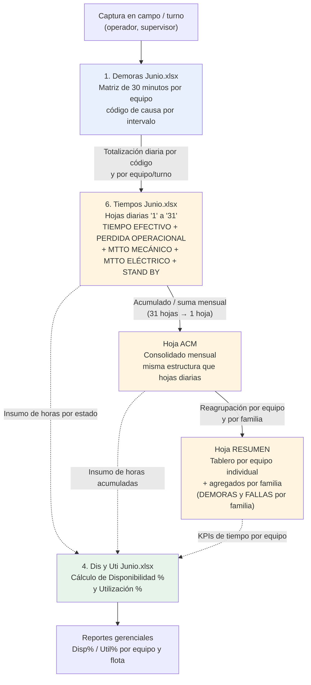

# Análisis Técnico del Libro "6. Tiempos Junio.xlsx"

**Empresa:** CAPSTONE GOLD S.A. DE C.V. (se infiere posible vínculo con el proyecto Cozamin, Zacatecas, México — inferencia no confirmada documentalmente dentro del propio archivo)
**Periodo de datos:** Junio 2026
**Archivo analizado:** `6. Tiempos Junio.xlsx`
**Alcance del análisis:** Estructura, jerarquía de columnas, fórmulas, catálogo de códigos de tiempo y relación con otros libros del mismo conjunto de reportes operacionales.

---

## Resumen ejecutivo

El libro **"6. Tiempos Junio.xlsx"** es un reporte de **disponibilidad y utilización de tiempo de equipos mina** para una operación subterránea, estructurado como una totalización diaria (31 hojas, una por día del mes) más dos hojas de consolidación: **ACM** (acumulado mensual) y **RESUMEN** (tablero por equipo individual).

Cada hoja diaria descompone el tiempo de cada equipo, por turno (1 y 2), en cuatro grandes componentes: **TIEMPO EFECTIVO** (código OP = operación productiva), **TIEMPO PERDIDA POR OPERACIONAL** (un catálogo de aproximadamente 89 códigos de causas de demora de 2 a 4 letras: AB, AR, AM, CL, CV, ET, FA, FE, FL, etc.), **TIEMPO PERDIDA POR MANTENIMIENTO MECÁNICO** y **TIEMPO PERDIDA POR MANTENIMIENTO ELÉCTRICO**, además de un bloque de **TIEMPO STAND BY**. Esta estructura es consistente entre todas las hojas diarias verificadas (se comparó la hoja "1" contra la hoja "20", no adyacentes, confirmando plantilla idéntica) y se replica sin cambios en la hoja ACM (acumulado del mes).

Un hallazgo relevante es que **varias fórmulas clave del libro están rotas** (arrojan `#REF!`), incluyendo la fórmula que genera la lista de códigos de causa (fila de encabezados, columna E) y la fórmula de TIEMPO EFECTIVO por equipo/turno en la primera fila de datos de cada hoja. Esto sugiere que en algún momento se eliminaron columnas, filas u hojas de referencia sin actualizar las fórmulas dependientes — un riesgo de integridad de datos que debe validarse con el usuario de negocio antes de tomar decisiones basadas en estos números.

No se encontró evidencia de lógica de **merma de material** (pérdida física de tonelaje, dilución, ley, humedad, recuperación metalúrgica o reconciliación de tonelaje) en ninguna de las 33 hojas del libro. El concepto de "pérdida" aquí es exclusivamente de **tiempo operativo/disponibilidad**, no de material — una distinción importante que se detalla más adelante.

---

## Propósito del libro

Se infiere que el propósito de este libro es **consolidar y totalizar, a nivel diario y mensual, el tiempo de vida de cada equipo minero según su estado operativo**, sirviendo como base de cálculo para indicadores de disponibilidad mecánica/eléctrica y utilización operativa de la flota. Aparentemente actúa como la capa de **agregación/totalización** de un proceso cuyo detalle fino (registro cada 30 minutos, con hora exacta y causa específica) se captura en otro libro del mismo conjunto ("1. Demoras Junio.xlsx").

El libro no registra producción, tonelaje, ley ni métricas metalúrgicas — su unidad de análisis es el **tiempo por equipo/turno/código de causa**, no el material extraído o procesado.

---

## Áreas o procesos involucrados

- **Operaciones mina subterránea** (equipos de carguío, perforación y anclaje).
- **Mantenimiento mecánico y eléctrico** de flota mina (como causa de indisponibilidad, no como proceso de gestión de mantenimiento en sí).
- **Planeación mina / control de gestión operacional**, como consumidor de estos datos para el cálculo de KPIs de disponibilidad (Disp%) y utilización (Util%).
- **Familias de equipos identificadas:**
  - SCOOP TRAMS (LHD): ST-07, ST-10, ST-12, ST-15, ST-16, ST-17, ST-18, ST-19, ST-20, ST-21.
  - BARRENACIÓN LINEAL (jumbos): JU-01, JU-02, JU-03.
  - BARRENACIÓN LARGA: SOLO 1 a SOLO 5, TUMI.
  - ANCLADORES: Anclador 03, 04, 06, 07, 08.
  - EQUIPOS DE SERVICIO: Telehandler 1-3, Retroexcavadora 2-3, EPAUS 1-2, Getman, Maclean.
  - MALACATE (equipo de izaje, aparentemente registrado de forma independiente).

---

## Inventario de pestañas

| Pestaña | Tipo | Descripción inferida |
|---|---|---|
| `1` a `31` | Hoja diaria | Totalización de tiempos por equipo/turno para cada día del mes de junio 2026. Plantilla idéntica en todas (218 columnas, ~107 filas). |
| `ACM` | Consolidado mensual | Misma estructura que las hojas diarias (211 columnas, 107 filas) — se infiere que es la suma/acumulado de las 31 hojas diarias del mes completo. |
| `RESUMEN` | Tablero por equipo | 109 columnas x 143 filas. Una fila por equipo individual (sin columna TURNO explícita en el bloque principal), con bloques de agregación adicionales por familia de equipo (DEMORAS LHD/JUMBOS/ANCLADORES/SCOOP, FALLAS LHD/JUMBOS/ANCLADORES/SCOOP) y columnas finales de OPE EFEC / STAND BY / MTTO por familia. |

**Nota:** las 31 hojas diarias corresponden efectivamente a los 30 o 31 días de junio; no se verificó exhaustivamente el contenido de cada una de las 31, pero la comparación puntual entre la hoja "1" y la hoja "20" (no adyacentes) confirmó una plantilla estructuralmente idéntica, por lo que se infiere razonablemente que las 31 comparten el mismo diseño.

---

## Análisis detallado por pestaña

### Hojas diarias (patrón único, ej. hoja "1")

**Dimensiones:** 218 columnas x 107 filas (variable ligeramente: ACM tiene 211 columnas por carecer del bloque final "DEMORAS").

**Jerarquía de encabezados (filas 2 a 8):**

- Fila 2: título de empresa — "CAPSTONE GOLD S.A. DE C.V."
- Fila 3: "TIEMPOS"
- Fila 4: "TIEMPO TOTAL"
- Fila 5: "TIEMPO DISPONIBLE"
- Fila 6: cabeceras de segundo nivel — "Familia / Equipo", "TURNO", "TIEMPO EFECTIVO", "TIEMPO PERDIDA POR OPERACIONAL / TIEMPO STAND BY" (etiqueta combinada en una sola celda fusionada), "TIEMPO PERDIDA POR MANTENIMIENTO MECANICO", "TIEMPO PERDIDA POR MANTENIMIENTO ELECTRICO", "TIEMPOS DEL DÍA", "SUMA DEL DÍA", "PRIMERA", "SEGUNDA", "DEMORAS".
- Fila 7: catálogo de códigos de causa (columnas E a CP, es decir columnas 5 a 94 — 90 códigos en total, el primero de los cuales es "OP" = tiempo efectivo/operación).
- Fila 8: subtotales de familia de equipo y etiquetas de resumen (TOT, OPE EFEC, STAND BY, MTTO MEC, MTTO ELEC, MTTO MEC-ELE).

**Estructura de filas (datos):** cada equipo ocupa dos filas consecutivas (Turno 1 y Turno 2), agrupadas bajo su familia (ej. filas 9-32 = SCOOP TRAMS, con fila 33 = "TOTAL" de la familia). El patrón se repite para BARRENACIÓN LINEAL, BARRENACIÓN LARGA, ANCLADORES, EQUIPOS DE SERVICIO y MALACATE, terminando en fila 95 con el "TOTAL" general de la hoja.

**Segundo bloque de resumen (filas 97-106):** un bloque adicional que agrega por macro-familia (SCOOPS, JUMBOS, SOLOS, ANCLADORES) x turno (1RA/2RA), pero utilizando un **catálogo de códigos ligeramente distinto** al de la fila 7 (ET, TP, F1, F2, FO1, CL, VE1, AR, CV, SE1, FSOP, R1, J1, TGM, IE1, FA1, CT1, ME1, CZ, LE1, CAR, DP, TOR1, FMG2, CE, MOR1, MD1, DN, RS1, D1, MT1, CFV, LIB1, MEL, MOV1, DC, PLOG). Esto sugiere que pueden coexistir **dos generaciones de catálogo de códigos** dentro del mismo libro (uno vigente, usado en la matriz principal, y otro posiblemente heredado de una versión anterior de la plantilla), o bien dos niveles de agrupación de causas con nomenclatura distinta. **Requiere validación con el usuario de negocio.**

**Columnas 99-188 ("TIEMPOS DEL DÍA"):** verificado por fórmula, este bloque es un **array dinámico (`ANCHORARRAY`)** que replica (hace "eco" de) el mismo catálogo de 90 códigos de la fila 7/columnas E:CP, desplegado como un segundo despliegue de datos por equipo. Aparentemente se usa como zona de cálculo intermedio o de verificación antes de los totales de columnas 189 en adelante.

**Columnas 189-218 (bloques de resumen):** contienen fórmulas de suma y de participación porcentual: TOT, OPE EFEC, STAND BY, MTTO MEC, MTTO ELEC, MTTO MEC-ELE, replicados en tres sub-bloques (posiblemente TOTAL DEL DÍA, PRIMERA hora/turno, SEGUNDA hora/turno) y un bloque final "DEMORAS" con TOTAL / OPERATIVAS / MECÁNICAS / ELÉCTRICAS en formato porcentual.

**Errores detectados:** la celda de TIEMPO EFECTIVO (columna E) en la primera fila de datos de cada equipo contiene una fórmula de tipo array cuyo texto es `=#REF!` — es decir, una referencia rota. Esto se repite en la hoja "20" y en ACM, confirmando que **no es un error aislado de una sola hoja**, sino un problema estructural de la plantilla o de una edición posterior que eliminó una hoja/rango de referencia.

### Hoja ACM

Estructura idéntica a las hojas diarias (mismos encabezados de fila 2-8, mismo catálogo de 90 códigos en fila 7, mismo error `#REF!` en la celda de TIEMPO EFECTIVO), con la única diferencia observada de que tiene 211 columnas en vez de 218 (carece del bloque final "DEMORAS" de columnas 215-218). Esto refuerza la hipótesis de que ACM es el **acumulado/consolidado mensual**, construido probablemente sumando o enlazando las 31 hojas diarias, aunque no se verificaron explícitamente fórmulas de suma cruzada entre hojas por restricciones de tiempo de exploración — **se recomienda validar con el usuario de negocio si ACM se alimenta por fórmula (SUM entre hojas) o por proceso manual/copiado de valores.**

### Hoja RESUMEN

Estructura distinta a las hojas diarias: 109 columnas x 143 filas, organizada por **nombre de equipo individual** en lugar de por familia/turno combinados. Se identificaron:

- Filas 3-28: una fila por equipo (SOLO 1-5, TUMI, JU-01 a JU-03, Anclador 03-08, ST-07 a ST-21), con ~59 columnas de datos numéricos por fila (mayoritariamente en cero en los datos de muestra revisados).
- Fila 2 (encabezado): columnas 94-96 etiquetadas "OPE EFEC", "STAND BY", "MTTO"; columnas 98, 101, 105, 108 etiquetadas "SOLOS", "JUMBOS", "ANCLADORES", "SCOOPS" — es decir, un bloque final de KPIs agregados por familia de equipo.
- Filas 51-54: bloque "DEMORAS LHD / DEMORAS JUMBOS / DEMORAS ANCLADORES / DEMORAS SCOOP".
- Filas 88-91: bloque "FALLAS LHD / FALLAS JUMBOS / FALLAS ANCLADORES / FALLAS SCOOP".

Se infiere que RESUMEN es un **tablero de mando (dashboard) mensual** que consolida, por equipo individual y por familia, los mismos conceptos de tiempo (operación efectiva, standby, mantenimiento) más un desglose específico de demoras y fallas por familia de equipo — probablemente derivado de ACM o directamente de las 31 hojas diarias.

---

## Catálogo de códigos de tiempo perdido identificado

El siguiente catálogo corresponde a los 90 códigos localizados en la fila 7 (columnas E a CP) de las hojas diarias y de ACM. La descripción es una **inferencia razonada** a partir de la nomenclatura minera estándar y del contexto ya conocido del libro relacionado "1. Demoras Junio.xlsx" (mismo catálogo de causas de demora, según lo indicado en el contexto de este análisis); **no fue posible confirmar el texto literal de cada descripción dentro de este archivo**, ya que la hoja de tiempos solo contiene los códigos abreviados, no su glosario. Se recomienda contrastar formalmente con el catálogo maestro de "1. Demoras Junio.xlsx" o con el área de planeación mina.

| Código | Descripción inferida | Categoría |
|---|---|---|
| OP | Operación (tiempo efectivo productivo) | Tiempo Efectivo |
| AB | Acceso bloqueado | Pérdida operacional |
| AR | Amacice / Regado | Pérdida operacional |
| AM | Amacice mecanizado | Pérdida operacional |
| CL | Cambio de pueble | Pérdida operacional |
| CV | Cargado de voladura | Pérdida operacional |
| ET | Equipo en tránsito | Pérdida operacional |
| FA | Falta de acero | Pérdida operacional |
| FE | Falta de energía | Pérdida operacional |
| FL | Falta de limpia | Pérdida operacional |
| FM | Falta de material (inferido, no confirmado) | Pérdida operacional |
| FO | Falta de operador (inferido) | Pérdida operacional |
| FP | Falta de personal (inferido) | Pérdida operacional |
| FSP | Falta de supervisión (inferido) | Pérdida operacional |
| FA1 / FA2 | Variantes de falta de acero (inferido) | Pérdida operacional |
| TGM1 | Tronadura / voladura general mina (inferido) | Pérdida operacional |
| IE | Instalación eléctrica / interferencia (inferido) | Pérdida operacional |
| OI | Orden / instrucción (inferido) | Pérdida operacional |
| OV | Ordeña de voladura (inferido) | Pérdida operacional |
| R1 | Relevo / reunión (inferido) | Pérdida operacional |
| SER1 | Servicio (inferido) | Pérdida operacional |
| J1 | Junta / jornada (inferido) | Pérdida operacional |
| TP | Tiempo perdido / traslado personal (inferido) | Pérdida operacional |
| VE1 | Ventilación (inferido) | Pérdida operacional |
| ZP | Zona peligrosa / zona de protección (inferido) | Pérdida operacional |
| DO1 | Demora operativa (inferido) | Pérdida operacional |
| DS | Desate de rocas (inferido) | Pérdida operacional |
| EA | Espera de autorización (inferido) | Pérdida operacional |
| CPL | Cambio de plan / cambio de pala (inferido) | Pérdida operacional |
| ... (resto del catálogo, ~30 códigos adicionales: BA1, AI, S1, VD, INV, L1, EXT1, GDIE, AL1, BD, CAR, CM, CAC, CAJ, CAFV, CZ, CD, DA, DN, DP, EST1, FT, ANS, FUGA, LE, FMG, MTB) | No se cuenta con contexto suficiente para inferir con confianza cada descripción individual | Pérdida operacional / Mantenimiento |
| ME1, MOR1, MD1, D1, RS1, SM1, TOR1, MB, MP, MTC, MEL1, CE1, CED, FT1 | Códigos consistentes con causas de **mantenimiento mecánico** (ME = mecánico, MOR = motor, MD = mando, etc. — inferido) | Pérdida por mantenimiento mecánico |
| PD, FR, SDA, PER, DCONT, FPER, GI1, CND, MOV, PDM, SE1, TDO1, CPD, FSF, AD, AR1, ED, FCR, BE | Códigos consistentes con causas de **mantenimiento eléctrico** (posición en columnas 76-94, bajo el encabezado "TIEMPO PERDIDA POR MANTENIMIENTO ELECTRICO") | Pérdida por mantenimiento eléctrico |

**Nota importante:** dado que el detalle exacto de cada código (glosario oficial) reside presumiblemente en "1. Demoras Junio.xlsx", este documento **no debe considerarse la fuente de verdad del catálogo** — es una lectura estructural del libro de tiempos, que reutiliza (aparentemente) el mismo set de códigos. Aparentemente sí existe consistencia de nombres de código entre la hoja diaria, ACM y el segundo bloque de resumen (filas 97+), aunque este segundo bloque usa una lista parcialmente distinta (ver sección de hallazgos), lo cual **requiere validación explícita con el usuario de negocio**.

---

## Flujo de negocio inferido

Se infiere el siguiente flujo de datos, basado en la estructura observada y en el contexto ya conocido de los libros relacionados del mismo conjunto de reportes:

**Aclaración sobre las líneas punteadas:** la relación entre "6. Tiempos Junio.xlsx" y "4. Dis y Uti Junio.xlsx" es una **inferencia basada en el nombre y propósito típico de estos reportes en la industria minera**, no fue verificada abriendo el libro de Dis y Uti en este análisis. Se recomienda confirmar si "4. Dis y Uti Junio.xlsx" efectivamente enlaza celdas hacia "6. Tiempos Junio.xlsx" (por fórmula externa) o si los datos se transcriben manualmente entre libros.

---

## Lógicas de negocio identificadas

| Lógica | Descripción | Evidencia encontrada |
|---|---|---|
| Jerarquía de tiempo | TIEMPO TOTAL ⊇ TIEMPO DISPONIBLE ⊇ (TIEMPO EFECTIVO + TIEMPO PERDIDA POR OPERACIONAL + TIEMPO STAND BY); en paralelo, TIEMPO PERDIDA POR MANTENIMIENTO (MECÁNICO + ELÉCTRICO) se resta también de la disponibilidad. Aparentemente **TIEMPO TOTAL = TIEMPO DISPONIBLE + tiempo no disponible/fuera de turno**, aunque esta parte superior de la jerarquía no fue posible verificarla por fórmula porque las celdas de encabezado (filas 2-5, columna E) no contienen fórmulas visibles, solo rótulos. **Requiere validación.** | Encabezados fusionados en filas 4-6; fórmulas de columnas 189-193 (`=SUM(CU9:GF9)`, `=IFERROR(CU9/GG9,"")`, etc.) que calculan participación porcentual de OPE EFEC / STAND BY / MTTO MEC / MTTO ELEC sobre el total del día. |
| Totalización por código de causa | Cada código de causa (90 en total) tiene una columna dedicada por fila de equipo/turno, sumada en un total general de fila (columna 95, fórmula `=SUM(E9:CP9)`). | Fórmula `95: '=SUM(E9:CP9)'` verificada en hoja "1". |
| Réplica de matriz por array dinámico | Las columnas 99-188 ("TIEMPOS DEL DÍA") son un `ANCHORARRAY` que reexpande el mismo rango de 90 códigos, probablemente para servir de zona de trabajo intermedio antes de calcular los porcentajes de las columnas 189+. | Fórmula `=_xlfn.ANCHORARRAY(E7)` en encabezado de columna 99. |
| Doble turno por equipo | Cada equipo aparece en dos filas consecutivas (columna TURNO = 1 y 2), permitiendo el análisis de tiempos por turno además del total diario. | Estructura de filas 9-10 (ST-07 turno 1 y 2), repetida para cada equipo. |
| Segundo catálogo de agrupación por macro-familia | Existe un segundo bloque (filas 97-106) que resume por macro-familia (SCOOPS, JUMBOS, SOLOS, ANCLADORES) usando una lista de códigos parcialmente distinta a la de la matriz principal. | Comparación directa de listas de códigos fila 7 vs fila 98. |
| Consolidación mensual (ACM) | Se infiere que ACM agrega el mes completo replicando la misma estructura de columnas que las hojas diarias. | Comparación estructural hoja "1" vs hoja "20" vs hoja "ACM" — headers y catálogo de códigos idénticos. |
| Tablero por equipo (RESUMEN) | Reorganiza los mismos conceptos de tiempo (OPE EFEC, STAND BY, MTTO) por equipo individual y por familia agregada, con bloques adicionales de demoras y fallas por familia. | Estructura de filas 3-28, 51-54, 88-91 y columnas 94-108 de la hoja RESUMEN. |

---

## Tratamiento de merma

Es importante distinguir dos conceptos que, por similitud de vocabulario ("pérdida"), podrían confundirse:

1. **TIEMPO PERDIDA POR OPERACIONAL / MECÁNICO / ELÉCTRICO** (presente extensamente en este libro): se refiere a la **pérdida de tiempo productivo** de un equipo — es decir, minutos u horas en los que el equipo no está realizando su función productiva (OP), ya sea por causas operativas, de mantenimiento mecánico o de mantenimiento eléctrico. Es un concepto de **disponibilidad y eficiencia**, no de material.

2. **Merma de material** (tonelaje, ley, dilución, humedad, recuperación metalúrgica, reconciliación mina-planta): se refiere a la **pérdida física o contable de mineral** entre la estimación de reservas/plan y lo efectivamente extraído, transportado y/o procesado.

Se realizó una búsqueda sistemática de palabras clave asociadas a merma de material (MERMA, DILUCIÓN, RECUPERACIÓN, HUMEDAD, LEY, RECONCILIACIÓN, AJUSTE, TONELAJE, TONELADA) en el texto de todas las celdas de las 33 hojas del libro (barriendo hasta 110 filas x 220 columnas por hoja). **El resultado fue cero coincidencias en todo el libro.**

**Conclusión:** no se observa evidencia suficiente para confirmar que este libro contenga o alimente lógica de merma de material. El libro "6. Tiempos Junio.xlsx" está enfocado exclusivamente en la dimensión de **tiempo operativo de equipos**, no en tonelaje ni en ley de mineral. Si existe un proceso de merma/reconciliación de material en la operación, se infiere que reside en otro libro no incluido en este análisis (posiblemente relacionado con "5. Productividad Junio.xlsx", nombre observado en el mismo directorio de archivos, aunque esto no fue verificado y queda fuera del alcance de este documento).

---

## KPIs o métricas derivadas

| KPI / métrica | Fórmula inferida | Fuente en el libro |
|---|---|---|
| % Operación Efectiva (OPE EFEC) | TIEMPO EFECTIVO (código OP) / TIEMPO TOTAL DEL DÍA | Columna 190 en hojas diarias: `=IFERROR(CU9/GG9,"")` |
| % Stand By | Suma de horas en códigos de stand by / TIEMPO TOTAL DEL DÍA | Columna 191: `=IFERROR(SUM(CV9:EF9)/GG9,"")` |
| % Mantenimiento Mecánico | Suma de horas en códigos de mantenimiento mecánico / TIEMPO TOTAL DEL DÍA | Columna 192: `=IFERROR(SUM(EG9:FM9)/GG9,"")` |
| % Mantenimiento Eléctrico | Suma de horas en códigos de mantenimiento eléctrico / TIEMPO TOTAL DEL DÍA | Columna 193: `=IFERROR(SUM(FN9:GF9)/GG9,"")` |
| % Demoras Operativas / Mecánicas / Eléctricas (bloque final) | Participación de cada categoría de demora sobre el total, calculado como porcentaje en columnas 216-218 (formato "0%") | Columnas 215-218 de cada hoja diaria |
| Total de horas por familia de equipo | Suma de subtotales de equipo (fila "TOTAL" al cierre de cada familia, ej. fila 33 para SCOOP TRAMS) | Filas de subtotal por familia en cada hoja diaria |
| Disponibilidad mecánica / eléctrica (inferido, no calculado en este libro) | Se infiere que estos tiempos alimentan el cálculo de Disp% en "4. Dis y Uti Junio.xlsx", típicamente: Disp% = (Tiempo Disponible − Tiempo Mantenimiento) / Tiempo Disponible | No verificado directamente; inferencia basada en el nombre del libro relacionado |
| Utilización operativa (inferido, no calculado en este libro) | Se infiere Util% = Tiempo Efectivo / Tiempo Disponible, calculado en "4. Dis y Uti Junio.xlsx" a partir de las horas de este libro | No verificado directamente |

---

## Riesgos, brechas y observaciones

| Riesgo / brecha | Detalle | Severidad inferida |
|---|---|---|
| Fórmulas rotas (`#REF!`) | La celda de TIEMPO EFECTIVO (columna E, fórmula de array) y la celda de encabezado del catálogo de códigos (columna 99, `ANCHORARRAY`) muestran errores `#REF!` de forma consistente en las hojas "1", "20" y "ACM". Esto indica que se eliminó una hoja, columna o rango de referencia sin actualizar las fórmulas dependientes. | Alta — puede estar afectando el cálculo real de TIEMPO EFECTIVO en todas las hojas del libro. |
| Doble catálogo de códigos | Existen dos listas de códigos de causa dentro del mismo libro (la de la matriz principal, fila 7, y la del bloque de resumen por macro-familia, fila 98), que no coinciden exactamente en nomenclatura. No se pudo determinar si son equivalentes bajo un mapeo distinto o si reflejan una migración incompleta de catálogo. | Media-Alta — riesgo de inconsistencia en reportes agregados. |
| Trazabilidad ACM ⟵ hojas diarias no verificada por fórmula | No se confirmó mediante inspección de fórmulas si ACM se alimenta automáticamente (SUM entre hojas) o mediante copiado manual de valores desde las 31 hojas diarias. | Media — afecta la confiabilidad del acumulado mensual si el proceso es manual. |
| Relación con "4. Dis y Uti Junio.xlsx" no verificada directamente | Se documenta como inferencia razonable (no confirmada) que este libro alimenta el cálculo de Disp%/Util% en el libro "4. Dis y Uti Junio.xlsx". | Media — de no existir enlace por fórmula, hay riesgo de doble digitación y desalineación entre libros. |
| Valores en cero en muestras revisadas | Varias filas de datos revisadas (ej. equipos ST-10, ST-12, ST-15 en hoja "1"; SOLO 1-5 y JU-01 en RESUMEN) muestran mayoritariamente ceros. No se determinó si corresponde a equipos efectivamente sin actividad en las fechas de muestra, o si refleja un problema de carga/actualización de datos. | Media — requiere validación funcional con el usuario de negocio sobre el estado real de la flota en las fechas muestreadas. |
| Archivo muy ancho y con arrays dinámicos | El uso extensivo de fórmulas de array dinámico (`ANCHORARRAY`) y rangos muy anchos (218 columnas) incrementa el riesgo de fragilidad ante ediciones futuras (inserciones/eliminaciones de columnas) y dificulta la auditoría manual del libro. | Media — riesgo de mantenibilidad a largo plazo. |
| Ausencia de lógica de merma de material | Confirmado mediante búsqueda exhaustiva de palabras clave: el libro no contiene lógica de merma, dilución, ley, humedad ni reconciliación de tonelaje. No es un riesgo del libro en sí, pero se documenta para evitar que se asuma erróneamente que "TIEMPO PERDIDA" incluye pérdida de material. | Informativo. |

---

## Recomendaciones para documentación, automatización o modelamiento de datos

1. **Corregir las referencias rotas (`#REF!`)** antes de utilizar este libro como fuente confiable de KPIs. Se recomienda que el equipo de planeación mina revise el historial de cambios del archivo (o reconstruya la fórmula de TIEMPO EFECTIVO y del catálogo de códigos) para restablecer la integridad de los cálculos base.

2. **Unificar el catálogo de códigos de causa** entre la matriz principal (fila 7) y el bloque de resumen por macro-familia (fila 98), documentando formalmente en un catálogo maestro único (idealmente compartido con "1. Demoras Junio.xlsx") la descripción completa de cada código, su categoría (operacional / mecánica / eléctrica / stand by) y su vigencia.

3. **Migrar el proceso de totalización a un modelo de datos tabular** (por ejemplo, una tabla de hechos con columnas: fecha, equipo, familia, turno, código de causa, categoría, horas), en lugar de 33 hojas anchas con fórmulas de array. Esto facilitaría la carga en herramientas de BI (Power BI, Looker, etc.) y eliminaría la fragilidad de las fórmulas de array dinámico ante cambios estructurales.

4. **Confirmar y documentar formalmente el flujo de datos** entre "1. Demoras Junio.xlsx" → "6. Tiempos Junio.xlsx" → "4. Dis y Uti Junio.xlsx", idealmente mediante fórmulas de enlace entre libros o, en un modelo de datos moderno, mediante un pipeline ETL que tome como única fuente de verdad la matriz de 30 minutos del libro de Demoras.

5. **Automatizar la consolidación ACM y RESUMEN** mediante fórmulas de suma explícitas entre hojas (o mediante un proceso ETL), evitando el copiado manual de valores, y agregar controles de calidad (ej. validación de que TIEMPO TOTAL = suma de sus componentes) para detectar automáticamente inconsistencias como las encontradas en este análisis.

6. **Evaluar la incorporación de un módulo de merma/reconciliación de material** como libro o proceso separado, si dicha necesidad existe en la operación, dado que el presente libro no la contempla y su ausencia podría generar una brecha de visibilidad entre el control de tiempos de equipo y el control de tonelaje/ley real extraído.

7. **Validar con el usuario de negocio** los puntos marcados como inferencia a lo largo de este documento, en particular: la jerarquía exacta TIEMPO TOTAL vs TIEMPO DISPONIBLE, el mecanismo de alimentación de ACM, la relación formal con "4. Dis y Uti Junio.xlsx", y el significado completo del catálogo de 90 códigos de causa.

---

*Documento generado a partir de exploración programática del archivo `6. Tiempos Junio.xlsx` (openpyxl/pandas), incluyendo inspección de valores, fórmulas (modo `data_only=False`) y estructura de encabezados de las hojas "1", "20", "ACM" y "RESUMEN", más una búsqueda exhaustiva de palabras clave relacionadas con merma de material en las 33 hojas del libro.*
