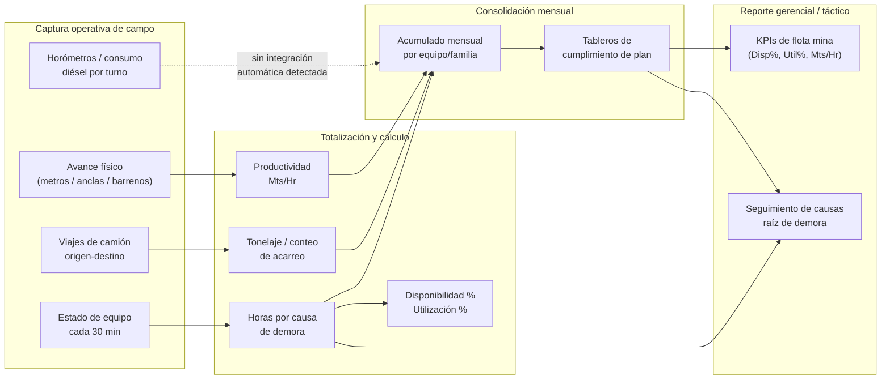
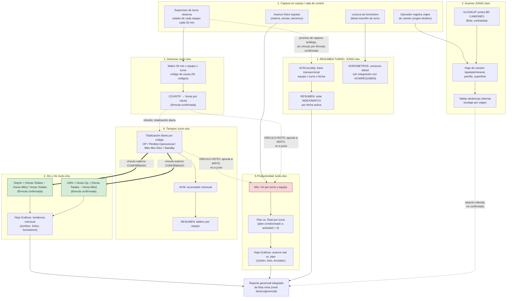
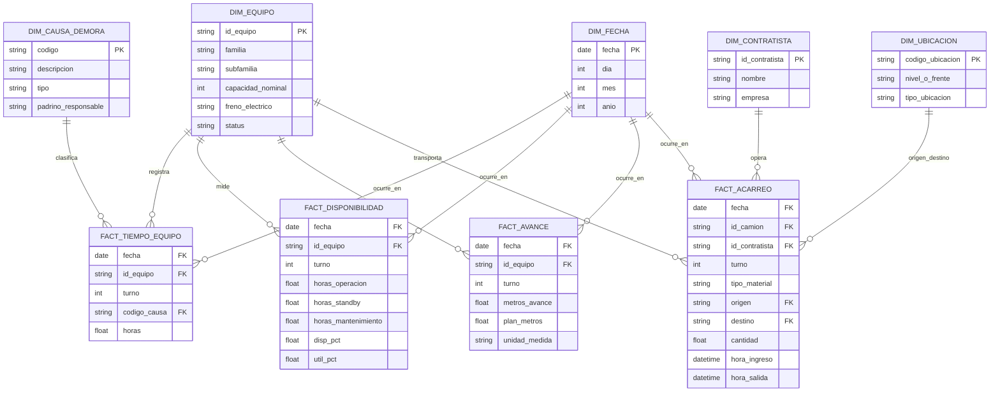

# Reporte Consolidado de Libros Excel — Minería Subterránea

**Empresa (inferida):** CAPSTONE GOLD S.A. DE C.V. (confirmada textualmente dentro de varios libros). Vínculo con **Capstone Mining Corp** confirmado por dominio SharePoint (`capstoneminingcorp.sharepoint.com`) embebido en referencias externas de "5.Productividad Junio.xlsx". Relación con el proyecto **Cozamin (Zacatecas, México)** inferida de la ruta de carpeta SharePoint `"...261906 Reportabilidad Capstone Copper - Cozamin/03 Reportes/..."` detectada en "4. Dis y Uti Junio.xlsx" — **requiere validación formal con el usuario de negocio**, ya que ningún libro confirma explícitamente la razón social completa ni la ubicación geográfica en su contenido interno.

**Periodo de datos:** Junio de 2026 (con hallazgo de vínculos residuales a mayo 2026 en un libro — ver sección de riesgos).

**Archivos analizados:** 6 libros de Excel, 201 hojas en total, ubicados en la misma carpeta de red (`01_Datos`), consistentes con un conjunto integrado de reportabilidad operativa diaria de mina subterránea.

**Fecha de este reporte:** 2 de julio de 2026.

**Metodología:** análisis programático (Python / openpyxl / pandas) de cada libro, incluyendo inspección de valores, fórmulas (`data_only=False`), vínculos externos (`xl/externalLinks`), macros VBA, y búsqueda exhaustiva de palabras clave relacionadas con merma de material en la totalidad de las hojas de cada archivo. Los seis análisis individuales (`analisis_*.md`) contienen el detalle completo por libro; este documento sintetiza los hallazgos transversales.

---

## 1. Resumen general

El conjunto de seis libros de Excel conforma una **suite de reportabilidad operativa diaria de una mina subterránea de metales** (oro/cobre), cubriendo el ciclo completo de gestión de flota mina: captura de eventos de demora, totalización de tiempos, cálculo de disponibilidad/utilización, productividad de avance, control de horómetros/cumplimiento por turno, y acarreo de material con camiones.

Los seis archivos comparten una **misma convención estructural**: 31 hojas diarias nombradas "1" a "31" (una por día calendario), con plantilla mayormente uniforme, más un número variable de hojas especiales de catálogo, consolidación mensual o gráficos. Todos comparten el **mismo catálogo de equipos** (Scoop Trams, Jumbos, equipos "Solo"/Barrenación Larga, Ancladores, y en algunos libros Malacate, equipos de servicio y camiones de acarreo) y, en dos de los libros, el **mismo catálogo de ~91 códigos de causas de demora**.

Se confirmaron, mediante evidencia técnica directa (fórmulas y vínculos externos reales, no solo inferencia), **dos relaciones de dependencia entre libros**:

1. **"4. Dis y Uti Junio.xlsx" consume datos de "6. Tiempos Junio.xlsx"** vía vínculo externo activo de Excel (`externalLinks`) hacia una ruta de SharePoint corporativo.
2. **"5.Productividad Junio.xlsx" consume datos externos de dos libros**, pero las rutas de vínculo apuntan **incorrectamente al mes de mayo** ("1. Demoras Mayo.xlsx" y "6. Tiempos Mayo.xlsx") en lugar de a los equivalentes de junio — un hallazgo crítico que pone en duda la vigencia de los datos de productividad reportados.

El hallazgo transversal más relevante para el alcance solicitado es que **ninguno de los seis libros contiene evidencia de lógica de merma, dilución, recuperación metalúrgica, ley de mineral, humedad o reconciliación de tonelaje**. La búsqueda de estos términos fue exhaustiva y sistemática en cada libro (documentada individualmente) y arrojó cero coincidencias reales en las más de 200 hojas revisadas. El conjunto de archivos está enfocado íntegramente en la dimensión **operativa de equipo mina** (tiempo, disponibilidad, utilización, avance físico en metros, tonelaje logístico de acarreo), no en el dominio geológico-metalúrgico.

También se identificaron **riesgos de integridad de datos significativos y recurrentes**: fórmulas con error `#REF!` en al menos dos libros ("1. RESUMEN TURNO- JUNIO.xlsx" y "6. Tiempos Junio.xlsx"), hojas fuente ocultas que concentran la lógica real del modelo (ACM en RESUMEN TURNO, Hoja2 en Acarreo), vínculos externos frágiles y potencialmente desactualizados, dependencia de macros VBA no versionadas (Acarreo), y captura incompleta de datos del periodo (Acarreo solo tiene datos hasta el día 19 de junio).

---

## 2. Inventario de archivos analizados

| # | Archivo | Formato | Tamaño aprox. | Hojas | Área / proceso principal | Periodicidad | Nivel de uso |
|---|---|---|---|---|---|---|---|
| 1 | 1. Demoras Junio.xlsx | .xlsx | 6.9 MB | 37 | Captura de demoras por intervalo de 30 min (mina, flota) | Turno / diaria (mes completo) | Operativo |
| 2 | 1. RESUMEN TURNO- JUNIO.xlsx | .xlsx | 0.6 MB | 3 (1 oculta) | Resumen de disponibilidad y cumplimiento por turno | Turno / diaria (vista por fecha) | Táctico / gerencial |
| 3 | 2. Acarreo JUNIO.xlsm | .xlsm (con macros VBA) | 1.2 MB | 33 (1 oculta) | Acarreo de material con camiones (origen-destino) | Turno / diaria | Operativo |
| 4 | 4. Dis y Uti Junio.xlsx | .xlsx | 0.9 MB | 32 | Disponibilidad (Disp%) y Utilización (Util%) de flota | Diaria + acumulado mensual | Táctico / gerencial |
| 5 | 5.Productividad Junio.xlsx | .xlsx | 0.8 MB | 33 | Productividad de avance (metros/hora) | Turno / diaria + acumulado mensual | Operativo / táctico |
| 6 | 6. Tiempos Junio.xlsx | .xlsx | 4.1 MB | 33 | Totalización de tiempos por código de causa | Diaria + acumulado mensual + resumen por equipo | Táctico / gerencial |

**Total:** 201 hojas distribuidas en 6 libros, todos correspondientes al mes de junio de 2026 (con la salvedad del hallazgo de vínculos a mayo en el libro 5).

---

## 3. Mapa de procesos cubiertos

**Procesos NO cubiertos por este conjunto de archivos** (ausencia confirmada mediante búsqueda exhaustiva en las 201 hojas): geología, control de leyes de mineral, planta de procesamiento, balance metalúrgico, dilución, recuperación, humedad, reconciliación mina-planta. Si estos procesos existen en la operación, se gestionan en sistemas o libros fuera del alcance de este análisis.

---

## 4. Relación entre libros

| Libro origen | Libro destino | Tipo de relación | Evidencia | Confiabilidad |
|---|---|---|---|---|
| 6. Tiempos Junio.xlsx | 4. Dis y Uti Junio.xlsx | Vínculo externo de Excel (`externalLink`) activo, fórmulas tipo `='[1]1'!$GT$9:$GU$20` | **Confirmada** — XML interno del paquete inspeccionado directamente | Alta |
| 1. Demoras Mayo.xlsx *(mes incorrecto)* | 5.Productividad Junio.xlsx | Vínculo externo de Excel apuntando a ruta SharePoint de mayo, no de junio | **Confirmada la existencia del vínculo, pero apunta al periodo equivocado** | Alta (como hallazgo de riesgo) |
| 6. Tiempos Mayo.xlsx *(mes incorrecto)* | 5.Productividad Junio.xlsx | Igual que el anterior, para horas efectivas de turno | **Confirmada la existencia del vínculo, apunta a mayo** | Alta (como hallazgo de riesgo) |
| ACM (hoja oculta) | RESUMEN (hoja visible) — ambas dentro de "1. RESUMEN TURNO- JUNIO.xlsx" | Fórmulas `INDEX/MATCH` con clave compuesta Fecha+Turno+Equipo | **Confirmada** — fórmula real extraída y documentada | Alta |
| 1. Demoras Junio.xlsx | 6. Tiempos Junio.xlsx | Se infiere que Tiempos es la totalización diaria del detalle de 30 min de Demoras, dado que comparten el mismo catálogo de ~90-91 códigos de causa | No se encontró fórmula de enlace directo entre ambos libros | Inferencia razonable, no confirmada |
| 1. Demoras Junio.xlsx / 1. RESUMEN TURNO- JUNIO.xlsx | 5.Productividad Junio.xlsx | Se infiere que el bloque "Mts"/avance de Productividad proviene de un libro de Resumen Turno o Demoras | No confirmado por fórmula (los vínculos reales encontrados apuntan a Demoras/Tiempos de **mayo**, no se confirmó un vínculo adicional hacia Resumen Turno) | Inferencia, requiere validación |
| 2. Acarreo JUNIO.xlsm | (resto del conjunto) | Se infiere relación temática por horarios de ingreso/salida y conteo de camiones/contratistas, útil para tiempos y productividad | No se encontró ningún `externalLink` ni fórmula de integración en este libro | Inferencia débil, no confirmada |
| 1. RESUMEN TURNO- JUNIO.xlsx (HOROMETROS) | ACM / RESUMEN (mismo libro) | Se esperaría conciliación entre horas operativas reportadas y horas-motor reales | No se detectó ninguna fórmula de vínculo | Brecha confirmada — desconexión de facto |

**Conclusión de esta sección:** de las múltiples relaciones plausibles entre los seis libros, solo **dos están confirmadas técnicamente** (Tiempos → Dis y Uti; y el vínculo roto de Productividad hacia Demoras/Tiempos de mayo). El resto de relaciones son inferencias razonables basadas en nomenclatura de archivos, catálogos de equipo compartidos y lógica de negocio típica de la industria minera, pero **no fueron verificadas mediante apertura cruzada de fórmulas entre los seis libros simultáneamente** (cada libro fue analizado con foco en sí mismo). Se recomienda una sesión de trazabilidad de datos (data lineage) con el usuario de negocio para cerrar esta brecha de confirmación.

---

## 5. Flujo operacional integrado inferido

**Leyenda:** flechas dobles (`==>`) representan vínculos confirmados mediante inspección directa de fórmulas/XML. Flechas punteadas (`-.->`) representan relaciones inferidas por nomenclatura, catálogo de equipos compartido o lógica de negocio típica, no verificadas por fórmula. El bloque en rojo (Productividad, nodo P1) marca el hallazgo crítico del vínculo externo mal dirigido a datos de mayo.

---

## 6. Matriz de pestañas, procesos y KPIs

| Libro | Pestañas clave | Proceso | KPIs / métricas que produce | Granularidad |
|---|---|---|---|---|
| 1. Demoras Junio | 31 diarias + CLAVES + UBICACIONES + START-END + HISTORICO POR DÍA | Captura de eventos de demora | Horas de Operación / Standby / Mantenimiento por causa; hora promedio de arranque | Equipo × intervalo 30 min × turno × día |
| 1. RESUMEN TURNO- JUNIO | RESUMEN + HOROMETROS + ACM (oculta) | Resumen de turno / disponibilidad | D.F. (Factor de Disponibilidad), U.D. (Factor de Utilización), % Cumplimiento de Plan | Equipo × turno × fecha |
| 2. Acarreo JUNIO | 31 diarias (19 con datos) + BD CAMIONES | Acarreo de material | Toneladas/viajes de tepetate y parrilla por origen-destino; utilización de flota de camiones | Viaje × camión × turno × día |
| 4. Dis y Uti Junio | 31 diarias + Graficos | Disponibilidad y utilización | Disp% y Util% diario y acumulado mensual, por equipo y por familia | Equipo × turno × día, con acumulado mensual |
| 5. Productividad Junio | 31 diarias + Graficos | Productividad de avance | Metros por hora (Mts/Hr); % variación Real vs. Plan; avance mensual por familia | Equipo × turno × día, con acumulado mensual |
| 6. Tiempos Junio | 31 diarias + ACM + RESUMEN | Totalización de tiempos | % Operación Efectiva, % Standby, % Mtto Mecánico/Eléctrico; % Demoras por categoría | Equipo × turno × día, con acumulado mensual y vista por equipo |

**KPIs presentes en más de un libro (candidatos a unificación en un modelo de datos centralizado):**

| KPI | Libros donde aparece | Fórmula(s) observada(s) | Consistencia entre libros |
|---|---|---|---|
| Disponibilidad (Disp% / D.F.) | 4. Dis y Uti, 1. RESUMEN TURNO | `(Horas Totales − Horas Mtto) / Horas Totales` (Dis y Uti, sobre horas totales del día); `(10 − Hrs.Mtto.) / 10` (RESUMEN TURNO, sobre jornada fija de 10 h) | **Fórmulas distintas** — misma intención de negocio, denominador diferente (horas totales reales vs. jornada fija de 10 h). Requiere unificación. |
| Utilización (Util% / U.D.) | 4. Dis y Uti, 1. RESUMEN TURNO | `Horas Op. / (Horas Totales − Horas Mtto)` (ambos libros usan la misma lógica relativa) | Consistente en definición, aunque con la misma diferencia de base de horas totales que Disponibilidad |
| Horas de Operación / Standby / Mantenimiento | 1. Demoras, 6. Tiempos, 1. RESUMEN TURNO | `COUNTIF` sobre códigos (Demoras); suma de códigos por categoría (Tiempos); captura directa o vía ACM (RESUMEN TURNO) | Mismo concepto, fuentes de captura potencialmente distintas — riesgo de doble captura no conciliada |
| Cumplimiento de Plan (% Real vs. Plan) | 1. RESUMEN TURNO, 5. Productividad | `REAL / PLAN` (RESUMEN TURNO, plan a veces fijo por fórmula: 50 o 60); `(Real-Plan)/Plan` (Productividad, plan condicionado a `Real>0`) | Ambos usan metas que son en la práctica **valores fijos embebidos en fórmulas**, no un plan dinámico de planeación — hallazgo relevante para el negocio |
| Catálogo de causas de demora | 1. Demoras (91 códigos, con descripción y "padrino") | 6. Tiempos (90 códigos abreviados, sin descripción, dos generaciones de catálogo detectadas) | **Inconsistencia potencial** — Tiempos no contiene el glosario, solo los códigos; y tiene un segundo bloque de resumen con lista parcialmente distinta. Requiere conciliación con el catálogo maestro de Demoras. |

---

## 7. Lógicas de negocio comunes

| Lógica de negocio | Descripción | Libros donde se identificó |
|---|---|---|
| Conversión de eventos discretos a horas | Captura de un código de estado cada 30 min, convertido a horas mediante conteo (`COUNTIF`) × 0.5 | 1. Demoras Junio |
| Disponibilidad mecánica | (Tiempo disponible − Tiempo de mantenimiento) / Tiempo disponible | 4. Dis y Uti, 1. RESUMEN TURNO |
| Utilización operativa | Tiempo operando / Tiempo disponible | 4. Dis y Uti, 1. RESUMEN TURNO, 6. Tiempos (% Operación Efectiva) |
| Clasificación tripartita de causas de demora | Toda causa se clasifica en OPERATIVA / MECÁNICA / ELÉCTRICA | 1. Demoras, 6. Tiempos |
| Consolidación de horas por familia de equipo | Suma de horas de equipos individuales agregada por familia (Scoop, Jumbo, Solo, Anclador, etc.), con recálculo de % sobre la base agregada (no promedio de porcentajes) | 4. Dis y Uti, 6. Tiempos, 1. RESUMEN TURNO |
| Cumplimiento de plan de avance | Comparación de avance real contra una meta (plan) de metros, anclas, barrenos o cucharones | 1. RESUMEN TURNO, 5. Productividad |
| Productividad por hora efectiva | Avance físico (metros) dividido entre horas efectivas de uso del equipo | 5. Productividad |
| Autocompletado de atributos vía tabla maestra | `VLOOKUP`/`INDEX-MATCH` contra un catálogo maestro (BD CAMIONES en Acarreo; ACM en RESUMEN TURNO) para evitar recaptura manual de atributos fijos | 2. Acarreo, 1. RESUMEN TURNO |
| Asignación de responsable ("padrino") por causa | Cada causa de demora tiene un responsable potencialmente distinto según familia de equipo | 1. Demoras |
| Clasificación de viaje por posición de columna (no por campo explícito) | El tipo de acarreo (tepetate/mineral, parrilla, superficie) se determina por en qué bloque de columnas se registra el dato, no por un campo de "tipo" explícito | 2. Acarreo |

**Observación transversal:** la mayoría de la lógica de negocio de este conjunto documental está implementada como **fórmulas de hoja de cálculo** (incluyendo fórmulas de array e `INDEX/MATCH` con claves compuestas), no como código versionable o reglas documentadas fuera de Excel. Esto es funcionalmente equivalente a una capa de lógica de negocio de una aplicación, pero implementada en una herramienta no diseñada para ese propósito a esta escala — un patrón de riesgo relevante para cualquier plan de modernización.

---

## 8. Tratamiento de merma y conciliación

Se realizó, en cada uno de los seis libros, una **búsqueda exhaustiva y sistemática** de los siguientes términos (insensible a mayúsculas/acentos), sobre la totalidad de valores de celda, fórmulas y comentarios de las 201 hojas del conjunto:

*merma, pérdida/perdida (de material), dilución/dilucion, recuperación/recuperacion, ley, humedad, ajuste, reconciliación/reconciliacion, diferencia (de tonelaje), tonelaje, tonelada, densidad, factor (de conversión metalúrgica), grado.*

### Resultado por libro

| Libro | Evidencia de merma/reconciliación de material | Nota |
|---|---|---|
| 1. Demoras Junio | Ninguna | Solo maneja tiempos y avance físico (TON/METROS sin desagregar) |
| 1. RESUMEN TURNO- JUNIO | Ninguna | Enfocado en gestión de equipos (disponibilidad/utilización), no en variables geometalúrgicas |
| 2. Acarreo JUNIO | Ninguna (2 falsos positivos de la palabra "pérdida", ambos referidos a fallas mecánicas de camiones — pérdida de potencia y diferencial dañado, no material) | Tiene el campo TEPETATE (material estéril) y un factor `×20` en fórmulas de resumen, interpretado como factor toneladas-por-parrillazo, no como factor de merma |
| 4. Dis y Uti Junio | Ninguna | KPI exclusivamente de tiempo/disponibilidad de equipo |
| 5. Productividad Junio | Ninguna | KPI exclusivamente de avance en metros |
| 6. Tiempos Junio | Ninguna | Aclara explícitamente que "TIEMPO PERDIDA" es un concepto de disponibilidad de equipo, no de pérdida de material — distinción documentada para evitar confusión |

### Conclusión explícita

**No se observa evidencia suficiente para confirmar que el conjunto de seis libros analizados contenga, calcule o gestione lógica de merma, dilución, recuperación metalúrgica, ley de mineral, humedad o reconciliación de tonelaje entre mina, geología y planta.** El alcance documental de estos archivos es **exclusivamente operativo de mina** (tiempo de equipo, disponibilidad, utilización, avance físico en metros, logística de acarreo en toneladas/viajes), no geológico ni metalúrgico.

Si la organización requiere trazabilidad de merma, dilución, ley o reconciliación mina-planta-geología, **esta información no reside en ninguno de los seis libros de este conjunto** y debe buscarse en otro sistema, proceso o conjunto de archivos (por ejemplo, un módulo de geología, control de leyes, o reconciliación de planta) que **no fue proporcionado ni analizado en este ejercicio**. Se recomienda formalmente **validar con el usuario de negocio** dónde se gestiona esta información, si existe, y evaluar si debe incorporarse como un séptimo dominio de datos en cualquier futuro modelo de arquitectura de reportabilidad minera.

### Elementos más cercanos a un futuro modelo de conciliación de tonelaje (aunque no son merma)

| Elemento | Libro | Relevancia para una futura conciliación de tonelaje |
|---|---|---|
| Capacidad nominal por camión (7 / 14 / 25 t) | 2. Acarreo (BD CAMIONES) | Base de comparación contra tonelaje real transportado, si se desea calcular una diferencia carga nominal vs. real en el futuro |
| Columna TEPETATE por viaje | 2. Acarreo | Volumen de material estéril movido, clasificable por origen-destino — insumo potencial de un futuro balance de movimiento de material |
| Columna TON/METROS por equipo/turno | 1. Demoras | Avance físico logrado, sin distinción sistemática de unidad (toneladas vs. metros) — requiere normalización antes de usarse en cualquier reconciliación |
| Totales MINERAL / MANTEO / ACARREO (Hoja2) | 1. Demoras | Área de cálculo manual/borrador con totales de producción por turno, sin fórmula ni fuente documentada — indicio de que existe conciliación manual fuera de este conjunto de archivos |

---

## 9. Oportunidades de estandarización

| Oportunidad | Descripción | Libros afectados |
|---|---|---|
| Catálogo único de causas de demora | Consolidar el catálogo de 91 códigos de "1. Demoras" con la lista (parcialmente distinta) de "6. Tiempos", en una única tabla maestra versionada, vinculada por fórmula (no copiada manualmente) a todas las hojas que la usan | 1. Demoras, 6. Tiempos |
| Catálogo único de equipos | Unificar la lista de equipos/familias (Scoop, Jumbo, Solo, Anclador, Malacate, Servicios, Camiones) en un maestro de flota compartido por los seis libros, con IDs consistentes | Todos |
| Fórmula única de Disponibilidad/Utilización | Definir una sola fórmula de negocio para Disp%/Util%, resolviendo la diferencia entre "horas totales reales del día" (Dis y Uti) y "jornada fija de 10 horas" (RESUMEN TURNO) | 4. Dis y Uti, 1. RESUMEN TURNO |
| Plantilla diaria uniforme | Estandarizar el número de filas/columnas de las 31 hojas diarias dentro de cada libro (se detectaron variaciones en Demoras, Acarreo y Productividad) | 1. Demoras, 2. Acarreo, 5. Productividad |
| Catálogo de ubicaciones/orígenes-destinos | Normalizar la nomenclatura de zonas/niveles/frentes en Acarreo (ej. "10.6EUK" vs "EUK10.6"), idealmente con lista desplegable o catálogo maestro compartido con Demoras (que usa códigos de ubicación similares en UBICACIONES) | 2. Acarreo, 1. Demoras |
| Definición formal de "Plan" | Externalizar las metas de plan (actualmente valores fijos embebidos en fórmulas: 50, 60, 112, 250, 120) a una tabla de planeación configurable y auditable | 1. RESUMEN TURNO, 5. Productividad |
| Unidad de medida por familia de equipo | Documentar y, si es necesario, separar en columnas distintas la unidad de "TON/METROS" y "Mts" según si el equipo se mide en toneladas (Scoop/acarreo) o en metros (Jumbo/desarrollo/anclaje) | 1. Demoras, 5. Productividad |
| Eliminación de hojas ocultas/residuales | Despejar o documentar formalmente las hojas ocultas (ACM en RESUMEN TURNO, Hoja2 en Acarreo) y las hojas residuales sin uso (LISTA DE CONTACTOS con datos de 2025 en Demoras, Hoja1 vacía en Productividad) | 1. RESUMEN TURNO, 2. Acarreo, 1. Demoras, 5. Productividad |

---

## 10. Recomendaciones para sistema de reportabilidad

1. **Corregir de inmediato los vínculos externos rotos o mal dirigidos**, en particular el hallazgo crítico de "5.Productividad Junio.xlsx" apuntando a archivos de mayo en lugar de junio, antes de usar ese libro para cualquier reporte oficial del mes.

2. **Resolver las fórmulas con error `#REF!`** detectadas en "1. RESUMEN TURNO- JUNIO.xlsx" (hoja ACM, múltiples columnas clave) y en "6. Tiempos Junio.xlsx" (celda de TIEMPO EFECTIVO y catálogo de códigos), ya que comprometen la confiabilidad de los KPIs de disponibilidad y cumplimiento actualmente reportados.

3. **Despejar o proteger formalmente las hojas ocultas** que contienen la lógica real del modelo (ACM, Hoja2), documentando su propósito para evitar que se eliminen accidentalmente en una limpieza de archivo o migración.

4. **Cerrar la brecha de captura de datos** identificada en "2. Acarreo JUNIO.xlsm" (sin datos desde el día 20 de junio) antes de considerar el conjunto de archivos como fuente de verdad para el cierre mensual completo.

5. **Establecer un proceso formal de validación de vínculos externos al abrir/cerrar cada libro** (por ejemplo, una macro o checklist de "actualizar vínculos" y verificación de que las rutas apuntan al periodo vigente), dado que la fragilidad de los vínculos de Excel entre archivos fue la causa raíz del hallazgo crítico #1.

6. **Diseñar un tablero de mando único e integrado** que combine los KPIs actualmente dispersos en cinco libros distintos (Demoras, Tiempos, Dis y Uti, Productividad, RESUMEN TURNO), evitando que el usuario de negocio deba abrir y conciliar manualmente múltiples archivos de Excel para obtener una vista completa del desempeño de flota mina del día.

7. **Formalizar un catálogo maestro de causas de demora y de equipos**, versionado y con control de cambios, referenciado por fórmula (no copiado) desde todos los libros que lo requieran.

8. **Documentar y comunicar formalmente el alcance del conjunto de archivos como "operativo de mina" (tiempo, disponibilidad, avance, acarreo)**, aclarando que no cubre geología, ley, dilución, recuperación metalúrgica ni reconciliación de tonelaje — para evitar que usuarios de negocio busquen esa información en este conjunto de reportes.

9. **Levantar formalmente los procesos de merma/ley/reconciliación mina-planta** con el usuario de negocio, identificando en qué sistema o proceso se gestionan actualmente (si existen), como base para decidir si deben incorporarse a una futura plataforma de reportabilidad integrada.

---

## 11. Recomendaciones para arquitectura de datos

El siguiente diagrama propone un modelo de datos relacional simplificado, inferido a partir de las estructuras de "una fila por transacción" ya presentes de forma implícita en varios de los libros (ACM en RESUMEN TURNO, la matriz de 30 min en Demoras, y el detalle de viajes en Acarreo), como punto de partida para una eventual migración a base de datos:

### Principios de diseño recomendados

1. **Formato largo (long format) en lugar de matriz ancha.** Las estructuras actuales (equipo × 30 min de tiempo, o equipo × 90 códigos de causa) deberían transformarse en tablas de hechos con una fila por evento/transacción (`fecha, equipo, turno, código, horas`), replicando el patrón que ya existe de forma implícita en la hoja ACM de "1. RESUMEN TURNO- JUNIO.xlsx" — ese diseño es el más cercano a un modelo relacional dentro de todo el conjunto y puede usarse como plantilla conceptual de partida.

2. **Separar dimensiones de hechos.** Equipo, causa de demora, ubicación, contratista y fecha deben ser tablas de dimensión independientes y versionadas, referenciadas por clave foránea desde las tablas de hechos (tiempo, disponibilidad, avance, acarreo) — reemplazando los catálogos duplicados/copiados manualmente detectados en varios libros.

3. **Eliminar la dependencia de vínculos externos de Excel (`externalLinks`) entre archivos.** Estos vínculos demostraron ser frágiles (hallazgo crítico de vínculo a mayo en Productividad) y deberían sustituirse por un proceso ETL programado (Power Query, Python, o un pipeline de base de datos) que centralice la carga desde una única fuente de verdad por dominio.

4. **Reemplazar macros VBA no versionadas** (timestamp automático en Acarreo) por lógica de aplicación versionable (por ejemplo, un trigger de base de datos o una regla de formulario de captura), documentada como código fuente auditable.

5. **Incorporar un dominio de datos de geología/metalurgia/reconciliación** como un séptimo componente del modelo, actualmente ausente en este conjunto de archivos, si el negocio confirma que existe en otro sistema — permitiendo en el futuro un modelo de conciliación mina-planta completo (mina → acarreo → planta → merma/ley → reconciliación).

6. **Definir explícitamente las fórmulas de KPI a nivel de modelo semántico** (Disp%, Util%, Mts/Hr, % Cumplimiento de Plan), resolviendo las inconsistencias detectadas entre libros (ej. base de "horas totales reales" vs. "jornada fija de 10 horas"), de modo que un futuro modelo tabular (Power BI / SQL) tenga una única definición de negocio por indicador.

7. **Establecer control de calidad automatizado** (ej. validación de que `TIEMPO TOTAL = suma de sus componentes`, o de que los vínculos externos apuntan al periodo vigente) como parte del pipeline de carga, para detectar automáticamente los tipos de inconsistencia encontrados en este análisis (fórmulas rotas, vínculos desactualizados, catálogos duplicados).

---

## Referencia a análisis individuales

Este reporte consolida los hallazgos de los siguientes seis documentos de análisis detallado, disponibles en la misma carpeta de entregables:

| Archivo de análisis | Libro Excel correspondiente |
|---|---|
| `analisis_1_Demoras_Junio.md` | 1. Demoras Junio.xlsx |
| `analisis_1_Resumen_Turno_Junio.md` | 1. RESUMEN TURNO- JUNIO.xlsx |
| `analisis_2_Acarreo_JUNIO.md` | 2. Acarreo JUNIO.xlsm |
| `analisis_4_Dis_y_Uti_Junio.md` | 4. Dis y Uti Junio.xlsx |
| `analisis_5_Productividad_Junio.md` | 5.Productividad Junio.xlsx |
| `analisis_6_Tiempos_Junio.md` | 6. Tiempos Junio.xlsx |

*Todas las afirmaciones marcadas como inferencia a lo largo de este reporte y de los análisis individuales deben validarse con el equipo de operaciones mina, planeación y TI antes de utilizarse como base para decisiones de negocio, automatización o diseño de arquitectura de datos.*
