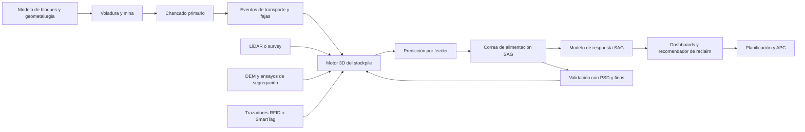
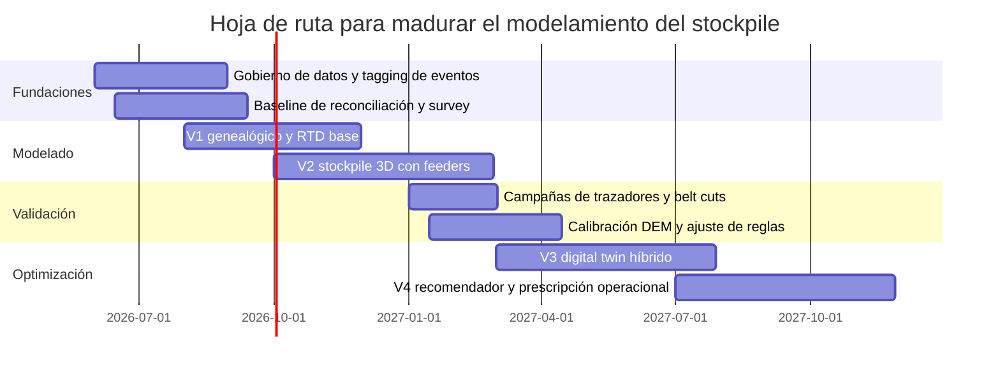

# Estado del arte en modelamiento de stockpiles de mineral entre chancado primario y alimentación SAG

## Resumen ejecutivo

El alcance solicitado es evaluar el estado del arte para modelar stockpiles de mineral grueso entre chancado primario y alimentación SAG, comparar niveles de madurez desde un baseline de balance de masa hasta un gemelo digital prescriptivo, y proponer una arquitectura y hoja de ruta técnica. Bajo ese marco, la conclusión principal es nítida: **el estado del arte no es un modelo único, sino una arquitectura híbrida por capas**. En la práctica, las soluciones más robustas combinan una capa transaccional de genealogía del material, una capa espacial tridimensional del stockpile, una capa física o semi-física para segregación y reclaim, una capa de reconciliación con encuestas y sensores, y una capa de decisión para blending y control. Los enfoques puramente contables tipo WAG/FIFO/LIFO siguen vigentes para inventario y accounting, pero ya no son suficientes cuando el objetivo es predecir en tiempo casi real **qué calidad, granulometría y dureza** llegarán realmente a cada alimentador y, por extensión, al SAG. fileciteturn0file0 citeturn39view0turn6view1turn6view3turn40view0turn40view3

La evidencia técnica más sólida hoy proviene de tres líneas que convergen. La primera es la línea **RTD y trazadores**, útil para cuantificar mezcla no ideal, by-pass, hold-up, zonas muertas y reconciliación mine-to-mill, pero limitada para describir heterogeneidad espacial 3D dentro del stockpile. La segunda es la línea **3D cellular automata y modelos voxelados**, hoy probablemente la opción con mejor balance entre fidelidad y viabilidad online para stockpiles de mineral grueso con segregación y múltiples feeders. La tercera es la línea **digital twin de partículas o pseudo-partículas**, que extiende el tracking a toda la cadena mine-to-mill y usa modelos reducidos o surrogates para cerrar los “blind spots” del stockpile en tiempo real. citeturn28view0turn28view1turn26view1turn6view1turn32view0turn6view3

Desde una perspectiva de priorización ejecutiva, la mejor decisión no es saltar directamente a un V4 prescriptivo. La secuencia con mejor retorno y menor riesgo es: **V1** balance de masa y genealogía parcelada; **V2** modelo 3D dinámico del stockpile con segregación y reclaim por feeder; **V3** gemelo digital híbrido con pseudo-partículas, reconciliación por survey/LiDAR y campañas de trazadores; **V4** optimización de reclaim, blending y setpoints aguas abajo. Ese orden está alineado con la madurez de la literatura peer-reviewed, con los casos industriales públicos en JKMRC/Hatch/UQ y con la funcionalidad que hoy exponen plataformas comerciales como Maptek, AVEVA y Metso. citeturn24search0turn24search6turn25view0turn35view0turn35view1turn40view0turn40view1turn40view3turn40view4

La recomendación de fondo para una concentradora de cobre que alimente un SAG es, por tanto, **un gemelo híbrido 3D del stockpile**: inventario y calidad por celdas o bloques; segregación calculada con reglas físicas calibradas; reclaim modelado por feeder y geometría de draw-down; corrección de forma y tonelaje con survey; ajuste continuo con PSD en correa, tonelaje, niveles, humedad, propiedades geometalúrgicas y campañas periódicas de trazadores RFID endurecidos o equivalentes. El DEM debe jugar como “motor de laboratorio” para calibración y pruebas de sensibilidad, no como motor online de toda la pila. citeturn17view0turn6view2turn6view3turn9view0turn40view4

## Contexto y hallazgos clave

En fuentes oficiales en español, la cadena operacional es consistente con el problema que se quiere resolver: Antamina describe el flujo mina → chancado → concentradora, y explicita que la concentradora integra apilamiento, molienda y flotación; Codelco Ministro Hales describe el paso desde chancado primario a un stockpile, y desde allí a la concentradora y a un molino SAG. Es decir, el stockpile no es un “buffer pasivo”; es un nodo operacional entre la fragmentación upstream y la respuesta del circuito SAG downstream. citeturn34view0turn34view1turn34view2

Ese nodo importa porque la alimentación SAG es particularmente sensible a la granulometría y a la dureza del mineral. En la literatura clásica de SMC/JKMRC, las fluctuaciones en la distribución de tamaño de feed son el segundo factor, sólo detrás de la competencia del mineral, en su impacto sobre el desempeño AG/SAG. Casos industriales y papers recientes de Hatch muestran además que F80 y contenido de finos siguen siendo variables troncales en los modelos de throughput, y que cambios en el crusher gap, la voladura y la segregación del stockpile alteran materialmente la respuesta del circuito. citeturn15view0turn15view1turn35view0turn35view1

El comportamiento del stockpile tampoco es ideal desde la física del flujo. La literatura de bulk solids distingue entre **plug flow**, **mezcla perfecta** y modelos no ideales con **axial dispersion**, by-pass y dead zones; y, para stockpiles de reclaim gravitacional, la literatura de Roberts/Jenike muestra que el sistema tiende a operar en **expanded flow**, con funnel flow en la masa superior y tolvas/feeder inferiores en mass flow. Eso implica que el “live stock” y el “dead stock” no son un artefacto contable, sino una realidad física gobernada por geometría, humedad, finos, fricción y consolidación. citeturn28view0turn28view1turn14view0turn14view1turn29search0turn30search17

El corolario técnico es relevante: si el modelo base trata la pila como un único tanque perfectamente mezclado, o como un FIFO puro, el error estructural será alto en escenarios con segregación por faja, caída, cono invertido de reclaim, múltiples draw points o recirculación por bulldozer/front-end loader. Es exactamente por eso que Servin y coautores dicen que los esquemas convencionales plug-flow/FIFO y perfect-mixing se quedan cortos en sistemas con surface flow y discharge flow complejos, y por eso la línea JKMRC ha migrado hacia modelos 3D dinámicos con segregación explícita. citeturn6view3turn6view1

## Familias de modelos y madurez actual

La siguiente tabla resume, con criterio de arquitectura, qué hace bien cada familia de modelos y dónde empieza a romperse.

| Familia | Qué representa bien | Dónde se rompe | Valor empresarial actual |
|---|---|---|---|
| **WAG / FIFO / LIFO transaccional** | Inventario, accounting, transacciones simples, stock intermedio | No ve segregación espacial, no diferencia feeders, no captura zonas muertas ni genealogía física real | Sigue siendo útil como capa de accounting y reconciliación base, pero es insuficiente como motor de control del stockpile. Datamine incluso lo describe como “relatively simplistic”. citeturn39view0 |
| **RTD y trazadores** | Tiempo de residencia, mezcla no ideal, dead zones, by-pass, reconciliación, campañas diagnósticas | No reconstruye completamente el campo 3D de calidad y PSD dentro de la pila | Muy útil para V1-V2 y para validación/diagnóstico. Northparkes lo usó para reconciliación mine-mill y análisis de hold-ups. citeturn28view0turn28view1turn26view1 |
| **Modelos 3D CA o voxelados** | Construcción y reclaim dinámicos, segregación multi-tamaño, estimación por feeder, superficie y PSD local | Requieren calibración, buenas reglas de segregación y asimilación de survey para no derivar | Hoy es la familia con mejor balance entre fidelidad, velocidad y escalabilidad online para coarse ore stockpiles. JKMRC ya reporta validación industrial y aptitud para aplicaciones de control y digital twins. citeturn6view1turn32view0turn24search6turn25view0 |
| **DEM** | Física granular de alta resolución, forma de partícula, fricción pared-mineral, altura de descarga, sensibilidad de diseño | Coste computacional y operacional alto para correr online el stockpile completo | Excelente para calibración, sensitivity analysis y diseño de reglas físicas; menos conveniente como motor online enterprise-scale. Esto es una inferencia fuerte a partir de que DEM aporta precisión y los digital twins online recurren a pseudo-partículas y reducción de orden para rendimiento en tiempo real. citeturn17view0turn6view3 |
| **Gemelos digitales particle-based** | Tracking end-to-end, fusión de sensores y simulación, tracking de propiedades a través de blind spots | Dependen de stack de datos, gobernanza y calidad de integración | Es la frontera actual de madurez avanzada. La literatura académica y los proveedores coinciden en tracking material-oriented con dashboards live, genealogía y vínculo entre mina, stockpile y planta. citeturn6view3turn40view0turn40view1turn40view3turn40view4 |

### Modelos transaccionales y de inventario

Los sistemas comerciales todavía mantienen modelos simplificados WAG/FIFO/LIFO porque son robustos, auditables y baratos de operar. MineMarket, por ejemplo, declara que estos modelos son “relatively simplistic” y suficientes para stock intermedio o despachos, mientras su módulo 3D agrega geometría, masa y calidad distribuidas. También es significativo que el propio motor 3D comercial CHASM asuma material ideal, homogéneo y free-flowing, lo que evidencia que incluso en software enterprise la física fina del stockpile todavía suele simplificarse. citeturn39view0

Eso confirma una idea clave para el diseño corporativo: la capa transaccional no debe desaparecer, pero **debe separarse conceptualmente de la capa física**. La primera resuelve governance, auditoría y metal accounting; la segunda resuelve predicción de alimentación real al SAG y soporte operacional. Mezclar ambas en un único modelo suele deteriorar simultáneamente precisión operativa y trazabilidad contable. Esta es una inferencia de arquitectura consistente con la coexistencia de modelos simples y 3D en plataformas comerciales y con la crítica académica a FIFO/perfect-mixing en stockpiles complejos. citeturn39view0turn6view3

### RTD, trazadores y mezcla no ideal

La metodología RTD sigue siendo un baseline metodológico muy potente. La revisión de RTD usada aquí recuerda que los benchmarks ideales son **plug flow** y **complete mixing**, y que los modelos no ideales incorporan axial dispersion, dead zones, recycle y bypass. Para un stockpile coarse ore, eso es conceptualmente útil porque permite estimar cómo una perturbación upstream —por ejemplo una voladura dura o un blend con arsénico— se “ensancha” y “retarda” antes de llegar al SAG. citeturn28view0turn28view1turn16view0

Los trazadores físicos han demostrado utilidad práctica. El caso de Northparkes mostró que el tracking por RFID de partículas sintéticas puede mejorar reconciliación mine-mill y ayudar a modelar hold-ups en términos de RTD y de comportamiento por tamaño. Más recientemente, un paper de 2024 sobre una mina cuprífera peruana reportó una implementación de tres meses con portales de detección desde mina a planta, capaz de identificar alimentación de waste, high grade, low grade y mineral con arsénico en tiempo real, con una estimación económica muy material en la etapa piloto. citeturn26view1turn38view0

La limitación es igual de importante: la simulación DEM de 2023 sobre tracking RFID a través de un coarse ore stockpile concluyó que el desempeño general del ore tracking basado sólo en RFID es pobre, particularmente cuando hay una o pocas tags por lote. Por eso, el uso correcto de tags hoy no es como mecanismo único de estimación del estado interno del stockpile, sino como **ground truth esporádico**, calibración, detección de eventos, y backtesting del gemelo. Metso, de hecho, posiciona SmartTag exactamente en ese espacio de integración con el digital twin y reconciliación mine-to-plant. citeturn6view2turn40view4

### Modelos 3D CA y voxelados

Aquí está, en mi juicio, la parte más madura del estado del arte específicamente para el tramo chancado primario → stockpile → SAG. La secuencia JKMRC es especialmente robusta. El paper **Part 1** describe un 3D cellular automaton para formación de la pila y segregación por estratificación superficial; el **Part 2** lo extiende a alimentación y descarga continuas, incorpora dos mecanismos de segregación, predice perfil de superficie y distribución de tamaño, y reporta validación industrial durante dos meses de operación. Además, la línea complementaria desarrolla tests de laboratorio para cuantificar la propensión a segregar y nuevos índices de segregación para materiales multi-tamaño. citeturn7search1turn6view1turn33search1turn32view0

Lo que vuelve especialmente atractiva esta familia no es sólo la fidelidad, sino la **viabilidad operacional**. Los propios artículos destacan que el modelo puede ser lo bastante rápido para aplicaciones de control dinámico y digital twin, y la página oficial del UQ/JKMRC señala que el JK Dynamic Stockpile/Bin model ya fue validado con datos industriales e implementado en varias aplicaciones industriales. En otras palabras, no se trata ya de un proof of concept puramente académico. citeturn17view0turn24search6turn25view0

### DEM y modelos híbridos

DEM sigue siendo la herramienta con mayor granularidad física para estudiar qué variables mueven de verdad la segregación: relación coarse/fine, altura de alimentación, forma de partícula, fricción interpartícula y contra paredes, entre otras. El estudio de 2022 en Applied Sciences muestra, por ejemplo, que la relación de partículas gruesas/finas afecta fuertemente la segregación; que la altura de alimentación influye tanto en segregación como en ángulos de repose y de descarga; y que la forma de partícula cambia el ajuste con la realidad. citeturn17view0

Sin embargo, el stack óptimo no es “DEM everything”. La evidencia revisada empuja a un **modelo híbrido**: DEM para calibrar leyes de segregación, zonas de flujo, efectos de humedad o fricción y reglas de reclaim; y luego un motor CA/voxel o pseudo-particle para operación continua y near real-time. Este posicionamiento no es un estándar formal publicado como tal, pero es la inferencia más consistente cuando se cruzan: precisión DEM, necesidad de rendimiento online, validación industrial de modelos 3D más ligeros y arquitectura de digital twins basados en pseudo-partículas y reducción de orden. citeturn17view0turn6view1turn6view3

### Gemelos digitales distribuidos y landscape comercial

El paper de Servin, Vesterlund y Wallin formula con claridad la lógica de siguiente nivel: el material se representa digitalmente mediante **pseudo-partículas** que cargan identidad, posición y observaciones de sensores/equipos; cuando el material entra en “blind spots” como silos o stockpiles, la copia digital se propulsa con simulación en tiempo real alimentada por controles y sensores disponibles. Esa arquitectura ya no piensa la operación como una cadena de equipos aislados, sino como una cadena de **transformaciones sobre el material**. citeturn6view3

El mercado ya se está alineando con esa visión. Maptek describe tracking de material desde in situ rock hasta ROM stockpiles y plant feed, incluyendo edad del material en stockpile, número de rehandles y composición variable del ROM pad; AVEVA ofrece inventory/WIP genealogy, balances ponderados y transparencia en tiempo real; Metso integra SmartTag con Geminex para feed-forward al plant digital twin; y CSIRO combina LiDAR/computer vision con modelling para scenario planning y mixed-source stockpiles. No toda esta evidencia es peer-reviewed, pero sí muestra con bastante claridad hacia dónde se está moviendo la capa industrial del estado del arte. citeturn40view0turn40view1turn40view3turn40view4turn9view0

## Datos, métricas y validación

El modelo correcto fracasa si el dato mínimo no existe. Para un stockpile entre chancado primario y SAG, la base de datos crítica no es “grado promedio de la pila”, sino un **pipeline de eventos y propiedades**. Hatch y Minera Los Pelambres siguen usando F80, contenido de finos, dureza y parámetros de conminución como variables troncales de throughput; los estudios de JKMRC añaden geometría 3D, surface profile, feeders y segregación; y los proveedores líderes incorporan resource model, fleet management, on-belt analysers, surveys y lab results como stack mínimo de integración. citeturn35view1turn6view1turn40view0turn40view3

| Dominio de datos | Variables críticas | Justificación operativa |
|---|---|---|
| **Mina y resource model** | bench/block de origen, dominio geometalúrgico, dureza, BWi, AxB, DWi/Mia/Mih/Mic, contaminantes, tipo de roca | Permite genealogía material y predicción de respuesta SAG. Los Pelambres y soluciones comerciales lo usan explícitamente. citeturn35view1turn23search0turn40view0 |
| **Chancado primario** | setting del crusher, potencia, throughput, horario/evento de lote, PSD de producto | El crusher condiciona top size y feed quality; Highland Valley y Toromocho muestran impacto directo en mill feed y throughput. citeturn15view1turn35view0 |
| **Transporte por fajas** | belt speed, tonnage, transfer points, tiempos, image analysis/PSD en correa, on-belt analyzers | La segregación puede empezar antes de la pila; el tracking end-to-end depende de timestamps y medición en correa. citeturn29search3turn40view0turn40view1 |
| **Stockpile** | topografía/survey, LiDAR o fotogrametría, nivel/surface profile, ángulo de repose, humedad, bulk density/compresibilidad, live/dead capacity | Son las variables que corrigen masa, forma y flow regime real de la pila. citeturn9view0turn14view1turn30search17turn29search0 |
| **Reclaim y feeders** | tasas por feeder, secuencia de reclaim, disponibilidad, draw-point activo, PSD descargado, calidad estimada | El feeder es la interfaz real con el SAG; JKMRC y DEM muestran que la descarga no es uniforme. citeturn6view1turn17view0 |
| **SAG feed belt y planta** | F80, % finos, humedad, throughput, potencia, estabilidad del molino, respuesta del APC | Cierra la validación aguas abajo y cuantifica valor de negocio del modelo. citeturn15view0turn35view1 |

Las métricas de validación deben estructurarse en cuatro capas. La primera es **reconciliación de masa**: cuánto error existe entre entradas, salidas y survey actualizado. La segunda es **fidelidad espacial**: cuánto se alejan forma, tonelaje y composición modeladas del estado observado por survey/LiDAR o campaigns. La tercera es **fidelidad de entrega**: error en F80, % finos, dureza/blend esperados por feeder o en SAG feed belt. La cuarta es **impacto de negocio**: reducción de variabilidad de alimentación, mejora de estabilidad SAG, mejora de throughput o reducción de feed fuera de especificación. Esta estructura no aparece empaquetada exactamente así en una sola fuente, pero se deriva directamente de la combinación de RTD/trazadores, papers de alimentacion SAG, JKMRC y plataformas industriales de inventory/stockpile management. citeturn26view1turn15view0turn35view1turn6view1turn40view3

También conviene separar dos historias de verdad. La primera es la **verdad operacional continua**, abastecida por historizadores, tonnages, feeders y surveys. La segunda es la **verdad experimental discreta**, abastecida por campañas de tags/trazadores, belt cuts, muestreos especiales y trials de segregación. La combinación de ambas es lo que permite evitar el sesgo de “modelo que se valida contra sí mismo”. La literatura RTD, Northparkes, el caso peruano de traceability y el paper RFID 2023 sustentan esta necesidad de campañas de ground truth aun cuando exista un sistema continuo. citeturn16view0turn26view1turn38view0turn6view2

## Arquitectura objetivo y hoja de ruta

La arquitectura objetivo que recomiendo para una operación cuprífera con stockpile coarse ore y alimentación SAG es la siguiente: **contabilidad transaccional + modelo 3D del stockpile + calibración física + reconciliación por survey + inferencia de feed al SAG + capa de optimización**. En términos de stack tecnológico, eso significa: parcelización por lote o pseudo-lote; ubicación del lote dentro de una malla 3D/voxel del stockpile; reglas de segregación y reclaim calibradas con ensayos y DEM; correción del estado con LiDAR/fotogrametría/survey; sensores o inferencias de PSD y calidad en la correa SAG; y un orquestador que vuelva esa información accionable para reclaim sequencing, blending y setpoints downstream. citeturn6view1turn6view3turn9view0turn40view0turn40view1turn40view3turn40view4

La lógica de despliegue recomendada se resume mejor en esta tabla.

| Nivel | Diseño recomendado | Qué entrega | Criterio para pasar de nivel |
|---|---|---|---|
| **V1** | Balance de masa por eventos + genealogía por lote + survey periódico + baseline RTD simple | Inventario confiable, edad del material, blend aproximado, reconciliación inicial | Cuando ya se puede explicar razonablemente la diferencia entre lo esperado y lo que el SAG realmente recibe. citeturn28view0turn39view0turn40view3 |
| **V2** | Modelo 3D CA/voxel del stockpile con segregación, feeders y reclaim explícitos | Predicción por feeder de PSD y composición; visualización 3D accionable | Cuando el modelo reproduce consistentemente shape, PSD y drift operacional. citeturn6view1turn32view0turn24search6 |
| **V3** | Gemelo digital híbrido con pseudo-partículas, integración mine-to-mill y campañas de trazadores | Tracking cross-system, reconciliación avanzada, alertas de feed problemático | Cuando el modelo ya soporta decisiones operativas diarias y aprendizaje sobre ore types. citeturn6view3turn38view0turn40view4 |
| **V4** | Optimización prescriptiva del reclaim, blending y coordinación con APC/planificación | Recomendaciones y eventualmente acciones cerradas sobre reclaim y planta | Cuando existe gobernanza de modelo, confianza operativa y rutinas de recalibración establecidas. citeturn23search7turn40view3turn25view0 |

A continuación, una sugerencia de diagrama de arquitectura en mermaid para llevar esta visión a un blueprint ejecutivo. La lógica está basada en la convergencia entre digital twin material-oriented, resource tracking, surveys, plant inventory y control predictivo. citeturn6view3turn40view0turn40view1turn40view3turn9view0

Y esta es una hoja de ruta razonable, con gate reviews claros y sin sobredimensionar capex digital antes de consolidar el dato base. La secuencia está alineada con la madurez observada en papers JKMRC/Hatch/SMC y en la oferta comercial industrial. citeturn24search0turn35view0turn35view1turn40view0turn40view3

## Preguntas abiertas y conclusión

Hay tres limitaciones abiertas que conviene reconocer. La primera es que **la evidencia pública peer-reviewed a escala industrial completa todavía es más abundante en modelado y validación puntual que en despliegues de control cerrado plenamente documentados**. La segunda es que mucha literatura madura del stockpile está en inglés, mientras que las fuentes oficiales en español son mejores para contexto operacional que para modelado avanzado. La tercera es que los claims comerciales sobre productividad o reducción de variabilidad son informativos, pero no equivalen por sí solos a evidencia académica replicada. citeturn25view0turn40view0turn40view3turn40view4turn34view0turn34view2

Dicho eso, la respuesta estratégica a la pregunta de estado del arte es bastante clara. **El mejor estado del arte hoy para un stockpile entre chancado primario y SAG no es FIFO mejorado, ni RFID-only, ni DEM-only. Es un gemelo híbrido 3D del stockpile, orientado al material, con reconciliación continua y calibración física periódica.** Ese enfoque es el que mejor alinea fidelidad física, viabilidad computacional, escalabilidad operativa y creación de valor en throughput, estabilidad de feed y reconciliación mine-to-mill. citeturn39view0turn6view2turn17view0turn6view1turn6view3turn25view0

Si tuviera que condensarlo en una decisión de portafolio: **V1 sin V2 sólo mejora reporting; V2 sin V3 mejora operación local; V3 bien ejecutado habilita realmente mine-to-mill; y V4 sólo tiene sentido cuando la organización ya opera con disciplina de datos, survey, trazadores y validación.** Esa es la ruta con mayor robustez técnica y menor riesgo de implementación. citeturn35view0turn35view1turn40view0turn40view1turn40view3