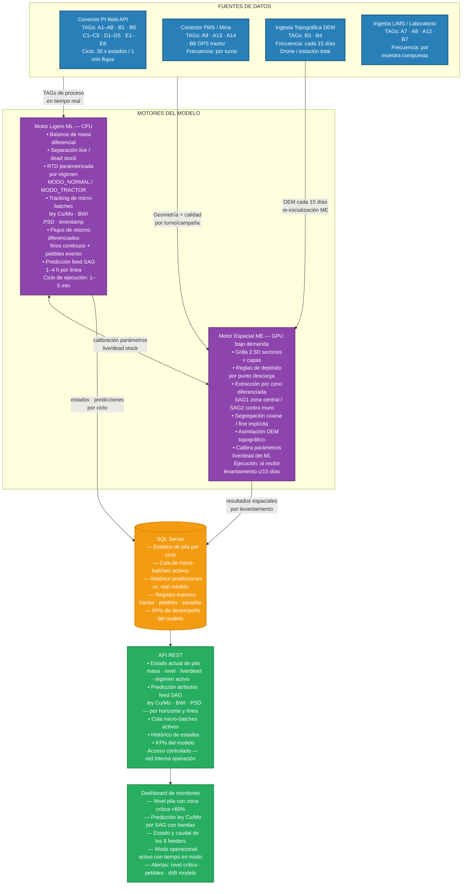

# Flujograma — Arquitectura y TAGs del Sistema de Modelamiento de Pila OS
## Mine-to-Mill — Las Bambas

**Leyenda de prioridades:**
- 🔴 Crítica — modelo inoperable sin esta señal
- 🟠 Alta — degradación severa >20% en error de predicción
- 🔵 Media — degradación moderada, funcionalidad mantenida

---

## Diagrama 1 — Flujo físico mine-to-SAG y TAGs por componente

```mermaid
flowchart TD
    classDef critica fill:#e74c3c,color:#fff,stroke:#c0392b,stroke-width:2px
    classDef alta fill:#e67e22,color:#fff,stroke:#d35400,stroke-width:1px
    classDef media fill:#3498db,color:#fff,stroke:#2980b9,stroke-width:1px
    classDef comp fill:#27ae60,color:#fff,stroke:#1e8449,stroke-width:2px

    subgraph MINA["MINA"]
        A9["A9 · Modelo de Bloques / FMS
        ley Cu/Mo · BWI · litología · t/turno"]:::alta
        A13["A13 · Coordenadas bahías
        descarga chancadoras"]:::alta
        A14["A14 · Litología frente
        activo por turno"]:::media
    end

    subgraph CHANC["CHANCADORA PRIMARIA"]
        A2["A2 · TPH chancadora"]:::critica
        A3["A3 · Estado chancadora"]:::critica
        A4["A4 · Estado correa transporte"]:::critica
        A5["A5 · Potencia chancadora"]:::alta
        A6["A6 · Estado Rock Breaker"]:::alta
        A7["A7 · Ley Cu entrada"]:::alta
        A8["A8 · Ley Mo entrada"]:::alta
        A10["A10 · P80/P20 producto
        chancadora"]:::alta
        A15["A15 · Humedad mineral"]:::media
    end

    subgraph CORREA_IN["CORREA CHANCADORA → PILA"]
        A1["A1 · Flujo másico entrada
        weightometer correa principal"]:::critica
        A11["A11 · Punto de descarga
        posición sobre la pila"]:::alta
    end

    subgraph PILA["PILA ORE STOCKPILE OS"]
        subgraph ESTADO_PILA["Estado y régimen"]
            B1["B1 · Nivel OS"]:::critica
            B2["B2 · Masa pila
            calculada — soft sensor"]:::critica
            B6["B6 · Estado tractor
            MODO_TRACTOR ~20% del tiempo"]:::alta
            B7["B7 · Densidad aparente
            por litología"]:::alta
            A12["A12 · Dureza BWI / A×b
            por litología — semanal"]:::alta
        end
        subgraph GEO_PILA["Geometría — para Modelo Espacial ME"]
            B3["B3 · Volumen DEM
            levantamiento c/15 días"]:::critica
            B4["B4 · Topografía base
            piso de la pila — fija"]:::critica
            B5["B5 · Posición 8 feeders
            coordenadas XYZ — fija"]:::critica
        end
    end

    subgraph RETORNO["FLUJOS DE RETORNO DESDE PLANTA"]
        D1["D1 · Retorno finos
        ~40 t/día continuo"]:::alta
        D4["D4 · Nivel bin pebbles
        pre-crusher"]:::alta
        D5["D5 · TPH generación
        pebbles SAG"]:::alta
        D2["D2 · Tonelaje campaña pebbles
        evento ~72,000 t — 2×/año"]:::alta
        D3["D3 · Flujo másico pebbles
        durante campaña — t/h"]:::alta
    end

    subgraph F_SAG1["FEEDERS SAG 1 — F1 a F4 — zona central"]
        C2a["C2 · Estado F1–F4"]:::alta
        C3a["C3 · Velocidad / apertura F1–F4"]:::alta
        C4a["C4 · Flujo másico F1–F4
        weightometer individual WIT"]:::alta
        C5a["C5 · Potencia motor F1–F4"]:::media
    end

    subgraph F_SAG2["FEEDERS SAG 2 — F5 a F8 — contra muro concreto"]
        C2b["C2 · Estado F5–F8"]:::alta
        C3b["C3 · Velocidad / apertura F5–F8"]:::alta
        C4b["C4 · Flujo másico F5–F8
        weightometer individual WIT"]:::alta
        C5b["C5 · Potencia motor F5–F8"]:::media
    end

    C1["C1 · Flujo másico salida total
    weightometer correa feeders"]:::critica

    subgraph SAG_1["MOLINO SAG 1"]
        E1a["E1 · TPH feed SAG 1"]:::alta
        E2a["E2 · Ley Cu feed SAG 1"]:::alta
        E3a["E3 · Ley Mo feed SAG 1"]:::alta
        E4a["E4 · Potencia SAG 1"]:::alta
        E5a["E5 · P80 feed SAG 1"]:::alta
        E6a["E6 · TPH salida SAG 1"]:::alta
        E7a["E7 · WI operacional SAG 1"]:::alta
        E8a["E8 · P80 producto SAG 1"]:::media
    end

    subgraph SAG_2["MOLINO SAG 2"]
        E1b["E1 · TPH feed SAG 2"]:::alta
        E2b["E2 · Ley Cu feed SAG 2"]:::alta
        E3b["E3 · Ley Mo feed SAG 2"]:::alta
        E4b["E4 · Potencia SAG 2"]:::alta
        E5b["E5 · P80 feed SAG 2"]:::alta
        E6b["E6 · TPH salida SAG 2"]:::alta
        E7b["E7 · WI operacional SAG 2"]:::alta
        E8b["E8 · P80 producto SAG 2"]:::media
    end

    COMP["COMPARACIÓN MINA vs. PLANTA
    Ley Cu/Mo predicha  vs.  medida en feed SAG
    P80 predicho  vs.  medido en feed SAG
    Masa modelo  vs.  levantamiento topográfico"]:::comp

    MINA --> CHANC
    CHANC --> CORREA_IN
    CORREA_IN --> PILA
    RETORNO --> PILA
    D5 --> D4
    D4 --> D2
    PILA --> F_SAG1
    PILA --> F_SAG2
    F_SAG1 --> C1
    F_SAG2 --> C1
    C1 --> SAG_1
    C1 --> SAG_2
    SAG_1 --> COMP
    SAG_2 --> COMP
    MINA --> COMP
    SAG_1 --> D5
    SAG_2 --> D5
    D1 --> PILA
    D2 --> PILA
    D3 --> PILA
```

---

## Diagrama 2 — Componentes del sistema de modelamiento y flujo de datos

---

*Preparado por: Juan Mansilla — ASTAY Systems*
*Fecha: 2026-06-05*
*Referencia: 2026-06-05-arquitectura-tags-modelamiento-pila.md*
