# Equipo ASTAY — Organización Operativa

> **Nota de gobierno:** Consolida Excel de puestos (08-JUN-2026) + Organigrama.pdf + lectura Gerencia Técnica. Pendiente validación con RR.HH., líderes de área y PMO antes de circular como estructura formal.

---

## Resumen ejecutivo

| Área | Líder | Headcount |
|------|-------|-----------|
| Customer Success & Operaciones | William Carpio | 4 |
| Analítica, Data Science & Producto | Alí Meres | 7 |
| BI / Data Platform & Servicios | Ignacio Uribe (14) · Erick Tocasca (7) | 14 (incl. equipo Quellaveco) |
| Ingeniería & Desarrollo | Oswaldo Aspilcueta (6) · Elio Rodríguez (6) | 12 internos + 4 externos |
| Equipo de Soporte (UX/Proyectos) | Luz Palomino | 3 |
| **Gerencia Técnica** | **Juan Manuel Mansilla** | 45 total |

---

## Organigrama — Equipo completo

> ⚠️ = riesgo organizacional activo · 🔵 = líder de área · bordes punteados = asignación matricial temporal

```mermaid
---
config:
  layout: elk
  theme: redux
---
flowchart TB
    subgraph SOPORTE["Soporte (2)"]
        EDGAR["Edgar Mamani
            Jr. Mining Tech Engineer"]
        JHON["Jhon Ramos
            Jr. Mining Tech Engineer"]
    end
    subgraph CS_AREA["CUSTOMER SUCCESS & OPERACIONES"]
        CS["🔵 William Carpio (4)
        Customer Lead"]
        REN["Pedro Renato Guzman
        Coordinación Operativa"]
        SOPORTE
    end
    subgraph NEGOCIO["Negocio (3)"]
        NATALY["Nataly Bejarano
            Mining Tech Engineer II"]
        FLOR["Flor Vargas
            Mining Tech Engineer I"]
        CARLOSM["Carlos Mendoza K.
            Mining Tech Engineer II"]
    end
    subgraph DATASCIENCE["DataScience (2)"]
        GUSTAVO["Gustavo Lozano ⚠️
            Data Scientist"]
        FABIAN["Fabián Albuajar
            Data Scientist ML"]
    end
    subgraph ENGDATOS_MLOPS["EngDatos & MLOPS (1)"]
        LESLIE["Leslie Espinoza ⚠️
            Data Engineer"]
    end
    subgraph ANA_AREA["ANALÍTICA, DATA SCIENCE & PRODUCTO"]
        ALI["🔵 Alí Meres (7)
            Analytics Technical Lead"]
        NEGOCIO
        DATASCIENCE
        ENGDATOS_MLOPS
    end
    subgraph AAQ_Analitica["Equipo de Analítica (3)"]
        OLIVER["Oliver Rojas
        Data Science Assistant"]
        MARILI["Marilin Sandoval
        Mining Tech Assistant"]
        JEAN["Jean Cordova
        Mining Tech Assistant"]
    end
    subgraph AAQ_ReportesA["Reportes A (3)"]
        JUANV["Juan Vasquez
        Data Engineer"]
        CARLOM["Carlomaria Bastidas
        BI Engineer"]
        KENNY["Kenny Larijo
        BI Engineer"]
    end
    subgraph AAQ_ReportesB["Reportes B (3)"]
        KEYSSI["Keyssi Echevarría
        Data Engineer"]
        JOSEA["José Almonacid
        Jr. Mining Tech Engineer"]
        TONY["Tony Canahua
        Jr. Mining Tech Engineer"]
    end
    subgraph AA_Support["Equipo Soporte Corp (3)"]
        NICOLAS["Nícolas Rodríguez
        Mining Tech Assistant"]
        WILMER["Wilmer Ccarita
        Jr. Mining Tech Engineer"]
        JHONATAN["Jhonatan Almora
        BI Analyst"]
    end
    subgraph BI_AREA["BI / DATA PLATFORM & SERVICIOS"]
        IGNACIO["🔵 Ignacio Uribe (14)
        BI Corporativo Anglo American"]
        ERICK["🔵 Erick Tocasca (7)
        BI Local · Gemelo Planta Quellaveco"]
        AAQ_Analitica
        AAQ_ReportesA
        AAQ_ReportesB
        AA_Support
    end
    subgraph DEV_Ext["Equipo Externo (4)"]
        JOSUET["Josue Torres
        Modelador Unity"]
        JUANCLQ["Juan Carlos
        Unity Dev Sr"]
        PORTILLOH["Hamed Portillo
        Científico de datos"]
        LUJANA["Alexis Luján
        Backend Developer"]
    end
    subgraph DEV_AREA["INGENIERÍA & DESARROLLO"]
        OSW["🔵 Oswaldo Aspilcueta (6)
        Tech Lead — Arquitectura · Despliegue"]
        ELIO["🔵 Elio Rodríguez (6)
        Tech Lead — Producto · Features"]
        JOSEM["José Mundaca
        Backend Developer"]
        BRYANLC["Bryan Luyo
        Backend Developer"]
        CESAR["César Gago
        Backend Developer"]
        JHERSON["Jherson Lopez
        Frontend Developer"]
        DAVID["David Pino
        Frontend Developer"]
        JEANLYN["Jeanlyn Fernandez
        Unity Developer"]
        MIGUEL["Miguel Mamami
        Unity Developer"]
        CARLOSAT["Carlos Mendoza T.
        QA Engineer"]
        QUISPEE["Enrique Quispe
        Data Scientist"]
        JOSET["José Tello
        Data Engineer"]
        PABLO["Pablo Quispe
        Data Engineer"]
        ROBERTO["Roberto Nureña
        Data Scientist"]
        DEV_Ext
    end
    subgraph UX_AREA["EQUIPO DE SOPORTE"]
        LUZ["🔵 Luz Palomino
        UX/UI Designer"]
        ALBERTO["Alberto Pinedo
        UX/UI Design Assistant"]
        BRYANLZ["Bryan Lozano
        Soporte Proyectos"]
    end

    GG["Juan Manuel Mansilla (45)
    Gerencia Técnica"] --> CS & ALI & ERICK & OSW & ELIO & LUZ & IGNACIO & DEV_AREA

    CS --> REN & SOPORTE
    ALI --> NEGOCIO & DATASCIENCE & ENGDATOS_MLOPS
    IGNACIO --> AA_Support & ERICK & AAQ_Analitica
    LUZ --> ALBERTO
    LESLIE -. "Asignada temporalmente
    Quellaveco" .-> ERICK
    ERICK --> AAQ_ReportesB & AAQ_ReportesA
    CARLOSM -. "Asignada temporalmente
    Quellaveco" .-> ERICK
    AAQ_ReportesB --> JEAN
    AAQ_ReportesA --> MARILI
    OSW --> CESAR & DAVID & JOSET & JEANLYN & CARLOSAT & QUISPEE & PORTILLOH & LUJANA
    ELIO --> JOSEM & PABLO & ROBERTO & MIGUEL & JHERSON & BRYANLC & JUANCLQ & JOSUET
    CESAR -. Par .- BRYANLC & JOSEM
    DAVID -. Par .- JHERSON
    JEANLYN -. Par .- MIGUEL
    JOSET -. Par .- PABLO
    QUISPEE -. Par .- ROBERTO

    style GG stroke:#D50000,fill:#E1BEE7
    style CS fill:#C8E6C9
    style ALI fill:#C8E6C9
    style IGNACIO stroke:#000000,fill:#C8E6C9
    style ERICK fill:#FFF9C4
    style OSW fill:#FFF9C4
    style ELIO fill:#FFF9C4
    style LUZ fill:#C8E6C9
    style GUSTAVO fill:#FFCDD2
    style LESLIE stroke-width:1px,stroke-dasharray:1,color:#757575
    style CARLOSM color:#757575,stroke-width:1px,stroke-dasharray:1
    style MARILI fill:#BBDEFB
    style JEAN fill:#BBDEFB
    style CARLOSAT fill:#FFE0B2
    style DEV_Ext fill:#edddef
```

---

## Detalle por área y equipo

---

### Customer Success & Operaciones

> Asegurar adopción, continuidad y satisfacción del cliente en operaciones mineras activas.

| Rol | Persona | Puesto |
|-----|---------|--------|
| 🔵 **Líder** | William Yohani Carpio Ore | Customer Success Lead |
| Coordinación operativa | Pedro Renato Guzman Torres | Mining Technology Project Coordinator |
| Soporte 12×7 | Edgar Idel Mamani Ponaylos | Jr. Mining Technology Engineer |
| Soporte 12×7 | Jhon Steve Ramos Salazar | Jr. Mining Technology Engineer |

---

### Analítica, Data Science & Producto

> Capacidad analítica avanzada, ciencia de datos, evolución funcional de productos y validación de modelos mineros.

| Rol | Persona | Puesto | Notas |
|-----|---------|--------|-------|
| 🔵 **Líder** | Alí Ivan Meres Vargas | Business Analytics Technical Lead | |

**Sub-equipo: Negocio (3)**

| Persona | Puesto |
|---------|--------|
| Nataly Nelly Bejarano De la Cruz | Mining Technology Engineer II |
| Flor Tatiana Vargas Cuellar | Mining Technology Engineer I |
| Carlos Josue Mendoza Kuong | Mining Technology Engineer II |

**Sub-equipo: Data Science (2)**

| Persona | Puesto | Notas |
|---------|--------|-------|
| Gustavo Jair Lozano Acuña | Data Scientist | ⚠️ Riesgo salida próxima |
| Fabián Alessandro Albuajar Carbajal | Data Scientist ML | |

**Sub-equipo: Eng Datos & MLOps (1)**

| Persona | Puesto | Notas |
|---------|--------|-------|
| Leslie Jennifer Espinoza Quispe | Data Engineer | ⚠️ Asignada temporalmente a BI Quellaveco |

---

### BI / Data Platform & Servicios

> BI, reportabilidad, pipelines de datos y dashboards operacionales.

**Ignacio Uribe — BI Corporativo Anglo American (14 personas)**

| Rol | Persona | Puesto |
|-----|---------|--------|
| 🔵 **Líder** | Jose Ignacio Uribe Perea | Operations Manager |

*Equipo Soporte Corporativo (3)*

| Persona | Puesto |
|---------|--------|
| Nícolas Rodríguez Díaz | Mining Technology Assistant |
| Wilmer Ccarita Choque | Jr. Mining Technology Engineer |
| Jhonatan Aldair Almora Mayta | BI Analyst |

*Equipo Analítica Quellaveco (3)*

| Persona | Puesto | Notas |
|---------|--------|-------|
| Oliver Everlin Rojas Pumaricra | Data Science Assistant | |
| Marilin Sandoval | Mining Technology Assistant | Matrix → apoya Reportes A |
| Jean Carlos Cordova Cruz | Mining Technology Assistant | Matrix → apoya Reportes B |

---

**Erick Tocasca — BI Local · Gemelo Planta Quellaveco (7 personas)**

| Rol | Persona | Puesto |
|-----|---------|--------|
| 🔵 **Líder** | Erick Gerardo Tocasca Tocasca | Business Intelligence Lead |

*Reportes A (3)*

| Persona | Puesto |
|---------|--------|
| Juan Daniel Vasquez Rengifo | Data Engineer |
| Carlomaria Bastidas Jaimes | BI Engineer |
| Kenny Osguel Larijo Quenaya | BI Engineer |

*Reportes B (3)*

| Persona | Puesto |
|---------|--------|
| Keyssi Najhely Echevarría Alegre | Data Engineer |
| José Alcides Almonacid Espinoza | Jr. Mining Technology Engineer |
| Tony Christian Canahua Choqueza | Jr. Mining Technology Engineer |

**Asignaciones matriciales entrantes a Erick:**
- Leslie Espinoza (Analítica → Quellaveco) — temporal ⚠️
- Carlos Mendoza K. (Analítica/Negocio → Quellaveco) — temporal

---

### Ingeniería & Desarrollo

> Construir, mantener, desplegar y evolucionar técnicamente los productos ASTAY.

**Sub-equipo A — Oswaldo Aspilcueta (Arquitectura · Despliegue · IT Impl.)**

| Persona | Puesto | Par |
|---------|--------|-----|
| 🔵 **Oswaldo Aspilcueta Salas** | Technical Lead | |
| César Enrique Gago Egocheaga | Backend Developer | Par: Bryan Luyo · José Mundaca |
| David Marcelo Pino Santillán | Frontend Developer | Par: Jherson Lopez |
| José Joaquín Tello León | Data Engineer | Par: Pablo Quispe |
| Jeanlyn Irvin Fernandez Eulogio | Unity Developer | Par: Miguel Mamami |
| Carlos Alexis Mendoza Tipiana | QA Engineer | |
| Luis Enrique Quispe Paredes *(Enrique)* | Data Scientist | Par: Roberto Nureña |
| *Hamed Portillo* | Científico de datos | Externo |
| *Alexis Luján* | Backend Developer | Externo |

**Sub-equipo B — Elio Rodríguez (Producto · Nuevas Features)**

| Persona | Puesto | Par |
|---------|--------|-----|
| 🔵 **Elio Xavier Rodríguez Condori** | Technical Lead | |
| José Andres Mundaca Cespedes | Backend Developer | Par: César Gago · Bryan Luyo |
| Pablo Alejandro Quispe Olaechea | Data Engineer II | Par: José Tello |
| Roberto Alonso Nureña Jara | Data Scientist | Par: Enrique Quispe |
| Miguel Alexander Mamami Villon | Unity Developer | Par: Jeanlyn Fernandez |
| Jherson Rony Lopez Perez | Frontend Developer | Par: David Pino |
| Bryan Andy Luyo Champi | Backend Developer | Par: César Gago · José Mundaca |
| *Juan Carlos* | Unity Dev Sr | Externo |
| *Josue Torres* | Modelador Unity | Externo |

**Equipo Externo (4)**

| Persona | Rol | Tipo |
|---------|-----|------|
| Josue Torres | Modelador Unity | Externo |
| Juan Carlos | Unity Developer Sr | Externo |
| Hamed Portillo | Científico de datos | Externo |
| Alexis Luján | Backend Developer | Externo |

---

### Equipo de Soporte (UX / Proyectos)

| Rol | Persona | Puesto |
|-----|---------|--------|
| 🔵 **Líder** | Luz Milagros Palomino De la Cruz | UX/UI Designer |
| Diseño | Alberto Carlos Pinedo Arteaga | UX/UI Design Assistant |
| Soporte Proyectos | Bryan Alex Lozano Briceño | IT Implementation Engineer |

---

## Matriz de gobierno por iniciativa

| Iniciativa | Owner negocio | Owner técnico | Customer Success | Equipo core |
|-----------|--------------|--------------|-----------------|-------------|
| DataTwin Las Bambas | William · Tec. Minera | Oswaldo · Elio | William + Renato | Desarrollo + Analítica |
| DataTwin Quellaveco | William · Erick | Elio · Oswaldo | William + Renato | BI + Data Eng. + Desarrollo |
| Gemelo Planta Quellaveco | Erick · Ignacio | Leslie + Desarrollo | William | BI + Data Engineering |
| Forecasting | Alí | DS + Desarrollo | William | Alí · Flor · Nataly · Fabián + DS |
| MineStock | Nataly · Alí | Desarrollo | William | Negocio + Desarrollo + Data |
| Marcobre | Tec. Minera | Oswaldo · Elio | William | Desarrollo |

---

## Riesgos organizacionales

| Riesgo | Impacto | Acción sugerida |
|--------|---------|----------------|
| Forecasting depende de Gustavo Lozano (salida próxima) | 🔴 Alto | Documentar modelos, pipelines y criterios; definir backup owner |
| Leslie Espinoza absorbida por BI Quellaveco (cuello de botella) | 🔴 Alto | Formalizar asignación temporal o definir reemplazo funcional |
| Carlos Mendoza K. con doble asignación (Analítica + Quellaveco) | 🟡 Medio | Clarificar % de dedicación y prioridad |
| BI consume capacidad de Desarrollo sin planificación explícita | 🟡 Medio/Alto | Crear RACI y calendario de capacidad compartida |
| Roles formales no reflejan operación real | 🔴 Alto | Mantener doble vista: organigrama formal + mapa operativo |
| DataTwin cruza múltiples dominios sin governance de producto | 🔴 Alto | Implantar Product Owner + Tech Lead + Business Owner por módulo |

---

## Validaciones pendientes

- [x] Confirmar con RR.HH. que el Excel es fuente oficial de nómina/puestos 🔼 📅 2026-06-25 ✅ 2026-06-18
- [ ] Confirmar con William el alcance de Customer Success vs. Account Management 📅 2026-06-25 🔼
- [x] Confirmar con Ignacio y Erick la separación BI corporativo / BI local / Gemelo Planta 🔼 📅 2026-06-25 ✅ 2026-06-18
- [x] Confirmar con Alí el ownership de Forecasting, MineStock y Data Science 🔼 📅 2026-06-25 ✅ 2026-06-18
- [ ] Confirmar con Oswaldo y Elio la frontera implementación vs. nuevas features 📅 2026-06-25 🔼
- [ ] Generar RACI por producto/proyecto 📅 2026-06-30 🔼

---

*Última actualización: 2026-06-19 — Fuente: Excel puestos 08-JUN-2026 + Organigrama.pdf + lectura Gerencia Técnica*
